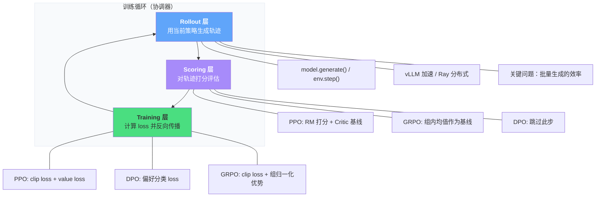

# C.2 三层架构与基于模型的 RL

上一节我们解决了"选哪个算法"的问题。但算法只是一堆数学公式——怎么把它变成一个真正能跑的训练系统？这就需要工程框架。本节先拆解现代 RL 框架的三层架构（Rollout → Scoring → Training），再对比主流框架的选型，最后把视野拓展到基于模型的 RL（MBRL）。

## 三层架构：Rollout → Scoring → Training

回顾第 2 章的 DPO 实验，你用 `DPOTrainer` 不到 50 行代码就跑通了对齐。但框架底层做了什么？如果你去看 HuggingFace TRL、OpenRLHF、veRL 等框架的源码，会发现它们都遵循同一个抽象：**三层架构**。



### 第一层：Rollout（生成层）

Rollout 层的任务很直接：用当前的策略模型对一批 prompt 生成回答（或者在传统 RL 中，用策略与环境交互收集轨迹）。对应代码就是 `model.generate()` 或 `env.step()`。

但这一层的工程挑战不小。首先，**批量生成的效率**是瓶颈——LLM 的自回归生成是串行的（一个 token 一个 token 地生成），在 PPO 的每个更新步骤之前都需要重新生成一批完整回答。如果没有优化，Rollout 可能占总训练时间的 70% 以上。

主流的解决方案是 **vLLM 加速**（通过 PagedAttention 和连续批处理提升生成吞吐量）和 **Ray 分布式**（把生成任务分配到多个 GPU 上并行）。在 veRL 框架中，Rollout 和 Training 甚至可以分配到不同的 GPU 组上——用专门的推理卡做生成，训练卡做梯度更新，互不干扰。

### 第二层：Scoring（评估层）

生成完回答后，需要给每个回答打分。不同算法的打分方式截然不同：

**PPO 的 Scoring 最复杂**：先用 Reward Model 对每个回答打分（得到 $r$），再用 Critic 网络估计每个状态的价值（得到 $V(s)$），最后计算优势函数 $\hat{A} = r - V(s)$。回忆第 6 章的 GAE（Generalized Advantage Estimation），它把多步的 TD Error 做指数加权平均来得到更稳定的优势估计。

**GRPO 的 Scoring 更轻量**：不需要 Critic 网络！它对同一个 prompt 生成一组回答（通常 4~16 个），用 Reward Model 打分后，直接用组内均值作为基线：$\hat{A}_i = (r_i - \mu_{group}) / \sigma_{group}$。这就是第 8 章里 GRPO 能省掉 Critic 的秘密。

**DPO 直接跳过 Scoring**：它的损失函数直接在偏好对（chosen vs rejected）上计算，不需要任何在线评分。这也是 DPO 工程上最简单的原因——少了两层（Rollout 和 Scoring），只需要做 Training。

```python
# 三种算法的 Scoring 层对比
def scoring_ppo(responses, prompts, reward_model, critic):
    """PPO: RM 打分 + Critic 基线"""
    rewards = reward_model.score(prompts, responses)      # RM 打分
    values = critic.estimate(prompts, responses)           # V(s) 估计
    advantages = rewards - values                          # A = R - V
    return advantages

def scoring_grpo(responses, prompts, reward_model, group_size=8):
    """GRPO: 组内均值作为基线（不需要 Critic）"""
    # 对每个 prompt 生成 group_size 个回答
    all_rewards = []
    for prompt in prompts:
        group_rewards = []
        for resp in responses[prompt]:  # 该 prompt 的 group_size 个回答
            group_rewards.append(reward_model.score(prompt, resp))
        group_rewards = torch.tensor(group_rewards)
        # 组内归一化
        advantages = (group_rewards - group_rewards.mean()) / (group_rewards.std() + 1e-8)
        all_rewards.append(advantages)
    return all_rewards

def scoring_dpo(chosen, rejected):
    """DPO: 不需要 Scoring 层，直接用偏好对"""
    return chosen, rejected  # 损失函数内部处理
```

### 第三层：Training（梯度更新层）

拿到分数后，就是计算 loss 并反向传播。这一层的核心挑战是**显存管理**——尤其是 PPO 需要同时维护四个模型（Actor、Critic、Reference、Reward Model）。回顾附录 A 的显存分析，7B 模型的 PPO 训练需要约 110GB 显存（bf16），必须用 LoRA + 梯度检查点才能在单卡上跑起来。

三个算法的 loss 对比：

| 算法 | Loss 组成                                              | 关键机制            |
| ---- | ------------------------------------------------------ | ------------------- |
| PPO  | clip loss + value loss + entropy bonus                 | 信任域裁剪 + GAE    |
| DPO  | $\log \sigma(\beta(\log \pi_\theta - \log \pi_{ref}))$ | 隐式奖励，无需 RM   |
| GRPO | clip loss + 组归一化优势                               | 无 Critic，组内比较 |

三层架构的价值在于：不管你用哪个算法，Rollout 和 Scoring 的基础设施可以复用。veRL 框架正是基于这个思路设计的——你只需要替换 Scoring 和 Training 层的实现，就能从 PPO 无缝切换到 GRPO。

---

## 框架选型：四大框架对比

有了三层架构的认知，我们来看看主流 RL 训练框架的差异。

| 框架              | 核心定位              | 支持算法              | 分布式方案     | 适合场景                       |
| ----------------- | --------------------- | --------------------- | -------------- | ------------------------------ |
| **veRL**          | 灵活的 RL 训练框架    | PPO, GRPO, DPO 等     | FSDP + Ray     | 研究实验，需要快速切换算法     |
| **LLaMA-Factory** | 一站式微调平台        | SFT, DPO, PPO, KTO    | DeepSpeed      | 快速上手，不需要深度定制       |
| **DeepSpeed**     | 底层分布式训练引擎    | 通用（需要自己写 RL） | ZeRO + 3D 并行 | 大规模生产训练，极致性能       |
| **Megatron-LM**   | NVIDIA 大模型训练框架 | 通用（需要自己写 RL） | TP + PP + DP   | 超大规模（70B+），GPU 集群训练 |

```python
# 不同框架的使用模式对比

# === LLaMA-Factory：最简单，配置文件驱动 ===
# 只需要一个 yaml 配置文件
"""
### dpo_config.yaml
model_name_or_path: meta-llama/Llama-2-7b-chat-hf
stage: dpo
dataset: dpo_mix7k
lora_rank: 16
bf16: true
"""
# 命令行一行启动：llamafactory-cli train dpo_config.yaml

# === veRL：最灵活，代码级控制 ===
from verl import PPOTrainer, GRPOTrainer

# 自定义 Rollout、Scoring、Training 的每一层
trainer = GRPOTrainer(
    actor_model="Qwen/Qwen2-7B",
    reward_model="path/to/rm",
    group_size=8,           # 每个 prompt 生成 8 个回答
    lora_rank=16,
    # 可以精细控制每一层的超参数
)
trainer.train()

# === DeepSpeed：最底层，需要自己组装 ===
import deepspeed
# 需要自己写训练循环、管理模型分片
# 适合需要极致性能优化的场景
```

**选型建议**：如果你刚起步，用 LLaMA-Factory 快速跑通实验；如果你需要做算法研究（比如对比 PPO 和 GRPO 的效果），用 veRL；如果你在做超大规模生产训练，直接上 DeepSpeed 或 Megatron-LM。

---

## 基于模型的 RL（MBRL）：从 Model-Free 到 Model-Based

到目前为止，本书所有算法——从第 4 章的 DQN 到第 8 章的 GRPO——都属于 **Model-Free RL**（无模型强化学习）。智能体不知道环境内部是怎么运作的，只能通过不断试错来积累经验。

但还有另一条路线：**Model-Based RL（MBRL，基于模型的强化学习）**。

### Model-Free vs Model-Based

| 维度       | Model-Free                             | Model-Based                            |
| ---------- | -------------------------------------- | -------------------------------------- |
| 核心思路   | 直接与环境交互，试错学习策略或价值函数 | 先学一个"世界模型"，在世界模型中做规划 |
| 样本效率   | 低（需要大量真实交互）                 | 高（可以在世界模型中"想象"更多经验）   |
| 训练稳定性 | 相对稳定                               | 世界模型可能不准确，导致策略也有偏差   |
| 代表算法   | DQN, PPO, SAC, DPO, GRPO               | MuZero, Dreamer, AlphaZero             |
| "脑内模拟" | 无                                     | 有——智能体可以在脑海里推演未来         |

用一个类比来说：Model-Free 就像一个不会下盲棋的棋手——每走一步都要看到棋盘；Model-Based 就像一个能在脑中推演未来几步的棋手——不需要真的落子，就能在脑中评估各种走法。

### 三大里程碑

**AlphaZero（2017）**：DeepMind 的 AlphaZero 不是从人类棋谱学习，而是从零开始自我博弈。它结合了 MCTS（蒙特卡洛树搜索）作为"世界模型中的规划"和神经网络作为"直觉评估器"——MCTS 做深度搜索，神经网络做快速评估。回顾第 5 章的 AlphaGo 实验，我们用简化版复现了这个思路。

**MuZero（2020）**：MuZero 的突破在于——它不需要知道游戏规则就能学会下棋和打游戏。它自己学习了一个隐式的世界模型，在这个模型中做规划。MuZero 在 Atari、围棋、国际象棋和将棋上都达到了超人类水平。

**Dreamer 系列（2020-2024）**：Dreamer 的思路更加激进——它在潜空间（Latent Space）中构建世界模型，然后在脑中进行"想象训练"。智能体的大部分学习不是在真实环境中发生的，而是在自己构建的虚拟世界中完成的。Dreamerv3 在 150 多个 benchmark 上达到了当时的 SOTA，而且使用的样本量远少于 Model-Free 方法。

### 为什么大模型领域较少提 MBRL？

一个有趣的问题是：本书从第 8 章到第 10 章讲的全是大模型的 RL，但从来没提过 MBRL。这是因为**大语言模型本身就是一个关于语言的世界模型**。

当你在第 8 章用 GRPO 训练模型做数学推理时，模型在思维链（CoT）中一步步推演——它其实就是在做某种形式的"内部规划"。语言模型已经内化了大量的世界知识，不需要额外训练一个"世界模型"来模拟语言的转移规律。

但在物理世界（机器人控制）中，情况完全不同。机器人需要理解物理规律——推一个杯子它会倒、踩到冰面会滑——这些知识不能靠文字学习，必须从物理交互中获得。这时候显式的世界模型（如视频预测模型 Sora）与 RL 的结合，正成为**具身智能**的核心方向——回顾第 11 章对连续控制与具身智能的讨论。

### MBRL 对比表

| 算法      | 世界模型类型           | 规划方式       | 样本效率 | 适用场景            |
| --------- | ---------------------- | -------------- | -------- | ------------------- |
| AlphaZero | 完美的（棋类规则已知） | MCTS           | 中等     | 完美信息博弈        |
| MuZero    | 隐式学习（不依赖规则） | MCTS in latent | 高       | 棋类 + Atari        |
| Dreamerv3 | 潜空间 RSSM            | Actor in dream | 极高     | 连续控制 + 视觉输入 |
| PPO/DPO   | 无                     | 无             | 低       | LLM 对齐 + 通用 RL  |

<details>
<summary>思考题：能否用 Sora 这样的视频生成模型作为机器人的世界模型？</summary>

这正是当前具身智能研究的热门方向之一。思路是：用 Sora 生成"如果机器人做了动作 X，世界会变成什么样"的视频，然后在这个"虚拟世界"中训练机器人的策略——不需要真的在物理世界试错。

挑战也不小：视频生成模型可能会"幻觉"出不存在的物理规律（比如让杯子穿过桌面），导致在虚拟世界中训练的策略在真实世界完全不 work。这和 Model-Based RL 的经典问题一样——**世界模型的精度决定了策略的质量**。Dreamer 系列用潜空间（而非像素空间）来构建世界模型，部分就是为了解决精度和计算效率的问题。

</details>

---

## 小结

三层架构（Rollout → Scoring → Training）是理解所有现代 RL 框架的钥匙。不管你用 PPO、DPO 还是 GRPO，底层都是这三个阶段的循环——区别只在于每个阶段的具体实现。框架选型方面：LLaMA-Factory 适合快速上手，veRL 适合算法研究，DeepSpeed/Megatron-LM 适合大规模生产。

MBRL 打开了另一个维度的可能性——让智能体在"脑海"中学习和规划。虽然大语言模型本身已经是一个隐式的世界模型，但在物理世界的具身智能中，显式的世界模型仍然是一个充满潜力的方向。

至此，附录 C 的算法选型指南就结束了。当你面对一个新项目时，回到本附录的决策速查表和五维度框架，你就知道该选哪个算法、用哪个框架了。
