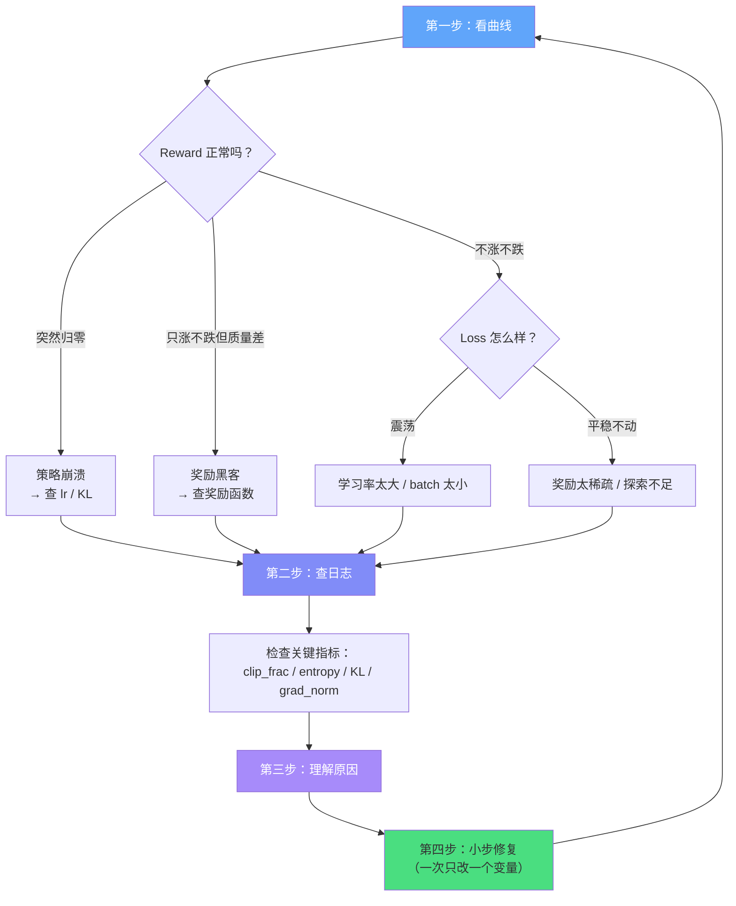

# A.2 显存爆炸与训练不收敛

上一节我们解决了训练"跑飞了"的问题。这一节来面对另外两种噩梦：**显存爆炸**（训练根本跑不起来）和**训练不收敛**（训练跑着但不动）。它们分别对应了"硬件瓶颈"和"算法瓶颈"，是 RL 工程化中最常遇到的两大拦路虎。

## 显存爆炸（CUDA Out of Memory）

### 现象：OOM 的暴力打击

你兴冲冲地写好了 PPO-RLHF 的训练脚本，配置了一个 7B 的 Actor 模型，按下了运行键。几分钟后，屏幕上出现了这一行刺眼的红字：

```
torch.cuda.OutOfMemoryError: CUDA out of memory.
Tried to allocate 2.34 GiB. GPU 0 has a total capacity of 79.15 GiB
of which 0.00 KiB is free.
```

80GB 的 A100 显存，居然不够用？这是很多 RLHF 初学者的第一反应。

### 理论：为什么 RLHF 需要这么多显存？

RLHF 的 PPO 训练和普通的 SFT（监督微调）有一个根本区别：**PPO 需要同时维护四个模型**。回顾第 6 章的 PPO 流程，这四个模型分别是：

| 模型               | 作用                           | 是否需要梯度 |
| ------------------ | ------------------------------ | ------------ |
| Actor（策略模型）  | 生成回答，接收梯度更新         | 是           |
| Critic（价值模型） | 估计 $V(s)$ 作为基线           | 是           |
| Reference（参考）  | 计算 KL 散度，防止策略偏移太远 | 否（冻结）   |
| Reward Model       | 对生成回答打分                 | 否（冻结）   |

让我们用代码来算一笔账：

```python
# RLHF 显存需求计算
def estimate_rlhf_memory(model_params_billion: float, precision: str = "fp32"):
    """估算 RLHF 训练的显存需求"""
    bytes_per_param = {"fp32": 4, "fp16": 2, "bf16": 2}[precision]

    model_gb = model_params_billion * bytes_per_param / 1024  # 单模型显存

    # 四个模型：Actor + Critic + Reference + Reward Model
    actor_gb = model_gb * 3        # 模型权重 + 梯度 + 优化器状态（Adam 约 2x）
    critic_gb = model_gb * 3       # 同上
    ref_gb = model_gb              # 冻结，只有权重
    rm_gb = model_gb               # 冻结，只有权重

    total = actor_gb + critic_gb + ref_gb + rm_gb

    print(f"模型规模: {model_params_billion}B ({precision})")
    print(f"  Actor (含梯度+优化器): {actor_gb:.1f} GB")
    print(f"  Critic (含梯度+优化器): {critic_gb:.1f} GB")
    print(f"  Reference (冻结): {ref_gb:.1f} GB")
    print(f"  Reward Model (冻结): {rm_gb:.1f} GB")
    print(f"  合计: {total:.1f} GB")
    print(f"  还需要额外的激活显存（取决于 batch_size 和 seq_len）")
    return total

# 7B 模型，fp32 精度
estimate_rlhf_memory(7.0, "fp32")
# Actor: 82.0 GB, Critic: 82.0 GB, Ref: 27.3 GB, RM: 27.3 GB
# 合计: 218.6 GB — 需要 3 张 A100-80G！

# 7B 模型，bf16 精度
estimate_rlhf_memory(7.0, "bf16")
# 合计: 109.3 GB — 还是需要 2 张 A100-80G
```

这就是为什么单卡训练 RLHF 几乎是不可能的——7B 模型的 PPO 训练在 fp32 下需要约 220GB 显存，即使用 bf16 也需要 110GB。

### 修复方案：四大显存优化技术

| 技术                 | 原理                                 | 显存节省 | 速度影响 |
| -------------------- | ------------------------------------ | -------- | -------- |
| **LoRA**             | 只训练低秩适配器，冻结主模型         | 60-80%   | 极小     |
| **混合精度（bf16）** | 用 16 位浮点替代 32 位               | ~50%     | 加速     |
| **ZeRO 优化**        | 将参数/梯度/优化器状态分片到多 GPU   | 线性扩展 | 通信开销 |
| **梯度检查点**       | 只保留部分中间激活，其余用计算换显存 | 60-70%   | 减慢 30% |

下面是一段综合使用这些技术的配置代码：

```python
# RLHF 显存优化最佳实践
from dataclasses import dataclass

@dataclass
class MemoryOptimizedConfig:
    """显存优化配置：让 7B RLHF 在单台机器上跑起来"""

    # LoRA：只训练低秩适配器
    lora_r: int = 16               # LoRA 秩（8/16/32）
    lora_alpha: int = 32           # 缩放系数
    lora_target_modules: list = None  # 默认应用到所有线性层

    # 混合精度
    bf16: bool = True              # 使用 bf16（A100/H100 推荐）
    fp16: bool = False             # V100 用 fp16

    # 梯度检查点
    gradient_checkpointing: bool = True

    # ZeRO 阶段（DeepSpeed）
    zero_stage: int = 2            # Stage 2: 梯度+优化器分片
                                   # Stage 3: 参数也分片（更省但通信更多）

    # 批处理优化
    micro_batch_size: int = 1      # 梯度累积：用小 batch 多次前向
    gradient_accumulation_steps: int = 8

    def estimate_memory(self, model_b: float):
        """估算优化后的显存需求"""
        base = model_b * 2 / 1024  # bf16 单模型
        # LoRA：可训练参数仅为原来的 ~0.5%
        trainable = base * 0.005 * 3  # 权重+梯度+优化器（LoRA 部分）
        frozen = base * 2            # Reference + RM（冻结）
        actor_critic = base * 2 + trainable * 2  # 主干冻结 + LoRA 可训练
        total = actor_critic + frozen
        # 梯度检查点再省 60% 激活显存
        total *= 0.6
        print(f"优化后 7B RLHF 预估显存: {total:.1f} GB（单卡）")
        return total

config = MemoryOptimizedConfig()
config.estimate_memory(7.0)
# 优化后 7B RLHF 预估显存: ~25-35 GB（单卡 A100 可行！）
```

::: tip 优先级建议
如果你的显存预算有限，按这个顺序依次尝试：**bf16 > LoRA > 梯度检查点 > ZeRO**。前三项都不需要多卡，ZeRO 才需要多 GPU 环境。回顾第 8 章的 DPO 实验中，我们用的正是 LoRA + bf16 的组合——因为 DPO 只需要两个模型（Actor + Reference），显存压力远小于 PPO。
:::

---

## 训练不收敛（Non-convergence）

### 现象：Loss 震荡，Reward 躺平

显存的问题解决了，训练跑起来了。但新的问题出现了：Loss 在 0.5 到 1.2 之间来回跳动，Reward 像死水一样纹丝不动。你等了 1000 步、5000 步、10000 步——Reward 还是在初始值附近徘徊。训练似乎在原地打转。

### 理论：为什么不收敛？

训练不收敛通常有三个根本原因，它们可能单独出现，也可能叠加在一起：

**原因一：奖励太稀疏。** 智能体需要完成一长串正确的动作才能获得任何正反馈。在没有得到正反馈之前，所有状态看起来都一样——"啥也没发生"。回顾第 3 章的 MDP 框架，如果 $R(s,a) = 0$ 对几乎所有 $(s,a)$ 都成立，那策略梯度 $\nabla_\theta J(\theta)$ 几乎为零——模型根本不知道该往哪走。

**原因二：超参数不当。** 学习率太大导致 Loss 震荡（在最优解两侧来回跳），学习率太小导致 Reward 不涨（每次更新步子太小）。折扣因子 $\gamma$ 设得太低会让模型变成"近视眼"（只看眼前利益），设得太高又会让训练信号被稀释。

**原因三：探索不足。** 策略过早收敛到某个局部最优，从此只做"还行但不是最好"的动作，永远不会发现更好的选择。

### 修复方案

```python
# 诊断训练不收敛的工具箱
import numpy as np

def diagnose_nonconvergence(metrics: dict) -> list:
    """根据训练指标诊断不收敛的原因"""
    diagnoses = []

    rewards = metrics.get("rewards", [])
    losses = metrics.get("losses", [])
    entropies = metrics.get("entropies", [])

    if len(rewards) < 100:
        return ["数据不足，至少跑 100 步再诊断"]

    # 诊断 1：Reward 是否在增长？
    recent = rewards[-50:]
    early = rewards[:50]
    if np.mean(recent) <= np.mean(early) * 1.05:
        diagnoses.append(
            "Reward 没有增长 → 可能是奖励太稀疏或学习率太小"
        )

    # 诊断 2：Loss 是否在震荡？
    loss_std = np.std(losses[-50:])
    loss_mean = np.mean(losses[-50:])
    if loss_std / max(loss_mean, 1e-8) > 0.3:
        diagnoses.append(
            "Loss 震荡剧烈 → 学习率可能太大，尝试降低 5-10 倍"
        )

    # 诊断 3：Entropy 是否过低？
    if entropies and np.mean(entropies[-50:]) < 0.1:
        diagnoses.append(
            "策略过早确定（entropy 过低）→ 增加探索（entropy bonus 或 ε-greedy）"
        )

    return diagnoses if diagnoses else ["暂未发现明显问题，继续训练观察"]
```

对应的修复策略表：

| 症状                    | 原因       | 修复方案                                             |
| ----------------------- | ---------- | ---------------------------------------------------- |
| Reward 不涨 + Loss 平稳 | 奖励太稀疏 | 奖励塑形：设计中间奖励引导智能体                     |
| Loss 震荡 + Reward 震荡 | 学习率太大 | 降低 lr，或使用余弦退火调度器                        |
| Reward 缓慢但单调增长   | 学习率太小 | 适当增大 lr，或增大 batch size                       |
| Entropy 很快降到接近 0  | 探索不足   | 增大 entropy bonus 系数，或增加 $\varepsilon$-greedy |
| Reward 卡在某个值不再涨 | 局部最优   | 增加好奇心驱动（Intrinsic Reward），调整 $\gamma$    |

---

## 调试四步法

无论是策略崩溃、奖励黑客、显存爆炸还是训练不收敛，都可以用同一个四步调试法来解决。这是我们在整个附录中反复使用的诊断流程：



**第一步：看曲线。** Reward 和 Loss 的曲线是第一线索。不同的异常模式（突然归零 vs 震荡 vs 不动）直接对应不同的问题类型。

**第二步：查日志。** 曲线告诉你"出了什么问题"，日志告诉你"哪里出了问题"。关键指标包括：clip fraction（被裁剪的比例，正常 < 0.2）、entropy（策略随机性，不应过快降到 0）、KL divergence（新旧策略距离，不应持续增大）、gradient norm（梯度大小，不应突然爆炸）。

**第三步：理解原因。** 每个异常背后都有数学解释。clip fraction 高 → 更新步长太大；entropy 归零 → 策略过早收敛；KL 持续增长 → 信任域被破坏。理解了原因，才能对症下药。

**第四步：小步修复。** **一次只改一个变量**，确认效果后再改下一个。同时改 lr + batch_size + clip_eps，你永远不知道哪个改动有效、哪个反而有害。

### 综合诊断速查表

| 异常指标                    | 正常范围     | 异常含义             | 首选修复               |
| --------------------------- | ------------ | -------------------- | ---------------------- |
| clip fraction               | 0.05 ~ 0.2   | > 0.3 → 步长太大     | 降低 lr 或增大 ε       |
| entropy                     | 缓慢下降     | 快速归零 → 探索不足  | 增大 entropy bonus     |
| KL divergence               | 稳定在 < 0.1 | 持续增长 → 策略漂移  | 增大 KL penalty        |
| gradient norm               | 稳定         | 突然爆炸 → 不稳定    | 降低 lr / 加 grad clip |
| explained variance (Critic) | > 0.5        | < 0 → Critic 没用    | 增大 Critic lr / 容量  |
| value loss                  | 缓慢下降     | 不降 → Critic 学不好 | 检查奖励尺度是否合理   |

<details>
<summary>思考题：Reward 一直涨就一定没问题吗？</summary>

不一定！回顾本附录上一节的"奖励黑客"——Reward 持续走高可能恰恰是问题正在恶化的信号。你需要同时关注 Reward 的**质量**（人工抽检）和**多样性**（entropy 不应归零），而不仅仅是数值大小。一个好的训练过程应该是：Reward 稳步上升 + entropy 缓慢下降 + KL 保持稳定。如果 Reward 暴涨但 entropy 归零，很可能是策略坍缩到了某种"刷分策略"。

</details>

---

## 小结

显存爆炸和训练不收敛分别代表了 RL 工程化的两大瓶颈：**硬件瓶颈**和**算法瓶颈**。好消息是它们都有成熟的解决方案：LoRA + bf16 + 梯度检查点的组合拳可以把 7B RLHF 的显存需求压到单卡可用；奖励塑形 + 超参调优 + 增加探索可以解决大多数收敛问题。

最后记住调试四步法：看曲线 → 查日志 → 理解原因 → 小步修复。这个流程适用于你在 RL 训练中遇到的几乎所有问题——包括我们上一节讨论的策略崩溃和奖励黑客。
