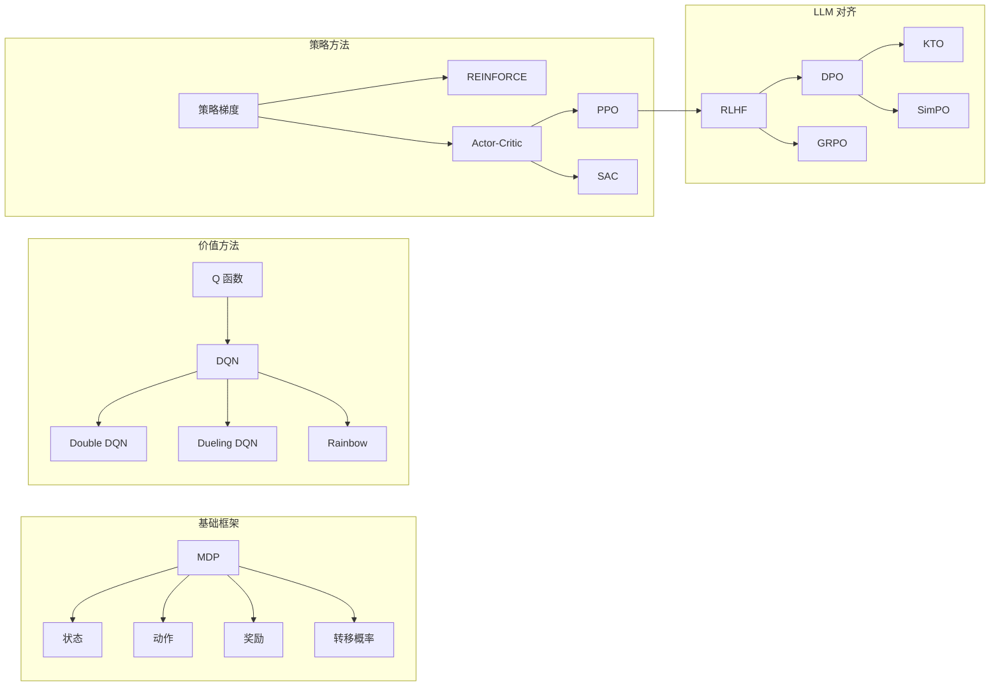

# 附录 G：术语对照表

> **本附录目标**：提供中英双语术语对照，按主题分组，每条附一句话定义和章节引用。遇到不熟悉的术语时，可以快速查阅。

## H.1 MDP 基础

| 中文                  | English                          | 一句话定义                                                                                              | 章节                            |
| --------------------- | -------------------------------- | ------------------------------------------------------------------------------------------------------- | ------------------------------- |
| 马尔可夫决策过程      | Markov Decision Process (MDP)    | 智能体与环境交互的形式化框架，由状态、动作、奖励、转移概率和折扣因子五元组定义                          | [Ch3](/chapter03_mdp/formalism) |
| 马尔可夫性质          | Markov Property                  | 未来只依赖当前状态，与历史无关：$P(s_{t+1} \mid s_t, a_t) = P(s_{t+1} \mid s_0, a_0, \ldots, s_t, a_t)$ | Ch3                             |
| 状态                  | State                            | 环境在某一时刻的完整描述，记为 $s$                                                                      | Ch3                             |
| 动作                  | Action                           | 智能体在某一状态下可执行的操作，记为 $a$                                                                | Ch3                             |
| 奖励                  | Reward                           | 环境对智能体动作的即时反馈信号，记为 $r$                                                                | Ch3                             |
| 策略                  | Policy                           | 从状态到动作的映射规则 $\pi(a \mid s)$，决定智能体如何选择动作                                          | Ch3                             |
| 价值函数              | Value Function                   | 从某状态出发、遵循某策略能获得的期望累积回报 $V^\pi(s)$                                                 | Ch3                             |
| Q 函数 / 动作价值函数 | Q-Function                       | 在某状态执行某动作后的期望累积回报 $Q^\pi(s,a)$                                                         | Ch3                             |
| 最优价值函数          | Optimal Value Function           | 所有策略中价值最大的函数 $V^*(s) = \max_\pi V^\pi(s)$                                                   | Ch3                             |
| 折扣因子              | Discount Factor $\gamma$         | 控制未来奖励重要程度的超参数，$\gamma \in [0,1)$，越大越重视长期回报                                    | Ch3                             |
| 转移概率              | Transition Probability           | 给定当前状态和动作后转移到下一状态的概率 $P(s' \mid s, a)$                                              | Ch3                             |
| 回报                  | Return                           | 从某时刻起累积的折扣奖励之和 $G_t = \sum_{k=0}^{\infty} \gamma^k r_{t+k}$                               | Ch3                             |
| 状态空间              | State Space                      | 所有可能状态的集合 $\mathcal{S}$                                                                        | Ch3                             |
| 动作空间              | Action Space                     | 所有可能动作的集合 $\mathcal{A}$，分为离散和连续两种                                                    | Ch3                             |
| 轨迹                  | Trajectory                       | 智能体与环境交互产生的一系列状态-动作-奖励序列 $(s_0, a_0, r_0, s_1, \ldots)$                           | Ch3                             |
| 回合                  | Episode                          | 从初始状态到终止状态的一次完整交互过程                                                                  | Ch1                             |
| 吸收状态              | Absorbing State                  | 一旦进入就不会再离开的终止状态                                                                          | Ch3                             |
| 部分可观测 MDP        | Partially Observable MDP (POMDP) | 智能体无法完全观测环境状态，只能看到观测值 $o$ 而非真实状态 $s$                                         | Ch3                             |

## H.2 算法类

| 中文         | English                               | 一句话定义                                                              | 章节                                                            |
| ------------ | ------------------------------------- | ----------------------------------------------------------------------- | --------------------------------------------------------------- |
| 策略梯度     | Policy Gradient                       | 直接对策略参数求梯度来优化期望回报的方法                                | [Ch5](/chapter05_policy_gradient/policy-gradient)               |
| REINFORCE    | REINFORCE                             | 最经典的蒙特卡洛策略梯度算法，用完整回合的回报估计梯度                  | Ch5                                                             |
| Actor-Critic | Actor-Critic                          | Actor 学习策略，Critic 学习价值函数，两者协同训练的框架                 | [Ch5](/chapter05_policy_gradient/actor-critic)                  |
| 优势函数     | Advantage Function                    | 动作价值减去状态价值 $A(s,a) = Q(s,a) - V(s)$，衡量某动作相对平均的好坏 | Ch5                                                             |
| DQN          | Deep Q-Network                        | 用深度网络近似 Q 函数，结合经验回放和目标网络的值函数方法               | [Ch4](/chapter04_dqn/from-q-to-dqn)                             |
| Double DQN   | Double DQN                            | 用独立的目标网络选择动作，解决 DQN 的 Q 值过估计问题                    | Ch4                                                             |
| Dueling DQN  | Dueling DQN                           | 将 Q 网络拆分为状态价值流和优势函数流，提升学习效率                     | Ch4                                                             |
| PPO          | Proximal Policy Optimization          | 通过裁剪概率比限制策略更新幅度，兼顾稳定性和样本效率                    | [Ch6](/chapter06_ppo/ppo-math)                                  |
| TRPO         | Trust Region Policy Optimization      | 用 KL 散度硬约束限制策略更新，PPO 的理论前身                            | [Ch6](/chapter06_ppo/trust-region-clipping)                     |
| DPO          | Direct Preference Optimization        | 用人类偏好数据直接优化策略模型，绕过显式的奖励模型训练                  | [Ch8](/chapter07_alignment/dpo-theory-and-family)                            |
| GRPO         | Group Relative Policy Optimization    | 用组内奖励统计量代替 Critic 的 PPO 变体，DeepSeek-R1 的核心算法         | [Ch8](/chapter08_grpo_rlvr/grpo-practice-and-mechanism)                      |
| SAC          | Soft Actor-Critic                     | 最大化熵的 Actor-Critic 算法，在连续控制任务中表现优异                  | [Ch11](/chapter09_continuous_control/sac-comparison)             |
| TD3          | Twin Delayed DDPG                     | 通过双 Q 网络、延迟更新和目标平滑解决 DDPG 过估计的连续控制算法         | [Ch11](/chapter09_continuous_control/continuous-policy-ddpg-td3) |
| DDPG         | Deep Deterministic Policy Gradient    | 将 DQN 思想扩展到连续动作空间的确定性策略梯度算法                       | Ch11                                                             |
| Q-Learning   | Q-Learning                            | 经典的无模型离线策略算法，通过时序差分学习最优 Q 函数                   | Ch4                                                             |
| A2C / A3C    | Advantage Actor-Critic                | 同步/异步多线程的 Actor-Critic 算法                                     | Ch5                                                             |
| Rainbow      | Rainbow DQN                           | 整合六项 DQN 改进的集成方法                                             | Ch4                                                             |
| DAPO         | Dynamic Advantage Policy Optimization | 动态采样和组奖励归一化的 PPO 变体                                       | Ch8                                                             |
| RLVR         | RL from Verifiable Rewards            | 用可验证奖励（如数学答案正确性）训练 LLM 的范式                         | Ch8                                                             |
| 时序差分学习 | Temporal Difference (TD) Learning     | 结合蒙特卡洛采样和动态规划的自举式价值估计方法                          | Ch3                                                             |

## H.3 LLM 对齐

| 中文               | English                                    | 一句话定义                                                          | 章节                                     |
| ------------------ | ------------------------------------------ | ------------------------------------------------------------------- | ---------------------------------------- |
| RLHF               | Reinforcement Learning from Human Feedback | 用人类偏好反馈训练奖励模型，再用 PPO 优化 LLM 的对齐方法            | [Ch7](/chapter10_rlhf/intro)            |
| RLAIF              | RL from AI Feedback                        | 用 AI 模型（而非人类）生成偏好反馈进行训练，降低人工标注成本        | Ch12                                     |
| SFT                | Supervised Fine-Tuning                     | 用标注数据对预训练模型进行监督微调，是对齐流程的第一步              | Ch7                                     |
| 奖励模型           | Reward Model                               | 从人类偏好数据训练出的打分模型，用于 RLHF 训练中评估回答质量        | Ch7                                     |
| 偏好学习           | Preference Learning                        | 从人类对多个回答的排序/比较中学习偏好的方法                         | Ch8                                      |
| Bradley-Terry 模型 | Bradley-Terry Model                        | 用奖励差值经过 sigmoid 变换来建模偏好的概率模型                     | [Ch8](/chapter07_alignment/dpo-theory-and-family)     |
| KL 散度惩罚        | KL Penalty                                 | 在 RLHF 训练中限制策略偏离参考模型的正则项                          | Ch6                                      |
| 对齐               | Alignment                                  | 使 LLM 的行为符合人类意图和价值观的过程                             | Ch8                                      |
| 对齐税             | Alignment Tax                              | 对齐训练后模型在某些能力（如推理）上性能下降的现象                  | Ch8                                      |
| 奖励黑客           | Reward Hacking                             | 模型找到奖励函数的漏洞获取高分，但实际输出质量很差                  | [附录A](/appendix_common_pitfalls/intro) |
| 参考模型           | Reference Model                            | DPO/PPO 训练中用作基准的策略模型（通常是 SFT 后的模型）             | Ch8                                      |
| 隐式奖励           | Implicit Reward                            | DPO 中由策略与参考模型的 log 概率比定义的奖励，不需要单独的奖励模型 | Ch8                                      |
| 偏好数据           | Preference Data                            | 包含提示和多个回答及其人类排序的数据集                              | Ch8                                      |
| Chosen / Rejected  | Chosen / Rejected                          | 偏好数据对中的优选回答（chosen）和劣选回答（rejected）              | Ch8                                      |
| KTO                | Kahneman-Tversky Optimization              | 只需要二元反馈（好/坏），不需要成对偏好数据的对齐方法               | Ch8                                      |
| SimPO              | Simple Preference Optimization             | 去掉参考模型的 DPO 变体，用长度归一化 log 概率作为隐式奖励          | Ch8                                      |
| IPO                | Identity Preference Optimization           | 从一般理论视角统一 DPO 类方法的对齐算法                             | Ch8                                      |
| InstructGPT        | InstructGPT                                | OpenAI 的 RLHF 流水线论文：SFT -> RM -> PPO                         | Ch7                                     |
| Constitution AI    | Constitutional AI                          | Anthropic 提出的用 AI 反馈替代人类反馈的对齐方法                    | Ch12                                     |
| 可验证奖励         | Verifiable Reward                          | 可以自动验证正确性的奖励信号（如数学题的对错、代码能否通过测试）    | Ch8                                      |

## H.4 训练工程

| 中文         | English                          | 一句话定义                                                       | 章节                                   |
| ------------ | -------------------------------- | ---------------------------------------------------------------- | -------------------------------------- |
| 经验回放     | Experience Replay                | 将交互数据存入缓冲区并随机采样的技术，打破数据相关性             | [Ch4](/chapter04_dqn/dqn-components)   |
| 目标网络     | Target Network                   | 延迟更新的独立网络，用于稳定 Q 学习的训练目标                    | Ch4                                    |
| 裁剪         | Clipping                         | PPO 中限制概率比在 $[1-\varepsilon, 1+\varepsilon]$ 范围内的机制 | Ch6                                    |
| GAE          | Generalized Advantage Estimation | 通过 $\lambda$ 参数平衡偏差与方差的优势估计方法                  | [Ch6](/chapter06_ppo/gae-reward-model) |
| LoRA         | Low-Rank Adaptation              | 冻结主模型、只训练低秩适配器矩阵的参数高效微调方法               | Ch8                                    |
| ZeRO         | Zero Redundancy Optimizer        | 将模型参数、梯度、优化器状态分片到多 GPU 的显存优化技术          | 附录A                                  |
| 混合精度训练 | Mixed Precision Training         | 同时使用 fp16/bf16 和 fp32 进行训练，节省显存并加速计算          | 附录D                                  |
| 分布式训练   | Distributed Training             | 在多个 GPU 或多台机器上并行训练模型的技术                        | Ch7                                   |
| 梯度检查点   | Gradient Checkpointing           | 用计算换显存，只保存部分中间激活、需要时重新计算                 | 附录A                                  |
| 批归一化     | Batch Normalization              | 对每个 mini-batch 做归一化以加速训练的技术                       | Ch4                                    |
| 学习率调度   | Learning Rate Schedule           | 训练过程中动态调整学习率的策略（如 warmup + cosine decay）       | Ch6                                    |
| 早停         | Early Stopping                   | 验证集性能不再提升时提前停止训练，防止过拟合                     | Ch8                                    |
| 梯度裁剪     | Gradient Clipping                | 限制梯度范数以防止梯度爆炸的技术                                 | Ch6                                    |
| Rollout      | Rollout                          | 用当前策略与环境交互收集一批数据的过程                           | Ch6                                    |
| Checkpoint   | Checkpoint                       | 训练过程中保存的模型快照，用于恢复训练或回滚                     | Ch6                                    |
| 超参数       | Hyperparameter                   | 训练前需要设定的参数（如学习率、batch size），不是通过训练学到的 | Ch1                                    |
| Batch Size   | Batch Size                       | 每次参数更新使用的数据样本数量                                   | Ch4                                    |
| Epoch        | Epoch                            | 遍历一次完整训练数据集的过程                                     | Ch8                                    |

## H.5 其他核心概念

| 中文           | English                        | 一句话定义                                                    | 章节 |
| -------------- | ------------------------------ | ------------------------------------------------------------- | ---- |
| 探索与利用     | Exploration vs Exploitation    | 在尝试新动作（探索）和选择已知最优动作（利用）之间的权衡      | Ch3  |
| 在线策略       | On-Policy                      | 训练数据由当前策略产生，数据用完即弃（如 PPO、REINFORCE）     | Ch5  |
| 离线策略       | Off-Policy                     | 可以使用旧策略产生的数据训练（如 DQN、SAC）                   | Ch4  |
| 模型无关       | Model-Free                     | 不需要学习环境动力学模型（转移概率）的方法                    | Ch4  |
| 模型相关       | Model-Based                    | 先学习环境模型，再用规划或模拟来优化策略的方法                | Ch12 |
| 自博弈         | Self-Play                      | 智能体与自身的历史版本对弈来持续进步的训练方式                | Ch12 |
| 蒙特卡洛树搜索 | Monte Carlo Tree Search (MCTS) | 通过模拟推演构建搜索树的规划算法，AlphaGo 的核心组件          | Ch12 |
| 世界模型       | World Model                    | 学习环境动态的神经网络，用于想象和规划                        | Ch12 |
| 多智能体       | Multi-Agent                    | 多个智能体同时在环境中交互的场景                              | Ch12 |
| 课程学习       | Curriculum Learning            | 从简单任务逐步过渡到复杂任务的训练策略                        | Ch11  |
| 样本效率       | Sample Efficiency              | 算法从有限交互数据中学习的效率，on-policy 通常低于 off-policy | Ch5  |
| 稀疏奖励       | Sparse Reward                  | 只在完成任务时才给奖励，中间步骤没有反馈的情况                | Ch4  |
| 奖励塑造       | Reward Shaping                 | 设计额外的中间奖励信号来引导学习的方法                        | Ch7 |
| 信用分配       | Credit Assignment              | 将最终奖励归因到序列中各个动作的过程                          | Ch7 |
| 模仿学习       | Imitation Learning             | 从专家示范数据中学习策略，而非从奖励信号学习                  | Ch7 |
| 价值迭代       | Value Iteration                | 通过反复应用贝尔曼算子来求解最优价值函数的动态规划方法        | Ch3  |
| 策略迭代       | Policy Iteration               | 交替进行策略评估和策略改化的动态规划方法                      | Ch3  |
| 泛化           | Generalization                 | 模型在未见过的数据或环境上表现良好的能力                      | Ch4  |
| 收敛           | Convergence                    | 训练过程中损失函数或性能指标趋于稳定                          | Ch1  |

## H.6 缩写速查

| 缩写  | 全称                             | 中文                   |
| ----- | -------------------------------- | ---------------------- |
| RL    | Reinforcement Learning           | 强化学习               |
| MDP   | Markov Decision Process          | 马尔可夫决策过程       |
| DRL   | Deep Reinforcement Learning      | 深度强化学习           |
| PG    | Policy Gradient                  | 策略梯度               |
| VF    | Value Function                   | 价值函数               |
| TD    | Temporal Difference              | 时序差分               |
| RLHF  | RL from Human Feedback           | 基于人类反馈的强化学习 |
| RLAIF | RL from AI Feedback              | 基于 AI 反馈的强化学习 |
| SFT   | Supervised Fine-Tuning           | 监督微调               |
| RM    | Reward Model                     | 奖励模型               |
| PEFT  | Parameter-Efficient Fine-Tuning  | 参数高效微调           |
| LLM   | Large Language Model             | 大语言模型             |
| VLM   | Vision-Language Model            | 视觉语言模型           |
| NLP   | Natural Language Processing      | 自然语言处理           |
| GAE   | Generalized Advantage Estimation | 广义优势估计           |
| KL    | Kullback-Leibler                 | KL 散度                |
| GPU   | Graphics Processing Unit         | 图形处理器             |
| OOM   | Out of Memory                    | 显存溢出               |

## H.7 术语关系图

::: tip 学习建议
刚开始不需要死记这些术语。在课程学习中遇到不认识的词，回来查表即可。反复使用后自然就记住了。如果你发现某个术语在表中没有收录，欢迎提 issue 补充。
:::
