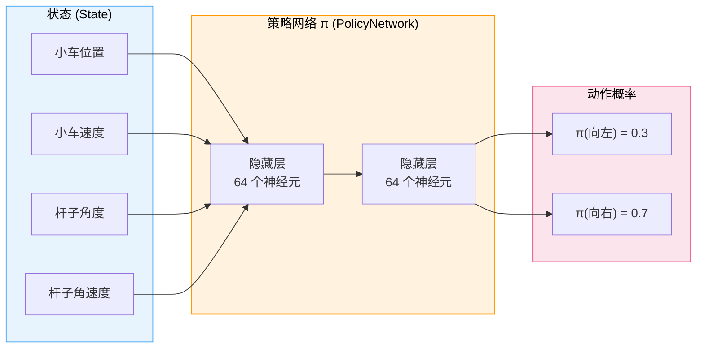
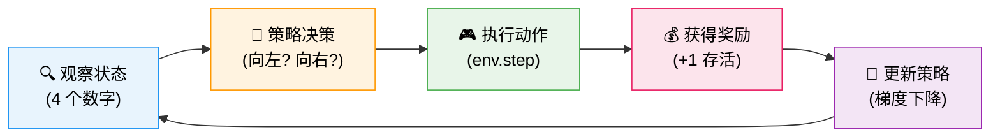
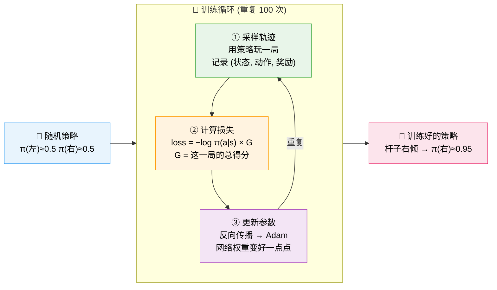

# 1.3 理论初探：RL 核心要素

> 📁 **本章代码**：[hello_rl.py](https://github.com/walkinglabs/hands-on-modern-rl/blob/main/code/chapter01_cartpole/hello_rl.py) · [hello_rl_tensorboard.py](https://github.com/walkinglabs/hands-on-modern-rl/blob/main/code/chapter01_cartpole/hello_rl_tensorboard.py) · [pytorch_from_scratch.py](https://github.com/walkinglabs/hands-on-modern-rl/blob/main/code/chapter01_cartpole/pytorch_from_scratch.py) · [requirements.txt](https://github.com/walkinglabs/hands-on-modern-rl/blob/main/code/chapter01_cartpole/requirements.txt)

现在你已经亲手跑通了一个 RL 训练流程，亲眼看到了智能体从"什么都不会"到"稳稳立住杆子"的全过程。接下来，我们要做一件在本书中反复出现的事情：**用理论框架重新解读刚才观察到的现象**。

让我们回到 CartPole 逐帧拆解，看看在这个看似简单的游戏背后，究竟隐藏着怎样的结构。

### **状态（State）：智能体看到了什么？**


每一帧，CartPole 环境都会向智能体发送一个包含 4 个数字的向量：

| 编号 | 含义 | 取值范围 |
|------|------|---------|
| 0 | 小车位置 | -4.8 ~ 4.8 |
| 1 | 小车速度 | -∞ ~ +∞ |
| 2 | 杆子角度 | -0.418 rad ~ 0.418 rad (约 ±24°) |
| 3 | 杆子角速度 | -∞ ~ +∞ |

这 4 个数字就是对当前局面的完整描述——智能体的"眼睛"只看得到这些。它看不到环境的源代码，也理解不了"物理定律"这些概念，它唯一的输入就是这 4 个数字。

这就是 RL 中"状态"的含义：**一组描述当前环境局面的数值**。不同的任务有不同的状态表示——下棋的状态是棋盘上每个格子的棋子，自动驾驶的状态是摄像头图像和雷达数据，而 CartPole 的状态就是这 4 个数字。

### **动作（Action）：智能体能做什么？**

CartPole 的动作空间极其简单：只有两个选择。

| 动作 | 含义 |
|------|------|
| 0 | 向左推小车 |
| 1 | 向右推小车 |

没有"不推"，没有"轻推重推"——只有左或右，非此即彼。这种有限的、离散的动作集合是 RL 中最常见的动作空间类型（叫做 `Discrete` 动作空间）。在第 10 章，我们会遇到连续动作空间——比如控制机器人的关节角度，那是一个完全不同的世界。

### **奖励（Reward）：智能体得到什么反馈？**

每存活一步，智能体获得 +1 分。杆子一倒，回合结束，分数不再累加。

这个设计看似简单，却蕴含着一个深意：**奖励信号是延迟的、稀疏的**。智能体在每一步都得到 +1，但它不知道"到底是刚才哪一步做得好、哪一步做得差"。它只知道"这一局总共坚持了 50 步"，至于第 23 步推左还是推右是关键，那是它需要自己弄明白的。

这个"奖励只告诉你结果好不好，不告诉你具体哪里好"的特性，是 RL 区别于监督学习的核心特征之一。在监督学习里，每个训练样本都有明确的"标准答案"；而在 RL 里，只有最终的总分，中间过程需要智能体自己去推断。

### **策略（Policy）：智能体怎么决策？**

把以上三个要素串起来，就得到了 RL 的核心概念——**策略（Policy）**。

策略就是"在状态 s 下选择动作 a 的规则"。在 CartPole 中，策略回答的问题就是：**"给定当前的小车位置、速度、杆角度、角速度，应该向左推还是向右推？"**

在训练开始之前，策略是随机初始化的——就像一个什么都不懂的新手，靠抛硬币做决定。训练的过程，就是不断调整策略的过程——让它在看到"杆子向右倾斜"时更倾向于向右推，在看到"小车快出界"时更倾向于往回推。

用数学语言说，策略是一个从状态到动作概率分布的映射：π(a|s)。在离散动作空间中，它输出每个动作被选中的概率。训练开始时，π(左) ≈ 0.5, π(右) ≈ 0.5；训练结束后，π 会学会在杆子右倾时输出 π(右) ≈ 0.95。



你可能会问一个问题：**策略一定要是神经网络吗？**

答案是**不一定**。策略只是一个从状态到动作的映射规则，它可以是任何形式。事实上，在深度学习兴起之前，RL 的策略有三种经典形态：

- **表格策略（Tabular Policy）**：建一张表，把每个状态对应的最优动作写死。比如国际象棋，你可以用一张表记录"看到这个棋局就走出一步棋"。问题是，当状态空间很大时（比如围棋有 10^170 种局面），表格根本装不下。
- **线性策略（Linear Policy）**：用一个线性函数 π(a|s) = softmax(W·s + b) 把状态映射到动作概率。计算简单、理论分析方便，但只能学习线性决策边界——对于"杆子角度和角速度的组合决定该推哪边"这种非线性关系，表达能力远远不够。
- **神经网络策略（Neural Network Policy）**：用多层非线性变换来拟合 π(a|s)。这正是我们在 1.4 节看到的那个 4→64→64→2 的小网络。它可以用梯度下降端到端地训练，而且有万能近似定理保证——只要网络足够宽，它可以拟合任何连续函数。

在 CartPole 这个简单任务里，三种策略都能工作。但当状态空间从 4 维变成 84×84×4 的像素（Atari 游戏 [^1]），或者变成数万维的文本序列（大语言模型），表格和线性策略就彻底无能为力了——状态太多，根本存不下来或者学不好。**神经网络之所以成为现代 RL 的标准选择，不是因为它是唯一选项，而是因为它是唯一能处理高维复杂状态的通用方案。**

所以你会在本书中看到，从 CartPole 到 Atari 到 LLM，策略的"外壳"全部是神经网络——但它们的核心思想都一样：输入状态，输出动作概率，用梯度下降来改进。

### **小结：RL 的核心循环**

把以上四个要素组合在一起，就得到了强化学习的核心循环：



在 CartPole 中，这个循环的具体含义是：

1. **观察状态**：环境告诉智能体当前的 4 个数字（位置、速度、角度、角速度）
2. **策略决策**：策略网络根据这 4 个数字，计算出"向左推"和"向右推"的概率
3. **执行动作**：按概率随机选择一个动作，交给环境执行
4. **获得奖励**：如果杆子没倒，得到 +1 分，同时收到新的 4 个数字
5. **更新策略**：根据这局的表现（总分高低），调整策略网络的参数

这个循环不仅适用于 CartPole——它适用于所有的 RL 问题。把"小车位置"换成"棋盘布局"，把"左推右推"换成"落子位置"，把"+1 存活"换成"胜负"，这个循环就变成了围棋 AI 的训练过程。把"4 个数字"换成"摄像头的像素"，把"左推右推"换成"方向盘角度"，这个循环就变成了自动驾驶的训练过程。

不同的任务只是换了皮肤，骨架永远是这四个要素：状态、动作、奖励、策略。

## 1.4 撕开黑盒：SB3 帮你封装了什么？

到目前为止，我们已经跑通了 CartPole 训练，读懂了训练曲线，也认识了状态、动作、奖励、策略这四个 RL 的核心要素。但在所有这些探索中，有一个东西始终是一个黑盒——那就是 `model.learn(total_timesteps=20000)` 这一行代码。它只有短短几个字，却在几秒钟内完成了从"什么都不知道"到"完美平衡"的全部学习过程。这合理吗？

当然合理，因为 SB3 替你封装了大量的工程细节。封装是好事，它让我们不必在第一章就面对复杂的数学和漫长的代码。但如果你一直把 SB3 当成一个魔法盒子，后续学习策略梯度（第 4 章）和 PPO（第 5 章）的时候就会觉得内容凭空出现。所以，在进入下一节之前，让我们撕开这个黑盒，看看里面到底装了什么。

答案其实并不神秘。`model.learn()` 背后做的事，可以拆解为三个部分：**一个做决策的神经网络、一段收集经验数据的环境交互循环、一套根据"做得好不好"来调整网络参数的更新规则**。接下来我们逐一展开，每个部分只保留最核心的逻辑，用最少的 PyTorch 代码把它写出来。

### 1.4.1 策略网络：一个迷你神经网络

我们在 1.3 节说过，策略 π 是一个"输入状态、输出动作概率"的函数。在 SB3 中，当我们写下 `PPO("MlpPolicy", env)` 的时候，`"MlpPolicy"` 就是这个函数的具体实现——一个多层感知机（MLP），也就是最普通的前馈神经网络 [^2]。它的结构简单得令人惊讶：

```python
import torch
import torch.nn as nn

class PolicyNetwork(nn.Module):
    def __init__(self):
        super().__init__()
        self.net = nn.Sequential(
            nn.Linear(4, 64),    # 输入：4 个状态数字
            nn.ReLU(),
            nn.Linear(64, 64),   # 隐藏层：64 个神经元
            nn.ReLU(),
            nn.Linear(64, 2),    # 输出：2 个动作的得分 (logits)
        )

    def forward(self, state):
        logits = self.net(state)
        probs = torch.softmax(logits, dim=-1)  # 转成概率
        return probs
```

你看，整个网络就这么几行。4 个输入对应我们在 1.3 节看到的 4 个状态数字（小车位置、速度、杆角度、杆速度），2 个输出对应两个动作（左推、右推）。中间是两层各有 64 个神经元的隐藏层，用 ReLU 激活函数。最后一层输出的 logits 经过 softmax 转换为概率——比如 [0.3, 0.7]，意思是"当前状态下，向左推的概率 30%，向右推的概率 70%"。

这就是 SB3 的 `MlpPolicy` 的核心骨架。当然，SB3 内部的实现更完善——它还包含一个并行的 Critic 网络用来预测状态价值、更精细的初始化策略、以及各种工程优化。但万变不离其宗：**策略网络就是一个从状态到动作概率的映射，而它的参数就是训练过程中被不断调整的对象**。

### 1.4.2 采样轨迹：让智能体在环境中玩一轮

有了策略网络，下一步就是让它和环境交互，收集训练数据。还记得 1.3 节末尾总结的那个核心循环吗？"观察状态 → 选择动作 → 获得奖励和新状态 → 更新策略 → 重复"。这里我们先看前半段：观察状态、选择动作、获得奖励和新状态。

这段逻辑用代码写出来非常直白：

```python
env = gym.make("CartPole-v1")
obs, info = env.reset()

trajectories = []  # 用来存储这一轮收集的所有经验

for step in range(200):  # 最多玩 200 步
    state_tensor = torch.FloatTensor(obs)

    # 策略网络输出动作概率
    probs = policy(state_tensor)
    # 按概率随机采样一个动作（这就是"探索"）
    action = torch.multinomial(probs, num_samples=1).item()

    # 执行动作，环境返回新状态和奖励
    next_obs, reward, done, truncated, info = env.step(action)

    # 把这条经验存起来
    trajectories.append((obs, action, reward))

    obs = next_obs
    if done or truncated:
        break
```

这段代码做的事情和你在 1.1 节写过的演示循环几乎一样，唯一的区别在于：演示循环是用训练好的模型选动作（`model.predict`），而这里是用一个还没训练好的策略网络按概率采样。也正因为如此，早期智能体的动作基本是随机的——这就是为什么训练开始时得分只有 20 分左右，正如我们在 1.2 节的曲线上看到的那样。

有一个细节值得留意：`torch.multinomial(probs, ...)` 这一行。它不是直接选概率最大的动作，而是**按概率随机抽取**。这意味着即使网络认为"向右推 90% 的概率是好的"，它仍有 10% 的机会选向左。这个随机性不是 bug，而是特性——它保证智能体不会死守一个可能并不完美的策略，而是持续探索新的可能性。我们在 1.2 节讨论过的"策略熵"，度量的正是这种探索的活跃程度。

### 1.4.3 策略更新：从"做得好不好"到"怎么改进"

收集完一轮经验数据后，关键问题来了：怎么用这些数据来改进策略？

直觉上很简单——如果某一局智能体拿到了很高的总奖励，说明它这一局做的动作"整体不错"，那我们就提高这些动作在未来被选中的概率。反过来，如果总奖励很低，就降低这些动作的概率。这个"提高或降低"的过程，在数学上体现为一个损失函数：

```python
# 计算这一局的总回报（所有步骤的奖励之和）
total_reward = sum(r for (_, _, r) in trajectories)

# 计算策略梯度损失
loss = 0
for obs, action, reward in trajectories:
    state_tensor = torch.FloatTensor(obs)
    probs = policy(state_tensor)
    log_prob = torch.log(probs[action])
    loss += -log_prob * total_reward  # 核心公式

# 反向传播，更新网络参数
optimizer.zero_grad()
loss.backward()
optimizer.step()
```

在这个过程中，我们计算了一个叫做"策略梯度损失（Policy Gradient Loss）" [^3] 的东西，然后调用 `optimizer.step()` 让 PyTorch 自动帮我们更新了那两层 64 个神经元的权重。

核心公式就一行：`loss += -log_prob * total_reward`。拆解来看：`log_prob` 是"策略选择这个动作的概率的对数"，`total_reward` 是"这一局的总得分"。如果总得分高，`-log_prob * total_reward` 这个值就大（注意前面有负号），梯度下降会朝着增大 `log_prob` 的方向更新参数——也就是提高这个动作在未来被选中的概率。反之，总得分低则会降低该动作的概率。

这个想法如此简洁，却有深刻的数学基础。我们在第 4 章会严格推导为什么 `∇log π(a|s) × G` 就是策略期望奖励的梯度方向——这就是著名的**策略梯度定理**。而第 5 章将要学习的 PPO 算法，本质上也是在这个公式的基础上加了一系列精巧的"安全机制"（比如裁剪），防止一步更新太大导致策略崩溃。但万变不离其宗，**"好的结果 → 强化对应动作的概率"** 这个核心思想，从最简单的 REINFORCE 到最复杂的 PPO，从未改变。

需要特别说明的是，上面展示的是最朴素的 REINFORCE 风格更新，而不是 SB3 实际使用的 PPO 算法。PPO 在此基础上增加了优势函数估计、裁剪机制、多次小批量更新等诸多改进。我们在这里刻意简化，是因为第一章的目标不是让你掌握完整的 PPO 实现，而是让你看到黑盒内部**大致在做什么**。等你到了第 4 章和第 5 章，我们会逐步把这里的每一处简化都补全。

### 1.4.4 把它们串起来

现在我们已经认识了三个零件：策略网络、采样循环、策略更新。让我们把它们拼成一个完整的训练过程。完整可运行代码见 [pytorch_from_scratch.py](https://github.com/walkinglabs/hands-on-modern-rl/blob/main/code/chapter01_cartpole/pytorch_from_scratch.py)，下面是核心骨架：



```python
policy = PolicyNetwork()
optimizer = torch.optim.Adam(policy.parameters(), lr=3e-4)
env = gym.make("CartPole-v1")

for iteration in range(100):        # 外层循环：重复训练 100 轮
    # 第一步：收集经验数据
    trajectories = collect_trajectories(policy, env)

    # 第二步：计算策略梯度损失
    loss = compute_policy_loss(policy, trajectories)

    # 第三步：更新网络参数
    optimizer.zero_grad()
    loss.backward()
    optimizer.step()
```

这三步循环，就是 `model.learn(total_timesteps=20000)` 的本质。SB3 帮你把这个循环包装成了一行代码，加上了一整套经过千锤百炼的默认参数（学习率、批量大小、裁剪范围、GAE 参数等等），让你不用关心任何底层细节就能训练出一个好用的智能体。

回头看，你在 1.1 节写下的那行 `model.learn()`，背后其实就是在反复做三件事：**收集数据、计算损失、更新参数**。策略网络从一个随机初始化的状态开始，通过一次又一次的"玩 → 反思 → 改进"循环，逐渐学会了在杆子右倾时向右推、在快出界时往回推。没有人在教它规则，它只是不断地试、不断地看结果好不好、不断地调整自己。

这就是强化学习的全部秘密。不是魔法，只是一个足够聪明的试错循环。

> **关键认知**：从现在起，当你看到任何 RL 库的 `model.learn()` 或 `trainer.train()` 时，不必再感到神秘。它们的核心骨架都和上面这个三步循环一样——区别只在于"怎么算损失"和"怎么采样数据"这两个细节上。后续章节的所有内容，本质上都是在回答这两个问题。
