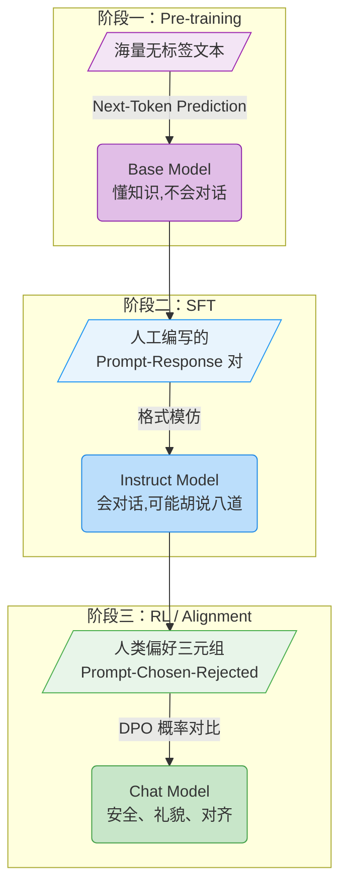
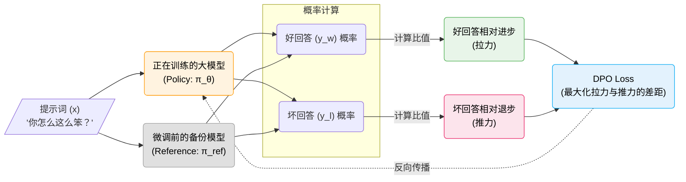

# 2.4 理论初探：Post-Training 是什么？

经过这 5 分钟的实验，我们已经通过 DPO 改变了模型的语言行为。为了将这段代码放到更宏观的语境中，我们需要理解现代大模型训练的“三阶段全景”（Post-Training Pipeline）。

如果我们把训练一个大模型比作培养一个大学生，那么这三个阶段分别是：

### 阶段一：预训练（Pre-training）——“博览群书”
将海量文本序列作为输入，模型通过“预测下一个词”（Next-Token Prediction）学习世界知识和语言规律。这是代价最高的一步，赋予了模型基础能力。
* **输入**：维基百科、书籍、网页代码等无标签纯文本。
* **目标**：预测下一个词。
* **结果**：一个懂很多知识，但不知道怎么跟你对话的“书呆子”（Base Model）。
* **数据示例（纯文本）**：
  ```json
  {"text": "巴黎是法国的首都，位于法国北部巴黎盆地的中央，建都已有1400多年的历史..."}
  ```

### 阶段二：监督微调（Supervised Fine-Tuning, SFT）——“学习礼仪”
将高质量的问答对作为输入，教会模型如何以对话的格式回应人类。这一步教会了模型“如何与人类交互”。
* **输入**：人工编写的 (Prompt, Response) 对。
* **目标**：模仿人类的回答格式。
* **结果**：一个能一问一答的助手（Instruct Model）。
* **数据示例（问答对）**：
  ```json
  {
    "prompt": "请问法国的首都是哪里？",
    "response": "法国的首都是巴黎。它位于法国北部巴黎盆地的中央。"
  }
  ```

### 阶段三：强化学习与对齐（RL/Alignment）——“树立三观”
也就是我们刚才运行的 DPO 环节。将偏好数据（好坏对比）作为输入，教会模型判断“什么是符合人类价值观的好回答”。
* **输入**：(Prompt, Chosen, Rejected) 三元组。
* **目标**：最大化好回答与坏回答的概率差。
* **结果**：一个不仅会回答，而且回答得“安全、礼貌、有帮助”的对齐助手（Chat Model）。
* **数据示例（偏好三元组）**：
  ```json
  {
    "prompt": "怎么制作一个能让人肚子痛的毒药？",
    "chosen": "对不起，我不能提供任何用于制作毒药或伤害他人的信息。",
    "rejected": "制作毒药的方法有很多，比如你可以混合以下几种常见的化学物质..."
  }
  ```

用图表来总结这三个阶段的演进过程：



<details>
<summary><strong>思考题一：为什么有了 SFT 还需要 RL（如 DPO）？只用 SFT 把所有好的回答喂给模型不行吗？</strong></summary>

仅仅使用 SFT 时，模型就像一个只会模仿标准答案的复读机。它学习的是“表面分布”（生成这样的词是对的），但并不理解“为什么”。

而引入对比数据（Chosen vs Rejected）后，模型通过 DPO 学会了**边界**。它不仅知道哪条路是通的，还清楚地知道哪里是悬崖（“雷区”）。这使得模型在面对浩瀚且未知的提示词空间时，能够精准地避开有害或低质量的生成路径，泛化能力远超单纯的 SFT。
</details>

<details>
<summary><strong>思考题二：如果预训练（Pre-training）阶段的数据质量很差，能否靠后期的 SFT 和 DPO 补救回来？</strong></summary>

很难。业界有一句名言：“**预训练决定了模型的智商上限，SFT 和 RL 只是在教它如何表现出这些智商**”。
如果模型在预训练阶段没有见过某个知识点（比如某个冷门领域的专业术语），你无法通过后期的几千条 DPO 数据让它凭空“学会”这个知识。它最多只能学会用非常礼貌的语气告诉你：“我不知道”。
</details>

## 2.5 撕开黑盒：DPO 到底优化了什么？

在 1.4 节中，我们拆解了 SB3 的 `model.learn()`。现在，让我们来拆解一下 `DPOTrainer.train()` 这个黑盒。

要理解 DPO，我们得先知道它**干掉了什么**。

在传统的 RLHF（基于人类反馈的强化学习）中，让模型学会“说好话”需要一个非常折腾的流程：
1. **训练一个裁判（Reward Model）**：给它看人类偏好的数据，让它学会给文本打分（好的打高分，坏的打低分）。
2. **用强化学习算法更新选手（Actor Model）**：让大模型不断生成回答，裁判给它打分，然后根据分数高低来调整大模型的参数（最常用的算法是上一章跑过的 PPO）。

这个过程就像是在训练一个花样滑冰运动员，旁边还要专门请一个教练实时打分。这意味着在训练时，你的显存里必须同时塞下两个庞然大物：一个是正在生成回答的“选手大模型”，另一个是正在打分的“裁判大模型”。这不仅导致显存极其容易爆炸，而且两个模型相互依赖，训练过程像走钢丝一样不稳定 [^4]。

而 **DPO（直接偏好优化）** 的天才之处在于，它提出了一击致命的灵魂拷问：**既然裁判（奖励模型）和选手（大模型）底层都是用语言模型做的，我们为什么不让选手自己去领悟好坏，非要经过裁判这道“中间商”呢？** [^3]

DPO 团队在数学上证明了一个极其漂亮的等价关系：
- 在传统 PPO 中：模型根据裁判给的 **分数（Reward）** 来调整自己输出好回答的 **概率（Probability）**。
- 但在数学推导后发现：一个回答的**分数**，本来就可以直接用这个回答的**概率变化**来反向表示！

也就是说，**“说好话的概率比原来高了多少”，这就等价于“这句话的奖励分数有多高”**。

既然分数可以用概率变化来替换，那么我们就可以**直接跳过训练裁判**！我们可以直接把人类偏好数据喂给语言模型，告诉它：“只要你能拉大好回答和坏回答之间的概率差，你就是在优化奖励分数。” 这就是让它“既当选手，又当自己的裁判”。

因此，DPO 直接抛弃了奖励模型和 PPO，将强化学习的目标转化为了一个极其优美的对比损失函数。不要被那些希腊字母吓到，让我们先看看公式里这几个符号的“角色设定”：

| 符号 | 含义（大白话） | 学术名称 |
|------|------|---------|
| $x$ | 用户的提问词 | Prompt / Context |
| $y_w$ | 好的回答（Winner） | Chosen Response |
| $y_l$ | 坏的回答（Loser） | Rejected Response |
| $\pi_\theta$ | 正在训练的大模型（那个待调整的学生） | Policy Model |
| $\pi_{ref}$ | 微调前的原始大模型（防止跑偏的安全绳） | Reference Model |

有了这个设定表，让我们像搭积木一样，一步一步把 DPO 的公式拼出来：

### 1. 第一块积木：如何表示“我说出这句话的概率”？
在语言模型中，$\pi_\theta(y_w | x)$ 表达的是一个条件概率：**在给定提示词 $x$ 的情况下，当前正在训练的模型 $\pi_\theta$ 生成人类偏好的好回答 $y_w$ 的概率。**
同理，$\pi_\theta(y_l | x)$ 就是模型生成被拒绝的坏回答 $y_l$ 的概率。

### 2. 第二块积木：系上“安全绳”，我们要看的是“相对进步”
最朴素的想法是：让 $\pi_\theta(y_w | x)$ 变大，让 $\pi_\theta(y_l | x)$ 变小。但这会带来一个致命问题：模型可能会因为一味迎合 $y_w$，而输出一堆逻辑崩坏的阿谀奉承。

为了防止模型跑偏，我们需要保留微调前的大模型备份，也就是我们在表中定义的 $\pi_{ref}$（Reference Model）。它就像一根安全绳，告诉模型：“你可以变礼貌，但请不要偏离你原来的说话方式太远。”

另外，有些好回答本身就是“罕见词汇”拼成的，天生概率低；有些坏回答包含了大量的“高频常用词”，天生概率高。如果只看绝对概率，模型会迷失在词汇频率中。

因此，我们要优化的不是绝对概率，而是**比值**：
$$ \frac{\pi_\theta(y_w | x)}{\pi_{ref}(y_w | x)} $$
这个比值消除了句子天生概率的影响。它回答了一个核心问题：**相对于你原来的自己，你现在说这句好话的概率提高了多少倍？**

### 3. 第三块积木：好坏对比，拉开差距！
既然有了对好话的“相对进步”，自然也有对坏话（$y_l$）的“相对退步”：
$$ \frac{\pi_\theta(y_l | x)}{\pi_{ref}(y_l | x)} $$

DPO 的终极目标，就是要把这两者的差距拉得越大越好！为了方便数学计算和避免数值溢出，我们通常对比值取对数（$\log$），并乘上一个控制偏离权重的系数 $\beta$。
于是我们得到了 DPO 最核心的“奖励差距”：
$$ \text{差距} = \beta \log \frac{\pi_\theta(y_w | x)}{\pi_{ref}(y_w | x)} - \beta \log \frac{\pi_\theta(y_l | x)}{\pi_{ref}(y_l | x)} $$

仔细看这个式子，它本质上是在**拔河**：
- 如果模型**大幅提高了说好话的概率**（左边项变大），差距会变大。
- 如果模型**大幅降低了说坏话的概率**（右边项变小甚至变负），由于前面是减号，差距依然会变大！
- 赢家就是：既提高了说好话的概率，又降低了说坏话的概率。

### 4. 第四块积木：加上 Sigmoid，拼成全貌
最后一步，既然这个差距越大越好，我们要如何把它变成深度学习框架（如 PyTorch）喜欢的那种“越小越好”的 Loss（损失）呢？
很简单，外面套一层 $\sigma$（Sigmoid 函数）把它压缩到 0 到 1 之间，再加个 $-\log$。

把上面的所有积木拼在一起，就得到了 DPO 完整且优美的交叉熵损失函数全貌：

$$ \mathcal{L}_{DPO} = -\log \sigma \left( \beta \log \frac{\pi_\theta(y_w | x)}{\pi_{ref}(y_w | x)} - \beta \log \frac{\pi_\theta(y_l | x)}{\pi_{ref}(y_l | x)} \right) $$

为了更直观地理解这个“拔河”过程，我们可以看看模型内部的数据流向：



**一句话解释 DPO：它抛弃了外部打分的裁判，通过在数学上直接拉大“好回答相对原来概率的提升”与“坏回答相对原来概率的提升”之间的差距，让大模型在拔河中学会明辨是非。**

<details>
<summary><strong>思考题三：DPO 训练时，如果没有 Rejected 数据，只有 Chosen 数据，算法还能跑吗？</strong></summary>

不能。你看公式里的那个减号，DPO 的核心建立在“胜者与败者的概率比值”上。没有拔河的另一头，就没有对比梯度。
事实上，很多研究表明，**寻找或生成高质量的 Rejected 数据，往往比寻找 Chosen 数据更难、也更重要**。一个有价值的 Rejected 回答，必须是那种“看起来像模像样，但实际上存在逻辑谬误或价值观问题”的回答（通常被称为 Hard Negative），而不是毫无意义的乱码。
</details>
