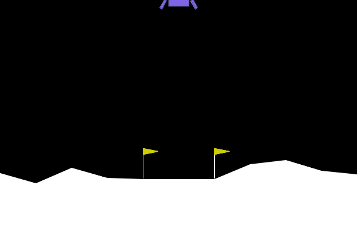
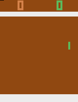

---
outline:
  level: [2, 3]
---

# 4.6 动手：视觉游戏项目

前面几节已经把 DQN 的三个核心部件分开讨论过：
Q 网络估计动作价值，
经验回放打散样本相关性，
目标网络稳定 TD Target。
到这里，公式本身已经不再陌生。
新的问题是：
这些部件进入一个完整训练任务时，
分别承担什么作用？

本节先从 LunarLander 开始。
它的状态仍然是 8 个数字，
动作仍然是 4 个离散选择；
但飞船的位置、速度、角度和落地接触都会影响奖励，
训练曲线也会出现明显波动。
这样的环境适合观察 DQN 的基本闭环：
智能体如何从交互样本中逐步学出
“在当前状态下哪个动作更有价值”。

随后，状态从 8 个数字变成屏幕像素。
DQN 的 TD 目标不变，
变化的是状态表示和训练条件：
MLP 要换成 CNN，
单帧要变成帧堆叠，
短训练要变成百万级环境步的实验。
最后，ViZDoom 和宝可梦用于说明边界：
动作离散并不意味着朴素 DQN 一定适合。

**本节导读**

**核心内容**

- 在 LunarLander 上从零搭出一个最小 DQN，读懂 Q 网络、经验回放、目标网络和探索策略在代码里的位置。
- 解释为什么从低维状态迁移到 Atari 像素输入时，真正新增的问题是表示学习和训练条件，而不是 TD Target 本身。
- 给出一个真实可训练的 Atari DQN 实验，并说明它和教学片段相比多了哪些稳定训练所必需的设置。
- 给出一套选择 DQN 任务的判断标准：Atari、Classic Control、LunarLander、GridWorld、小型 2D 游戏和自定义离散动作任务。
- 在附录中用 ViZDoom 和宝可梦作为边界案例，理解部分可观测、稀疏奖励和长时规划为什么会让朴素 DQN 变吃力。

**核心公式**

$$
y_i = r_i + \gamma(1-d_i)\max_{a'}Q(s'_i,a';\theta^-)
\quad \text{（用目标网络构造 TD Target）}
$$

$$
\mathcal{L}(\theta)
=
\frac{1}{B}\sum_{i=1}^{B}
\left(y_i-Q(s_i,a_i;\theta)\right)^2
\quad \text{（一批样本上的均方 TD Error）}
$$

第一行构造目标值：
一条经验给当前动作提供了一个学习目标。
第二行计算误差：
当前 Q 网络给出的 $Q(s_i,a_i;\theta)$
与目标值之间相差多少。
经验回放决定这批样本从哪里来，
目标网络决定 $y_i$ 使用哪套参数计算，
梯度下降则推动 $\theta$ 向误差更小的方向移动。

## 4.6.1 在 LunarLander 中训练 DQN

LunarLander 中，智能体控制一艘小型登月舱，目标是尽量平稳地落在两个旗帜之间。动作只有 4 个：不喷、开左侧喷口、开主发动机、开右侧喷口。状态是一个 8 维向量，包含飞船的位置、速度、角度和支架接触信息。


DQN 要学习的不是"这个状态好不好"，而是"在这个状态下，各个动作分别有多大价值"。Q 网络的输入是 8 个状态数字，输出是 4 个动作价值。网络结构很简单：两个隐藏层，每层 128 个神经元，最后输出 4 个数。

```python
class QNetwork(nn.Module):
    def __init__(self, state_dim=8, action_dim=4, hidden_dim=128):
        super().__init__()
        self.net = nn.Sequential(
            nn.Linear(state_dim, hidden_dim), nn.ReLU(),
            nn.Linear(hidden_dim, hidden_dim), nn.ReLU(),
            nn.Linear(hidden_dim, action_dim),
        )
    def forward(self, x):
        return self.net(x)
```

第一个尝试应该尽量简单：每一步交互完，立刻用这条经验更新网络。没有回放池，没有目标网络，只有一个 Q 网络在线学习。

### 尝试一：在线更新

```python
env = gym.make("LunarLander-v3")
q_net = QNetwork()
optimizer = torch.optim.Adam(q_net.parameters(), lr=1e-3)
gamma = 0.99

for episode in range(800):
    state, _ = env.reset(seed=episode)
    total_reward = 0.0

    while True:
        # ε-贪心选动作
        if random.random() < 0.1:
            action = env.action_space.sample()
        else:
            with torch.no_grad():
                action = int(q_net(torch.FloatTensor(state)).argmax())

        next_state, reward, terminated, truncated, _ = env.step(action)
        done = terminated or truncated
        total_reward += reward

        # 立刻用这条经验更新
        q_value = q_net(torch.FloatTensor(state)).gather(0, torch.LongTensor([action]))
        with torch.no_grad():
            next_q = q_net(torch.FloatTensor(next_state)).max()
            target = reward + (0.0 if done else gamma * next_q)
        loss = nn.functional.mse_loss(q_value, torch.FloatTensor([target]))

        optimizer.zero_grad()
        loss.backward()
        optimizer.step()

        state = next_state
        if done:
            break
```

这段代码跑起来会发现两个典型问题。

第一，样本高度相关。飞船连续几十步都在下降，网络反复看到"下降状态"，很快就会忘记起飞和着陆该怎么做。训练曲线震荡剧烈，今天学会的减速，明天就忘。


第二，移动目标。Q 网络的更新目标是 `r + γ * max Q(s')`，但 `max Q(s')` 也是由同一个 Q 网络计算的。每更新一次参数，目标值就跟着变，网络像是在追一个不断移动的影子。


这两个问题不是 LunarLander 独有的。任何用神经网络做 Q 值近似的在线学习都会遇到。DQN 的解决方案是加两个组件：经验回放和目标网络。

### 改进一：经验回放

经验回放的做法是把交互得到的转移先存起来，再随机抽取小批量进行训练。它解决的不是 TD Target 怎么算，而是每次更新时网络应当看到什么样的数据。

```python
from collections import deque

class ReplayBuffer:
    def __init__(self, capacity=100_000):
        self.buffer = deque(maxlen=capacity)

    def push(self, state, action, reward, next_state, done):
        self.buffer.append((state, action, reward, next_state, done))

    def sample(self, batch_size):
        batch = random.sample(self.buffer, batch_size)
        states, actions, rewards, next_states, dones = zip(*batch)
        return (
            torch.FloatTensor(np.array(states)),
            torch.LongTensor(actions),
            torch.FloatTensor(rewards),
            torch.FloatTensor(np.array(next_states)),
            torch.FloatTensor(dones),
        )

    def __len__(self):
        return len(self.buffer)
```

回放池可以看作一个不断更新的训练集。智能体每走一步就追加一条经验；网络每更新一次，就从这份训练集中随机抽取一批样本。这样带来两个直接结果：样本相关性下降，旧经验可以被重复使用。一次失败着陆虽然只发生了一次，但只要还在回放池中，之后仍然可能被抽到并用于修正 Q 网络。


需要注意的是，经验回放并不会让样本真正变成独立同分布。它只是把连续轨迹打散成更接近监督学习小批量的形式。回放池太小，样本仍然容易被最近轨迹主导；回放池太大，早期低质量随机经验会保留更久。容量、开始学习前的填充步数和采样批量大小，都会影响稳定性。

### 改进二：目标网络

目标网络是一个"滞后"的 Q 网络。它的参数不是每步都更新，而是每隔固定步数才从在线网络复制一次。TD Target 的计算使用这个滞后网络的输出，而不是在线网络的最新输出。

```python
q_net = QNetwork(state_dim=8, action_dim=4)
target_net = QNetwork(state_dim=8, action_dim=4)
target_net.load_state_dict(q_net.state_dict())  # 初始时同步

# 训练时：
# q_values 来自 q_net（在线网络）
q_values = q_net(states).gather(1, actions.unsqueeze(1)).squeeze(1)

# targets 来自 target_net（目标网络）
with torch.no_grad():
    next_q_values = target_net(next_states).max(dim=1)[0]
    targets = rewards + gamma * (1 - dones) * next_q_values

loss = nn.functional.mse_loss(q_values, targets)
# ... 反向传播更新 q_net

# 每隔 target_update 步，把 q_net 复制给 target_net
if steps_done % target_update == 0:
    target_net.load_state_dict(q_net.state_dict())
```

目标网络的作用是固定住 TD Target 中的"下一状态价值"，让它在若干次更新内保持不变。在线网络可以在这几轮更新中朝着一个稳定的方向调整，而不是追逐自己刚刚改过的数值。

把这两个改进加到在线版本上，训练就会明显稳定很多。

### 改进三：ε-贪心衰减

探索也不能一成不变。如果 ε 始终固定为 0.1，智能体永远有 10% 的概率随机乱喷，永远学不到精细控制。如果 ε 一开始就设为 0，智能体只按随机初始化的 Q 值行动，根本收集不到有效经验。

合理的做法是让 ε 从 1.0 逐渐衰减到 0.05：前期多探索，后期多利用。

```python
def epsilon(steps_done):
    progress = min(steps_done / epsilon_decay, 1.0)
    return epsilon_start + progress * (epsilon_end - epsilon_start)
```

前 2 万步 ε 接近 1.0，智能体几乎完全随机行动，回放池被各种失败和意外填满。随着 ε 下降，智能体越来越多地依赖 Q 网络的判断，但同时也保留了少量随机动作来继续发现新状态。

### 完整训练闭环

把上面三个改进拼在一起，得到完整的 DQNAgent：

```python
class DQNAgent:
    def __init__(self, state_dim=8, action_dim=4, lr=1e-3, gamma=0.99,
                 epsilon_start=1.0, epsilon_end=0.05, epsilon_decay=20_000,
                 batch_size=64, target_update=1_000):
        self.action_dim = action_dim
        self.gamma = gamma
        self.batch_size = batch_size
        self.target_update = target_update
        self.steps_done = 0

        self.epsilon_start = epsilon_start
        self.epsilon_end = epsilon_end
        self.epsilon_decay = epsilon_decay

        self.q_net = QNetwork(state_dim, action_dim)
        self.target_net = QNetwork(state_dim, action_dim)
        self.target_net.load_state_dict(self.q_net.state_dict())
        self.target_net.eval()

        self.optimizer = torch.optim.Adam(self.q_net.parameters(), lr=lr)
        self.buffer = ReplayBuffer()

    def epsilon(self):
        progress = min(self.steps_done / self.epsilon_decay, 1.0)
        return self.epsilon_start + progress * (self.epsilon_end - self.epsilon_start)

    def select_action(self, state):
        self.steps_done += 1
        if random.random() < self.epsilon():
            return random.randrange(self.action_dim)
        with torch.no_grad():
            return int(self.q_net(torch.FloatTensor(state).unsqueeze(0)).argmax(dim=1).item())

    def update(self):
        if len(self.buffer) < self.batch_size:
            return None

        states, actions, rewards, next_states, dones = self.buffer.sample(self.batch_size)

        # 在线网络给出当前动作的 Q 值
        q_values = self.q_net(states).gather(1, actions.unsqueeze(1)).squeeze(1)

        # 目标网络给出 TD Target
        with torch.no_grad():
            next_q_values = self.target_net(next_states).max(dim=1)[0]
            targets = rewards + self.gamma * (1 - dones) * next_q_values

        loss = nn.functional.mse_loss(q_values, targets)
        self.optimizer.zero_grad()
        loss.backward()
        torch.nn.utils.clip_grad_norm_(self.q_net.parameters(), 10)
        self.optimizer.step()
        return float(loss.item())

    def update_target(self):
        self.target_net.load_state_dict(self.q_net.state_dict())
```

外层训练循环负责按时间顺序连接这些步骤：交互、存储、学习、同步。

```python
env = gym.make("LunarLander-v3")
agent = DQNAgent()

for episode in range(800):
    state, _ = env.reset(seed=episode)
    total_reward = 0.0

    while True:
        action = agent.select_action(state)
        next_state, reward, terminated, truncated, _ = env.step(action)
        done = terminated or truncated

        agent.buffer.push(state, action, reward, next_state, float(done))
        agent.update()

        if agent.steps_done % agent.target_update == 0:
            agent.update_target()

        state = next_state
        total_reward += reward
        if done:
            break

    if (episode + 1) % 50 == 0:
        print(f"Episode {episode + 1} | Avg50={np.mean(reward_history[-50:]):.1f}")
```

这段循环可以按"交互、存储、学习、同步"四个词来读。训练曲线不一定平滑上升——策略可能先学会减速，随后又因为探索或 Q 值偏差而退步。评估时不应只看某一局，而应与随机策略基线比较。随机策略通常在 -200 左右；DQN 如果能把平均回报稳定推到明显高于这个水平，就说明学到了一部分控制规律。

### 训练结果可视化

下图是训练好的模型实际运行 3 个 episode 的着陆过程。每个 episode 独立渲染，动作按 Q 值最大选取（无探索）。为了让页面阅读不被长动画打断，动图都压到 150 帧以内；括号里的步数仍然是环境中的真实交互步数。正式评估仍应使用多局完整 episode 的平均回报。

如果想重新查看这组可视化，可以运行本节配套脚本 `code/chapter04_dqn/render_lunarlander_split.py`。下面的命令会用指定 seed 重新渲染三个原始 episode；讲义中的 GIF 为了页面加载速度，又在此基础上做了抽帧压缩。

```bash
python code/chapter04_dqn/render_lunarlander_split.py \
  --model output/dqn_gym/LunarLander-v3/final_model.zip \
  --output-dir output/lunarlander_episodes \
  --episodes 3 \
  --seeds 9 10019 171 \
  --max-steps 1000 \
  --fps 30
```

先明确标准。LunarLander 的单局"成功降落"不是只看飞船有没有碰到地面，而是看它是否在两个旗帜之间平稳落下：接近落地区域、水平和垂直速度较小、机身角度稳定、支架接触地面，并且没有坠毁。回报可以把这些因素合在一起读：单局超过 200 通常可以看作一次高质量成功降落；100 到 200 说明策略大体有效但动作仍有浪费或风险；明显低于 100 往往意味着落点、速度、姿态或终止方式出了问题。环境层面的"解决"则不能靠单局判断，通常要看多局平均回报是否稳定超过 200。

这里还要注意一个容易误读的地方：姿态扣分并不是没有，Gymnasium 的 LunarLander 会在 shaping 中使用 `-100 * abs(angle)` 惩罚机身角度，同时也惩罚位置偏差、速度偏差，并奖励支架接触。真正加入每步回报的是相邻两步 shaping 的差值，再叠加燃料惩罚和终止奖励。因此，一个 episode 的总回报不是只由最后姿态决定；如果飞船没有坠毁、位置和速度改善较多，即使过程中姿态看起来不够漂亮，也可能得到中等正回报。反过来，姿态失控如果导致偏离落地区域、硬着陆或坠毁，就会通过终止方式和前面的速度、位置项一起表现为低分。

**Episode 1（回报 313.7，263 步）** — 这是一局高分成功降落。飞船较快进入可控下降状态，接近地面前把速度压住，最后在落地区域内接触地面。它的分数最高，主要来自落点、速度和姿态都较好；但肉眼看不一定处处比 Episode 2 更漂亮，因为回报还包含燃料消耗、位置 shaping 和接触奖励等细节。


**Episode 2（回报 173.2，676 步）** — 这是一局中等成功。飞船最终能落下来，但过程拖得更长，中间需要反复修正姿态和位置，说明策略没有很快找到干净的下降路径。它仍然明显好于失败局，是因为最后没有坠毁；但回报只有 100 多分，说明动作效率、燃料消耗和稳定性都不如高分样例。


**Episode 3（回报 5.9，104 步）** — 这是一局明显失败。飞船偏离稳定下降路径后没有恢复姿态，落地时两条支架都没有形成正常接触，更接近"飘出去后坠毁/硬着陆"的失败，而不是悬停到超时。它的回报虽然不是最小的负数，但视觉上更清楚地展示了失败的终止方式。



三个 episode 按回报从高到低排列，差异直接体现了评估的关键原则：不能只看单局表现。Episode 1 是高分成功，Episode 2 是 100 多分的中等成功，Episode 3 是明显失败。评估时应看多次平均，而非单局。

### 实际训练曲线

本节配套代码用 Stable-Baselines3 的 DQN 实际跑了一次 `LunarLander-v3`（seed=0）。训练 `100000` 个环境步，每 `10000` 步用 5 个 episode 做确定性评估。


评估均值从第 `10000` 步的 `-225.79` 上升到第 `100000` 步的 `253.12`。训练结束后的独立评估为 `175.30 ± 64.79`。

这条曲线说明了 DQN 的学习不是单调上升。第 `60000` 步附近策略已经明显优于随机策略，但第 `80000` 步又出现回落，随后在第 `100000` 步重新达到较高评估回报。讲义中的"训练成功"不是看某一局着陆是否漂亮，而是看多次评估的平均回报是否整体脱离随机基线。

同一个脚本换 seed 再跑一次，结果可能完全不同。例如 seed=42 在 100k 步后评估回报仍在负数附近徘徊，seed=123 在 300k 步后最高只到过 186 随后回落。这说明朴素 DQN 对初始条件和超参数仍然敏感，也是后续改进（Double DQN、Dueling DQN 等）的意义所在。

测试时要关闭探索，只按 Q 值最大的动作行动，否则评估结果会混入随机动作，无法判断网络本身学得如何。

```python
test_env = gym.make("LunarLander-v3")
returns = []
for seed in range(10):
    state, _ = test_env.reset(seed=10_000 + seed)
    total_reward = 0.0
    while True:
        with torch.no_grad():
            action = int(agent.q_net(torch.FloatTensor(state).unsqueeze(0)).argmax(dim=1).item())
        state, reward, terminated, truncated, _ = test_env.step(action)
        total_reward += reward
        if terminated or truncated:
            break
    returns.append(total_reward)
print(f"测试平均回报: {np.mean(returns):.1f}")
```

要稳定解决环境，通常还需要更长训练、更稳的超参数，或者 Double DQN、Dueling DQN 等改进。到这一步，状态是 8 个数字，网络输出 4 个动作价值，回放池打散经验，目标网络稳定 TD Target——完整的 DQN 训练闭环已经出现。

接下来，状态将从数值向量变成一张屏幕。

## 4.6.2 从向量到像素

DQN 真正引起广泛关注，来自它在像素输入任务上的表现。

DeepMind 2015 年发表在 Nature 上的论文[^mnih2015]展示了一个程序：只使用屏幕像素和游戏得分，就在 29 种 Atari 游戏中达到人类水平。这个结果的意义不只是网络变大，而是说明 Q-Learning 可以和表示学习结合——智能体不再需要人手提供球的位置、速度和距离，而是从图像中直接学习这些决策线索。

下面的架构图展示了 DQN 如何从原始像素出发，经过卷积网络输出每个动作的 Q 值：

, Figure 1）](./images/dqn-architecture.png)

LunarLander 的状态是 8 个数字，Q 网络只需要一个 MLP。Atari Pong 的状态则是一张屏幕：输入是像素，不是球和球拍的显式坐标。此时不需要改变 TD Target，DQN 的学习目标仍然是

$$
r+\gamma\max_{a'}Q(s',a';	heta^-)
$$

改变的是 $Q(s,a;	heta)$ 中的状态表示。

网络必须先从图像中学习有用特征，再输出动作价值。LunarLander 中的问题是：如何用 8 个数字估计动作价值。Atari 中的问题变成：如何先把屏幕变成可用于决策的表示。

这个区别最直接的体现是状态和网络的组合。

LunarLander 用 8 维向量配 MLP，关键困难是控制噪声和训练波动，可以作为课堂短训练。Atari Pong 用 4 帧堆叠的 84×84 图像配 CNN 加全连接层，关键困难是从像素中提取位置、速度和运动方向，训练成本通常需要数百万到千万级环境步。

其中最关键是状态表示。

单张图像只显示"球在哪里"，无法显示"球往哪里走"。连续几帧放在一起，网络才能从位置变化中推断速度和方向。帧堆叠的作用，是把静态图片变成包含短期运动信息的状态。

Gymnasium 提供了常用预处理。下面的代码用于理解输入形状，但还不是完整训练实验——它回答的基础问题是：如何把游戏画面整理成 CNN 能处理的张量。

```python
import gymnasium as gym

def make_atari_env(game_id="ALE/Pong-v5"):
    env = gym.make(game_id)
    env = gym.wrappers.AtariPreprocessing(
        env,
        grayscale_obs=True,
        scale_obs=True,
        frame_skip=4,
    )
    env = gym.wrappers.FrameStackObservation(env, stack_size=4)
    return env

env = make_atari_env()
state, _ = env.reset()
print(state.shape)  # (4, 84, 84)
```

这段代码包含三步：灰度化减少颜色维度，缩放到 84×84 降低计算量，帧堆叠保留运动信息。处理后，输入从原始游戏画面变成适合 CNN 的张量。这一步还没有开始学习，只是把观测整理成可学习的形式。

### 像素状态表示

```python
class CNNQNetwork(nn.Module):
    def __init__(self, input_channels=4, num_actions=6):
        super().__init__()
        self.conv = nn.Sequential(
            nn.Conv2d(input_channels, 32, kernel_size=8, stride=4),
            nn.ReLU(),
            nn.Conv2d(32, 64, kernel_size=4, stride=2),
            nn.ReLU(),
            nn.Conv2d(64, 64, kernel_size=3, stride=1),
            nn.ReLU(),
        )
        self.fc = nn.Sequential(
            nn.Linear(64 * 7 * 7, 512),
            nn.ReLU(),
            nn.Linear(512, num_actions),
        )

    def forward(self, x):
        x = x / 255.0
        x = self.conv(x)
        x = x.view(x.size(0), -1)
        return self.fc(x)
```

这不是一套新算法。网络仍然输出每个动作的 Q 值，仍然使用经验回放和目标网络训练。变化发生在前半段：网络从读取 8 个数字，变成读取图像局部结构。卷积层学习边缘、形状和运动线索，全连接层再把这些线索合成动作价值。

MLP 与 CNN 的区别在于输入假设。MLP 假设每个输入维度已经是有意义的状态特征；CNN 则假设空间邻近的像素之间存在局部结构。对于 Pong，球、球拍和边界都由局部像素组成，卷积正适合提取这些模式。

和 LunarLander 相比，Atari 版本的训练条件也有明显变化。

像素有空间结构，MLP 展平后会浪费这种结构，因此需要 CNN。单帧无法判断运动方向，因此需要帧堆叠。图像状态更多样，需要更大的回放池来保存经验。不同 Atari 游戏奖励尺度不同，需要奖励裁剪来统一训练信号。CNN 参数更多，训练时更容易出现不稳定更新，因此需要梯度裁剪。像素任务更难，目标网络需要保持更长时间的稳定性，因此同步频率更慢。

因此，从 LunarLander 到 Atari 的迁移不是简单替换 `env_id`。

TD 学习的骨架没有变；变复杂的是状态表示和训练条件。教学片段可以说明原理，真实 Atari 训练还需要加入环境预处理、评估和保存等实验环节。


## 4.6.3 真实 Atari 训练

前面的代码片段说明了 CNN 和帧堆叠的必要性，
但它还不是一个可靠的 Atari 实验。
完整训练中，失败往往不是因为少写一层卷积，
而是因为环境预处理、探索、回放池、学习起点和评估方式没有统一。
CleanRL 的 `dqn_atari.py`、Stable-Baselines3 的 DQN，
以及 RL-Baselines3-Zoo 的 Atari 配置，
都采用了相似的实验结构：
先用 Atari wrapper 标准化环境，
再让 DQN 在足够长的交互中积累经验。[^cleanrl-dqn] [^sb3-dqn] [^sb3-atari] [^rlzoo-dqn]


从教学代码走向真实 Atari 实验时，
第一个变化是训练时间尺度。
短实验的作用是确认环境、预处理、评估和模型保存彼此连通；
它不能证明策略已经学会打 Pong。
长实验才用于观察评估回报是否持续脱离随机水平。
因此，下面的命令应当被读作两种实验目的，
而不是两个互相替代的超参数组合。

::: details 实验入口：从短实验到长实验

```bash
pip install -r code/chapter04_dqn/requirements.txt

# 讲义图像使用的 smoke run：只验证真实 Atari 训练链路
python code/chapter04_dqn/dqn_atari_sb3.py \
  --env-id ALE/Pong-v5 \
  --total-timesteps 5000 \
  --learning-starts 10000 \
  --eval-freq 2500 \
  --eval-episodes 1 \
  --checkpoint-freq 5000 \
  --output-dir output/dqn_atari_runs \
  --run-name ALE_Pong-v5_dqn_seed0 \
  --no-swanlab

# 课堂短实验：确认环境、wrapper、日志和模型保存彼此连通
python code/chapter04_dqn/dqn_atari_sb3.py \
  --env-id ALE/Pong-v5 \
  --total-timesteps 200000 \
  --learning-starts 10000 \
  --swanlab-run-name DQN-Pong-smoke

# 长实验：观察评估回报是否形成稳定趋势
python code/chapter04_dqn/dqn_atari_sb3.py \
  --env-id ALE/Pong-v5 \
  --total-timesteps 5000000 \
  --learning-starts 100000 \
  --checkpoint-freq 250000 \
  --eval-freq 50000 \
  --swanlab-run-name DQN-Pong-long
```

训练日志会写到 `output/dqn_atari/`。
观察训练过程时，
应优先看评估回报是否逐渐脱离随机水平，
而不是只看 loss 是否下降：

```bash
tensorboard --logdir output/dqn_atari

# 将本地 eval CSV 重新导出为讲义图片
python code/chapter04_dqn/export_dqn_curves.py --run pong

# 将训练好的模型渲染成讲义中的 Pong GIF
python code/chapter04_dqn/render_atari.py \
  --model output/dqn_atari_runs/ALE_Pong-v5_dqn_seed0/final_model.zip \
  --output docs/chapter04_dqn/images/dqn-atari-pong-smoke.gif \
  --seed 0 \
  --max-steps 1200 \
  --render-every 4 \
  --fps 20
```

:::

`200k` 步足以确认实验链路是否完整；
若希望看到 Pong 出现明显学习趋势，
通常需要百万级环境步。
本节也实际运行了一个 `ALE/Pong-v5` 的短实验：
训练 `5000` 个环境步，
每 `2500` 步评估 1 个 episode，
并写入评估 CSV、曲线图和模型文件。
两次评估回报都是 `-21.0`，
这符合预期：
这个规模只能证明真实 ALE 环境、Atari wrapper、CNN DQN、
模型保存和评估链路已经打通，
还不能说明策略学会了 Pong。


训练曲线只告诉我们"分数没有变好"，
还不能告诉我们智能体具体错在哪里。
因此，本节也把同一个 5k smoke 模型渲染成一局 Pong 回放：
模型使用训练时相同的 wrapper 和 4 帧堆叠来选动作，
讲义中的 GIF 则保存原始 RGB 游戏画面，
便于直接观察球、球拍和得分变化。

**Pong smoke run（回报 -21.0，757 步）** — 这是一局失败回放。球拍没有稳定跟随球的垂直位置，几乎没有形成有效防守，最后以 `-21` 结束。这个 GIF 的作用不是证明 DQN 已经学会 Pong，而是把短实验的结论可视化：环境能跑通，CNN DQN 能输出动作，评估和渲染链路能保存下来；但 5k 步远远不够让像素策略学到可用的击球规律。



把这段回放和 LunarLander 的成功着陆对比，会看到两个任务的差别。
LunarLander 的 8 维状态已经把位置、速度、角度和支架接触直接给了网络；
Pong 的网络看到的是像素堆叠，必须先从画面中分辨球和球拍，
再从连续帧里推断球的运动方向。
所以，在 Atari 中，"能显示 GIF"只是实验链路完成，
"GIF 里出现稳定策略"才说明训练开始真正有效。

RL-Zoo 的 Atari DQN 默认训练 `1e7` 步，
使用 `CnnPolicy`、4 帧堆叠、
`100000` 大小的回放池，
并在 `100000` 步后才开始学习。
这个量级来自 Atari 的数据特性：
输入是图像，
早期随机策略产生的大部分经验质量较低，
智能体必须积累足够多样的样本，
Q 网络才不至于只拟合最近一小段失败轨迹。

### 训练条件与资源

Atari DQN 的关键不在某个单独的超参数，
而在一组相互配合的训练条件。
这些条件分别回答三个问题：
观测如何整理，
样本如何积累，
训练如何稳定。

| 训练条件 | 实现中的位置 | 作用 |
| -------- | ------------ | ---- |
| `AtariWrapper` | `make_atari_env(...)` | 自动接上 no-op reset、max-and-skip、life-loss episode、Fire reset、84×84 预处理和奖励裁剪 |
| `VecFrameStack(..., 4)` | `build_env` | 把 4 帧合成一个状态，让网络看到运动方向 |
| `CnnPolicy` | `DQN("CnnPolicy", ...)` | 使用适合像素输入的卷积特征提取器 |
| `learning_starts=100000` | DQN 参数 | 先填充回放池，避免网络从极少量连续样本里过早学习 |
| `train_freq=4` | DQN 参数 | 不必每一帧都更新，降低相关样本带来的抖动 |
| `target_update_interval=1000` | DQN 参数 | 避免 TD Target 随在线网络每步同步变化 |
| `EvalCallback` 和 checkpoint | callbacks | 在长训练过程中持续保留评估结果和模型状态 |

这些处理弥补了教学片段中省略的训练条件。
`NoopReset` 让每局开头不完全一样，
避免智能体只适应固定开局。
`EpisodicLife` 把丢一条命视作训练 episode 的结束，
使 Pong、Breakout 这类游戏更快暴露错误动作的后果。
`MaxAndSkip` 每 4 帧重复一次动作并取相邻帧最大值，
既降低计算量，
也减轻 Atari 闪烁画面对观测的干扰。[^sb3-atari]

Gymnasium 的 `ALE/Pong-v5` 这类环境本身可能带默认帧跳过和 sticky action。
因此，训练入口显式将环境构造参数设为
`frameskip=1`、`repeat_action_probability=0.0`，
再交给 `AtariWrapper` 统一处理。
这样可以避免环境默认设置与 wrapper 设置叠加，
使实际 frame skip 偏离预期。

资源预期也应当跟实验问题对应起来。
如果只是确认环境、wrapper、评估和保存流程是否连通，
`100k` 到 `200k` 环境步已经足够；
这类实验在 CPU 上也能完成，
只是速度较慢。
如果目标是观察 Pong 的学习趋势，
通常需要 `1M` 到 `2M` 环境步，
并且更适合使用 GPU。
若要接近常见 Atari DQN 训练设置，
步数往往会扩大到 `5M` 到 `10M`，
此时需要保存 checkpoint、评估均值、方差和必要的视频回放。

Atari DQN 能够稳定训练，
关键不在于额外隐藏了某个新算法，
而在于这些稳定训练的条件是否齐全：
图像被压到合适尺寸，
状态包含运动信息，
奖励尺度被裁剪，
回放池足够大，
学习开始得足够晚，
目标网络更新得足够慢，
训练过程包含评估和保存。
CleanRL、RL-Zoo 和 SB3 的实现风格不同，
但对 Atari DQN 的核心判断是一致的。

## 4.6.4 其他可以尝试的 DQN 任务

除了前面的 LunarLander 和 Atari，还有更多环境适合作为 DQN 的练习入口。

只要动作离散、观测足够决策、奖励能在合理时间内反馈，就可以把 DQN 当作基线来试。但"适合"不等于"放进去就能跑"——在动手之前，有四个条件值得先过一遍。

### 什么样的任务适合 DQN

动作空间要能写成 `0, 1, ..., n_actions-1` 的离散集合。

这样 Q 网络的输出层才能一一对应。如果任务要求连续转向角、油门大小或机械臂力矩，朴素 DQN 就不再自然，应该考虑 DDPG、TD3、SAC 这类连续动作算法。

观测也要足够用来决策。

当前帧或帧堆叠应该包含关键信息。如果当前画面看不见敌人位置、任务进度藏在很长的历史里，只看当前帧的 DQN 就会缺少信息，需要增加帧堆叠、加入 RAM 特征，或者换成带记忆的网络。

奖励要能在合理时间内反馈出来。

DQN 通过 TD Target 把未来回报一步步传回。如果回放池里长期只有负样本或无意义转移，网络就不知道早期哪个动作有用。这不是公式写错了，是学习信号离动作太远。

最后，ε-贪心探索要能产生有效经验。

当动作组合太多、episode 太长、失败反馈太晚时，随机探索可能长时间收集不到有意义样本。这时需要缩小动作集合、设计阶段性奖励，或者换用更适合长时探索的方法。

不满足这些条件并不意味着 DQN 完全不行，而是说明需要额外设计：动作连续就换算法，观测缺失就加记忆，奖励稀疏就做工程或分解任务。

在这些条件之下，任务可以按状态表示的复杂度大致分成三类。

### 低维起点：Classic Control

Gymnasium 的 CartPole、MountainCar 和 Acrobot 给出低维连续状态，但动作空间是离散的。

以 CartPole 为例，状态只有小车位置、速度、杆的角度和角速度四个数，动作只有向左和向右两个选择。这类任务适合作为第一批 DQN 实验，因为失败原因容易定位：如果 CartPole 学不起来，通常说明学习率、探索衰减、回放池或目标网络中至少有一处不合适。

MountainCar 的状态更短，只包含位置和速度，但奖励更稀疏。

智能体需要通过左右摆动积累势能才能到达山顶。同样是低维控制任务，MountainCar 通常比 CartPole 更能体现探索策略的重要性。


::: details 实验入口：Classic Control

```bash
cd code
pip install -r chapter04_dqn/requirements.txt

python chapter04_dqn/dqn_gym_sb3.py \
  --env-id CartPole-v1 \
  --total-timesteps 100000 \
  --learning-starts 1000

python chapter04_dqn/dqn_gym_sb3.py \
  --env-id MountainCar-v0 \
  --total-timesteps 300000 \
  --learning-starts 5000
```

:::

在 CartPole 中，若评估回报接近环境上限，说明策略已能稳定保持杆子平衡。

在 MountainCar 中，更合理的观察对象是到达终点的频率是否上升，以及平均回报是否逐步接近较短路径对应的数值。两个任务强调的问题不同：CartPole 看更新是否稳定，MountainCar 看探索是否足够。

### 像素进阶：Atari

从低维向量到像素画面，Atari 是下一个自然台阶。

Atari 的核心变化不是 TD Target，而是状态表示从向量变成了图像。Pong、Breakout 等环境的观测是游戏画面，动作是有限个控制指令，奖励来自游戏分数。LunarLander 主要考察如何稳定学习动作价值，Atari 还额外考察如何从图像中学习状态表示，因此需要 CNN、帧堆叠和更长训练。

训练设置比网络结构本身更容易影响结果。

84×84 灰度化、帧跳过、4 帧堆叠、奖励裁剪、足够大的 replay buffer，以及较晚开始学习的 `learning_starts`——这些处理共同决定了回放池中的样本是否具有足够的多样性和稳定性。Atari 更适合作为完整视觉 DQN 实验，而不是第一个用来判断算法是否写对的环境。


::: details 实验入口：Atari Pong

```bash
python chapter04_dqn/dqn_atari_sb3.py \
  --env-id ALE/Pong-v5 \
  --total-timesteps 5000000 \
  --learning-starts 100000 \
  --checkpoint-freq 250000 \
  --eval-freq 50000
```

:::

### 自定义环境：GridWorld 与小型任务

GridWorld 提供了最透明的任务设计方式。

起点、障碍物、目标位置、动作集合和奖励函数都写在环境里，结构一目了然。状态可以用坐标、one-hot 或局部图像表示，动作通常是上下左右。当状态空间较小时，可以先用表格 Q-Learning 验证最优路径；当状态表示变为更高维特征时，再用 DQN 代替 Q 表。

如果智能体学不到有效策略，原因通常可以回到环境定义本身：奖励是否太稀疏，动作设计是否合理，episode 是否过长。

这些问题在小型任务中容易被观察到，因此 GridWorld 适合用来理解 DQN 中状态、动作和奖励的基本关系。


再往上走一步，任何动作空间为 `gym.spaces.Discrete(n_actions)` 的任务都可以尝试 DQN。

低维向量用 `MlpPolicy`，图像用 `CnnPolicy`。但"动作离散"只是必要条件——如果奖励极其稀疏、观测严重缺少信息，或者随机探索几乎无法得到有效反馈，朴素 DQN 仍然难以收敛。

综上，DQN 适用于动作离散、奖励可观测、episode 长度有限且探索能产生有效转移的任务。

当任务表现出强部分可观测、极稀疏奖励或长时规划需求时，需要结合 Double DQN、Dueling DQN、优先回放、n-step return 或记忆网络等改进。

下面的附录沿着这条边界展开：ViZDoom 主要暴露部分可观测问题，宝可梦主要暴露稀疏奖励和长时规划问题，Minecraft 则进一步把开放世界、层级目标和长程探索推到更困难的位置。


ViZDoom 原始论文就在简化场景上用卷积网络 + Q-learning + 经验回放训练了智能体。[^vizdoom-paper] DQN 可以训练，但依赖几个约束：场景专为学习设计、动作集合受控、奖励离目标行为较近、episode 长度适中。


官方示例 `examples/python/learning_pytorch.py`[^vizdoom-learning-pytorch] 结构完整：环境初始化、图像预处理（缩放到 30×45 灰度）、动作枚举（按钮 0/1 组合）、帧重复（`frame_repeat=12`）、在线/目标网络、经验回放和 Double DQN 更新。这些组件和本章前面介绍的 DQN 直接对应。

最小运行方式：

```bash
git clone https://github.com/Farama-Foundation/ViZDoom.git
cd ViZDoom
python -m venv .venv
source .venv/bin/activate
pip install vizdoom torch numpy scikit-image tqdm
python examples/python/learning_pytorch.py
```

训练时要区分两件事：一是代码路径是否完整（每个 epoch 能产出训练/测试回报），二是策略是否真正学到行为（评估回报应逐步脱离随机水平）。如果 loss 下降但评估回报长期无趋势，说明网络可能在拟合噪声。


合理的实验起点是 `simpler_basic.cfg` 或 `basic.cfg`：场景小、反馈近、移动和射击都能较快影响奖励。观测先用灰度图缩放到 84×84 或更小；动作集合保持克制（左转、右转、前进、射击），避免枚举所有按钮组合导致输出维度膨胀。


更复杂的场景（如 HealthGathering、MyWayHome）需要更长时记忆。Lample 和 Chaplot 的研究就在 DQN 思路上加入了循环记忆和辅助游戏特征预测。[^lample-chaplot] 这说明当任务需要记住来路、敌人位置或已探索区域时，短帧堆叠的 CNN-DQN 往往不够。


ViZDoom 不是否定 DQN，而是说明另一条边界：当观测本身不满足马尔可夫性时，只增加卷积深度不能自动补全缺失的历史信息。此时需要 DRQN 等记忆机制，或更强的探索与任务分解。

| 问题 | 表现 | 对 DQN 的影响 |
| ---- | ---- | ------------- |
| 第一人称视角 | 当前帧只显示面前区域 | 当前观测不能表示全局状态 |
| 3D 导航 | 距离、转角和遮挡改变动作后果 | 同一按键在不同朝向下含义不同 |
| 延迟反馈 | 当前移动可能很久之后才影响生存 | TD Target 难以把远期收益传回早期动作 |
| 动作组合 | 前进、转向、射击可组合 | 动作数膨胀后，随机探索很难采到好样本 |
| 场景过拟合 | 一个 cfg 上学到的策略未必迁移 | 需在独立场景或固定测试集上检查评估 |

## 附录：DQN 可以通关宝可梦吗？

《宝可梦红》可以被包装成 DQN 环境：屏幕是观测，方向键和 A/B/Start 是离散动作，剧情推进可以变成奖励。[^pyboy] 但和 Pong 不同，宝可梦的目标和按键之间隔着很长的行动链，随机探索几乎不会产生足够的正样本。

| 问题 | Pong | 宝可梦红 |
| ---- | ---- | -------- |
| 决策链长度 | 一局几十到几百步 | 关键目标可能隔数千步 |
| 奖励密度 | 得分变化较频繁 | 剧情和徽章奖励很稀疏 |
| 状态含义 | 球和球拍位置、速度 | 地图、坐标、菜单、剧情 flag、背包、队伍状态 |
| 探索难度 | 随机动作可较快看到反馈 | 随机动作容易原地循环或卡在菜单 |


### 早期子任务实验

Alec Letsinger 的实验将宝可梦包装为 PyBoy 环境，用 DQN 训练智能体离开起始房子并触发早期 flag。[^pokemon-dqn-house] 这个结果依赖较小的状态空间（角色位置、所在区域、flag 数），说明 DQN 可以处理早期子任务，但一旦目标继续推进，就需要对话、剧情、菜单和战斗之间的长动作序列，Q 网络很难直接学到。

PWhiddy 的 `PokemonRedExperiments`[^pokemon-red-experiments] 提供了更完整的实验基础：PyBoy 环境、ROM 校验、状态文件、地图可视化和反循环检测。这类任务的工程重点不在 `model.learn(...)`，而在环境包装：从模拟器读屏和 RAM、保存可复现起点、用地图覆盖率追踪探索、检测智能体是否卡住。

因此，宝可梦中的 DQN 目标应从短反馈任务开始：

| 训练目标 | 可用状态 | 奖励信号 | 教学意义 |
| -------- | -------- | -------- | -------- |
| 离开起始房间 | 坐标、地图编号、少量 flag | 新坐标、新地图 | 观察 DQN 是否能从局部导航中学到动作偏好 |
| 探索 Pallet Town | 屏幕图像加坐标记录 | 新位置、循环惩罚 | 观察探索覆盖是否扩大 |
| 触发早期剧情 | 坐标、地图、flag | flag 变化、关键位置奖励 | 观察稀疏事件如何进入 TD Target |
| 完整通关 | 徽章、剧情、战斗、背包和队伍状态 | 最终目标过远，单一奖励很难训练 | 说明朴素 DQN 需要分任务和更强记忆 |

### 宝可梦中的 DQN 形式

如果采用 DQN，网络结构本身不变：给定屏幕状态 $s$，输出每个按键动作的价值。输入可以是 84×84 灰度图和 4 帧堆叠；RAM 中的地图编号、坐标更适合用于构造奖励和评估指标。

| 组件 | Atari Pong | 宝可梦早期任务 |
| ---- | ---------- | -------------- |
| 观测 | 84×84 灰度，4 帧堆叠 | 同上；可记录 RAM 坐标 |
| 动作 | Atari 离散动作 | Game Boy 按键，通常 7–8 个 |
| 奖励 | 游戏分数 | 新坐标、新地图、事件变化等 shaping |
| 回放池 | 包含防守、击球、得分等短反馈 | 容易包含撞墙、原地循环、菜单状态 |
| 合理目标 | 百万级步数后观察得分趋势 | 出房间、进入新地图、扩大探索覆盖 |


**最小训练入口。**

```bash
cd code
pip install -r chapter04_dqn/requirements.txt
```

准备合法获得的 `PokemonRed.gb`，建议从已有存档 `start.state` 开始（避免消耗步数在标题菜单上）：

```bash
python chapter04_dqn/dqn_pokemon_red_pyboy.py \
  --rom /path/to/PokemonRed.gb \
  --state /path/to/start.state \
  --total-timesteps 500000 \
  --learning-starts 20000

tensorboard --logdir output/dqn_pokemon_red/tb
```

如果平均回报和 `unique_positions` 长期不动，通常不是网络不够深，而是奖励太稀疏、动作持续帧数不合适，或智能体被菜单、墙边和重复对话困住。当短训练能产生位置变化后，再扩大步数并使用多个随机种子评估，才有意义讨论策略是否稳定。

### 训练目标的边界

若任务限制在早期导航，并且奖励对新坐标、新地图和循环行为给出明确反馈，DQN 可以从 replay buffer 中采样到有用转移。完整通关则要求智能体在很长时间范围内维持目标，处理剧情、背包、队伍和战斗等隐藏状态，这超出了朴素 DQN 的能力范围。

| 朴素 DQN 的问题 | 在宝可梦里的表现 | 可能的改进 |
| ---------------- | ---------------- | ---------- |
| 随机收集经验 | 大量样本是撞墙、原地循环、反复开菜单 | 课程学习、密集奖励、优先回放 |
| 当前帧信息不完整 | 同一画面对应不同剧情 flag 或菜单状态 | 帧堆叠、RAM 特征、DRQN |
| Q 值高估 | 稀疏奖励下错误高估被反复利用 | Double DQN、Dueling DQN、n-step |
| 无效操作 | 反复开菜单、对话卡住 | action mask、anti-loop 惩罚 |
| episode 太长 | 单次失败消耗大量采样 | 存档起点、阶段目标、checkpoint |

因此，"DQN 可以通关宝可梦吗？"的精确回答是：DQN 可以在模拟器上训练早期子任务；若目标是完整通关，则需要任务拆分、奖励工程和更长时记忆。这与本节主线一致：DQN 的关键限制不是"不能看像素"，而是当奖励太远、状态太隐蔽、规划链条太长时，单纯增大 Q 网络并不能自动解决问题。


## 附录：DQN 可以通关我的世界吗？

Minecraft 是开放世界沙盒游戏，目标不是单一动作技能，而是一串相互依赖的长期任务链：砍树 → 木镐 → 石头 → 石镐 → 铁矿 → 铁锭 → 铁镐 → 钻石。


从接口上看，Minecraft 可以被包装成强化学习环境：屏幕是观测，键盘鼠标动作可离散化，获得物品可以成为奖励。[^malmo] [^minerl] 但"获得钻石"之前通常要先完成一长串中间步骤，如果只把最终成功作为奖励，随机探索几乎不会产生正样本。

MineDojo 进一步把 Minecraft 组织成开放式任务平台，包含物品收集、合成、技术树和程序生成任务。[^minedojo] 一个高层目标往往不是单个 Q 函数能短期传播完的，而是一条由许多中间步骤组成的依赖链。

因此，"能不能用 DQN 训练 Minecraft 子任务"的答案是肯定的——可以把任务限制为固定小地图中收集木头、走到指定方块、在短 episode 内获得某个物品，并用少量离散动作。此时 CNN-DQN 可以作为基线。

但"朴素 DQN 能不能从零完整通关"的答案应当谨慎得多。完整通关涉及长时记忆、层级目标、背包状态、合成配方、稀疏奖励和复杂动作空间，超出了 Atari DQN 的典型假设。更常见的路线是引入模仿学习（如 VPT[^vpt]）、世界模型（如 DreamerV3[^dreamerv3]）或语言驱动的层级策略（如 Voyager[^voyager]）。

| 目标 | DQN 是否适合 | 关键原因 |
| ---- | ------------ | -------- |
| 固定区域内收集物品 | 可以作为基线 | 动作少、奖励近、episode 较短 |
| 简短导航或拾取任务 | 可以尝试 | 状态和目标关系较直接 |
| 获得钻石 | 需要大量任务设计 | 中间步骤多，奖励极稀疏 |
| 完整通关 | 不适合朴素 DQN | 需要长期规划、记忆、合成和开放探索 |

所以，DQN 可以训练 Minecraft 中被约束好的离散子任务；若目标是从零获得钻石甚至完整通关，就需要把任务拆成层级目标，引入演示、世界模型或更强的规划机制。这与宝可梦附录的结论相似，但 Minecraft 更进一步：它不仅奖励远，动作和状态也更加开放。


## 本节收获

- 在 LunarLander 中，DQN 的核心训练循环可以概括为：交互、存储、采样、计算 TD Target、反向传播、同步目标网络。
- 从 LunarLander 到 Atari，核心公式不变，变化的是状态表示：MLP 处理向量，CNN 处理像素，帧堆叠提供运动信息。
- 真正可训练的 Atari DQN 还需要完整 wrapper 链、延迟学习、足够大的回放池、周期评估和 checkpoint；否则只能证明训练管线连通，不能证明策略已经学到稳定行为。
- DQN 适合动作离散、奖励可观测、episode 长度有限且探索能产生有效转移的任务。
- ViZDoom 提醒我们：部分可观测会让当前观测不能完整表示状态，DQN 需要记忆机制或更强表示来补足历史信息。
- 宝可梦提醒我们：DQN 可以训练真实模拟器里的神经网络 Q 策略，但完整通关需要分任务、奖励工程和更长时记忆。
- Minecraft 提醒我们：开放世界任务不仅奖励稀疏，还包含层级目标、背包状态、合成链和更复杂的动作空间。

下一节我们回到算法本身，看研究者如何沿着 DQN 继续改进：减少 Q 值高估、分离状态价值和动作优势、以及组合多个技巧形成 Rainbow。[DQN 家族与视角迁移](./dqn-family)

## 参考文献

[^mnih2015]: Mnih, V., et al. (2015). Human-level control through deep reinforcement learning. _Nature_, 518(7540), 529-533. <https://www.nature.com/articles/nature14236>

[^cleanrl-dqn]: CleanRL. DQN implementations and Atari DQN training scripts. <https://docs.cleanrl.dev/rl-algorithms/dqn/>

[^sb3-dqn]: Stable-Baselines3. DQN documentation. <https://stable-baselines3.readthedocs.io/en/master/modules/dqn.html>

[^sb3-atari]: Stable-Baselines3. Atari wrappers documentation. <https://stable-baselines3.readthedocs.io/en/master/common/atari_wrappers.html>

[^rlzoo-dqn]: RL-Baselines3-Zoo. DQN hyperparameter configuration for Atari. <https://github.com/DLR-RM/rl-baselines3-zoo/blob/master/hyperparams/dqn.yml>

[^gym-classic]: Gymnasium. Classic Control environments. <https://gymnasium.farama.org/environments/classic_control/>

[^gym-env-creation]: Gymnasium. Environment creation tutorial. <https://gymnasium.farama.org/tutorials/gymnasium_basics/environment_creation/>

[^vizdoom-official]: ViZDoom. A Doom-based AI research platform for visual reinforcement learning. <https://github.com/Farama-Foundation/ViZDoom>

[^vizdoom-paper]: Kempka, M., Wydmuch, M., Runc, G., Toczek, J., & Jaśkowski, W. (2016). ViZDoom: A Doom-based AI Research Platform for Visual Reinforcement Learning. <https://arxiv.org/abs/1605.02097>

[^vizdoom-learning-pytorch]: ViZDoom official examples. `examples/python/learning_pytorch.py`. <https://github.com/Farama-Foundation/ViZDoom/blob/master/examples/python/learning_pytorch.py>

[^lample-chaplot]: Lample, G., & Chaplot, D. S. (2016). Playing FPS Games with Deep Reinforcement Learning. <https://arxiv.org/abs/1609.05521>

[^pyboy]: PyBoy. Python API documentation for emulator control, memory and screen access. <https://docs.pyboy.dk/>

[^pyboy-screen]: PyBoy. Screen API documentation. <https://docs.pyboy.dk/api/screen.html>

[^pokemon-dqn-house]: Alec Letsinger. Reinforcement Learning: Pokemon Red. <https://aletsinger.com/projects/project-one/>

[^pokemon-red-experiments]: PWhiddy. PokemonRedExperiments. <https://github.com/PWhiddy/PokemonRedExperiments>

[^malmo]: Johnson, M., Hofmann, K., Hutton, T., & Bignell, D. (2016). The Malmo Platform for Artificial Intelligence Experimentation. <https://arxiv.org/abs/1607.05077>

[^minerl]: Guss, W. H., et al. (2019). MineRL: A Large-Scale Dataset of Minecraft Demonstrations. <https://arxiv.org/abs/1907.13440>

[^minedojo]: Fan, L., et al. (2022). MineDojo: Building Open-Ended Embodied Agents with Internet-Scale Knowledge. <https://arxiv.org/abs/2206.08853>

[^vpt]: Baker, B., et al. (2022). Video PreTraining (VPT): Learning to Act by Watching Unlabeled Online Videos. <https://arxiv.org/abs/2206.11795>

[^dreamerv3]: Hafner, D., et al. (2023). Mastering Diverse Domains through World Models. <https://arxiv.org/abs/2301.04104>

[^voyager]: Wang, G., et al. (2023). Voyager: An Open-Ended Embodied Agent with Large Language Models. <https://arxiv.org/abs/2305.16291>
