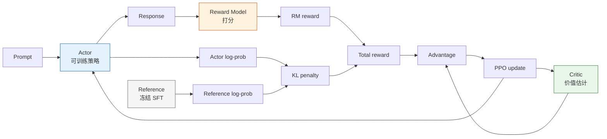

# 8.5 PPO-RLHF：按奖励练习

## 本节导读

**核心内容**

- 理解 PPO-RLHF 为什么需要 Actor、Reference、Reward Model、Critic 四个角色。
- 掌握 KL 惩罚、token-level reward、advantage、PPO clip 在 LLM 训练中的对应关系。
- 学会阅读 PPO-RLHF 训练曲线：reward、KL、长度、entropy、value loss 同时看。

**核心公式**

$$
r_t =
\begin{cases}
-\beta(\log \pi_\theta(y_t\mid s_t)-\log \pi_{ref}(y_t\mid s_t)), & t<T \\
r_{RM}(x,y)-\beta(\log \pi_\theta(y_t\mid s_t)-\log \pi_{ref}(y_t\mid s_t)), & t=T
\end{cases}
\quad \text{（RLHF token 奖励：每步 KL，末尾加 RM 分）}
$$

$$
\rho_t(\theta)=\frac{\pi_\theta(y_t\mid s_t)}{\pi_{\theta_{old}}(y_t\mid s_t)}
\quad \text{（新旧策略概率比）}
$$

$$
\mathcal{L}_{clip}(\theta)
=-\mathbb{E}_t\left[
\min(\rho_t A_t,\ \mathrm{clip}(\rho_t,1-\epsilon,1+\epsilon)A_t)
\right]
\quad \text{（PPO 裁剪目标）}
$$

> **先记住一句话**
>
> PPO-RLHF 不是让模型“无约束追求高 reward”，而是在 Reference 拉住、PPO 裁剪、Critic 降噪的情况下，小步提高高质量回答的概率。

有了 SFT 模型和 Reward Model，经典 RLHF 的最后一步就是用 PPO 继续优化策略。InstructGPT 这类流程里，PPO 阶段不是“一个模型自己训练自己”，而是四个角色一起工作：

| 角色                 | 来源                | 作用                              |
| -------------------- | ------------------- | --------------------------------- |
| Actor                | SFT 模型继续训练    | 生成回答，并被 PPO 更新           |
| Reference            | 冻结的 SFT 模型     | 提供 KL 约束，防止 Actor 偏离太远 |
| Reward Model         | 偏好数据训练得到    | 给 Actor 生成的回答打分           |
| Critic / Value Model | 通常从 Actor 初始化 | 估计价值函数，降低 PPO 方差       |



## 把 LLM 回答拆成一条轨迹

第 3 章里，一条 RL 轨迹长这样：

$$
s_0,a_0,r_0,s_1,a_1,r_1,\ldots
$$

在 LLM 里，prompt 固定后，生成回答也可以写成轨迹：

```text
s_0 = prompt
a_0 = 第 1 个 token
s_1 = prompt + 第 1 个 token
a_1 = 第 2 个 token
...
s_T = prompt + 完整回答
```

动作就是 token，策略就是语言模型：

$$
\pi_\theta(a_t\mid s_t)=P_\theta(y_t\mid x,y_{<t})
$$

和 CartPole 不同，LLM 通常不是每生成一个 token 就有一个人类奖励。Reward Model 往往只在完整回答 $y$ 结束后给一个分数 $r_{RM}(x,y)$。为了让 PPO 能在 token 级别更新，工程上会把奖励拆成两部分：

1. 每个 token 都有 KL 惩罚，防止偏离 reference。
2. 最后一个 token 或 EOS 位置加上 RM 的整段奖励。

这就是本节开头的 token 奖励公式。它看起来有点绕，但直觉很简单：

> 你可以尝试写得更好，但每一步都要为“偏离原来的 SFT 模型”付一点成本；只有整段回答完成后，裁判才给总分。

## 一次 PPO-RLHF step 发生了什么

PPO-RLHF 的核心循环可以拆成六步：

1. 从 prompt 数据集中采样一批问题。
2. Actor 生成回答。
3. Reward Model 给回答打分。
4. Reference 计算同一段回答的 log-prob，用来得到 KL 惩罚。
5. Critic 估计 value，和 total reward 一起算 advantage。
6. PPO 用裁剪目标更新 Actor 和 Critic。

```python
# ==========================================
# PPO-RLHF 训练循环：概念版
# ==========================================
for batch in prompt_dataloader:
    prompts = batch["prompt"]

    # 1. Actor 生成回答
    responses, actor_logprobs = actor.generate_with_logprobs(prompts)

    # 2. Reward Model 打分
    rm_scores = reward_model.score(prompts, responses)

    # 3. Reference 计算 KL
    ref_logprobs = reference_model.logprobs(prompts, responses)
    kl_penalty = actor_logprobs - ref_logprobs

    # 4. 总奖励 = RM 分数 - KL 惩罚
    rewards = rm_scores - beta * kl_penalty

    # 5. Critic 估计优势
    values = critic.value(prompts, responses)
    advantages, returns = compute_gae(rewards, values)

    # 6. PPO 更新 Actor 和 Critic
    ppo_update(
        actor=actor,
        critic=critic,
        prompts=prompts,
        responses=responses,
        old_logprobs=actor_logprobs,
        advantages=advantages,
        returns=returns,
    )
```

这段代码省略了很多工程细节，但它抓住了经典 RLHF 的本质：Reward Model 给方向，Reference 拉住边界，Critic 降低方差，PPO 控制更新幅度。

### 手算一个 token 的 KL 惩罚

假设某个位置上，Actor 和 Reference 对实际生成 token 的 log-prob 分别是：

$$
\log \pi_\theta(y_t\mid s_t)=-1.2,\qquad
\log \pi_{ref}(y_t\mid s_t)=-1.6
$$

Actor 比 Reference 更喜欢这个 token，因为 $-1.2$ 对应的概率更大。KL 近似项是：

$$
\log \pi_\theta-\log \pi_{ref}=0.4
$$

如果 $\beta=0.05$，这一步 KL 惩罚就是：

$$
-\beta \cdot 0.4 = -0.02
$$

如果整段回答最后 RM 给了 $1.3$ 分，总奖励就可以理解为：

```text
前面每个 token：只扣 KL
最后 EOS token：RM 分数 - 最后一步 KL
```

这也是为什么 RLHF 的 reward 曲线必须和 KL 一起看。Actor 得分上涨，可能是回答真的变好，也可能是它离 reference 越来越远。

## PPO 更新到底在更新什么

对每个生成 token，PPO 都比较“旧策略生成它时的概率”和“当前新策略给它的概率”。概率比是：

$$
\rho_t(\theta)=\frac{\pi_\theta(y_t\mid s_t)}{\pi_{\theta_{old}}(y_t\mid s_t)}
$$

如果 advantage $A_t>0$，说明这个 token 所在轨迹比 Critic 预期好，PPO 希望提高它的概率；如果 $A_t<0$，说明比预期差，PPO 希望降低它的概率。

但不能无限提高或降低，所以要裁剪：

| 情况    | PPO 想做什么      | clip 的作用                        |
| ------- | ----------------- | ---------------------------------- |
| $A_t>0$ | 提高该 token 概率 | 提高到 $1+\epsilon$ 附近就别再猛推 |
| $A_t<0$ | 降低该 token 概率 | 降到 $1-\epsilon$ 附近就别再猛压   |

这和第 7 章 PPO 的直觉完全一致。区别只是：动作从“LunarLander 的推力方向”变成了“词表里的某个 token”。

### 一个极简 PPO 数值例子

假设某个 token 的旧概率是 $0.10$，新概率是 $0.13$：

$$
\rho=\frac{0.13}{0.10}=1.3
$$

clip range 设为 $\epsilon=0.2$，则上界是 $1.2$。如果这个 token 的 advantage 是 $A=2$：

$$
\rho A=1.3\times2=2.6
$$

裁剪后：

$$
\mathrm{clip}(\rho,0.8,1.2)A=1.2\times2=2.4
$$

PPO 取较小值 $2.4$，等于告诉优化器：这个 token 确实好，但这一步已经提高得够多了，别再推太猛。

如果没有这个裁剪，LLM 的 PPO 很容易因为少数高 reward 样本，把某些模板 token 的概率一下推得过高，出现输出坍缩。

## 为什么 PPO-RLHF 容易不稳定

PPO-RLHF 比普通监督微调更容易出问题，原因不只是“超参数多”。它有三个结构性风险：

| 风险            | 发生了什么                                            | 训练里会看到什么                           |
| --------------- | ----------------------------------------------------- | ------------------------------------------ |
| 非平稳数据      | Actor 每更新一步，下一批回答分布就变了                | reward / KL / length 曲线互相拉扯          |
| RM 分布外错误   | 策略会主动搜索 Reward Model 没见过、但给高分的区域    | reward 上升，但人工观感下降                |
| Reference drift | Actor 离 SFT reference 太远，忘掉原本的语言和指令能力 | 输出变长、重复、模板化，甚至乱码或胡言乱语 |

所以 PPO-RLHF 的训练目标不是“让 reward 越快涨越好”，而是让 reward 在 KL、长度、多样性和回归评测都健康的前提下缓慢变好。

## 为什么需要 Reference

如果只最大化 RM 分数，Actor 会很快偏离 SFT 模型，进入 RM 没见过的区域。这个区域里 RM 的分数不再可靠，模型可能写出很长、很空、很模板化甚至有害的回答，却拿到高分。

Reference 的作用是提供一个“不要离原来的 assistant 太远”的约束：

$$
R_{total}(x, y) = r_{RM}(x, y) - \beta D_{KL}(\pi_\theta(y|x) \| \pi_{ref}(y|x))
$$

这里的 $\pi_{ref}$ 通常就是冻结的 SFT 模型。$\beta$ 越大，Actor 越难偏离 SFT；$\beta$ 越小，Actor 越容易探索，也越容易 reward hacking。

Reference 不是“保守派摆设”，而是 RM 泛化边界的保险绳。RM 是在某个回答分布上训练的，通常来自 SFT 模型或相近模型的采样。Actor 如果离这个分布太远，RM 就会进入分布外预测区域。分布外高分往往最危险，因为它会被 PPO 当成真奖励继续放大。

可以把 $\beta$ 想成一个旋钮：

| $\beta$ | 训练现象                 | 风险                           |
| ------- | ------------------------ | ------------------------------ |
| 太大    | KL 很低，reward 不动     | 学不动，RLHF 几乎退化成 SFT    |
| 合适    | reward 缓慢上升，KL 稳定 | 健康更新                       |
| 太小    | reward 快速上升，KL 失控 | reward hacking、乱码、模式坍缩 |

## 为什么需要 Critic

PPO 不是只看“这个回答得了几分”，还要判断“这个回答比当前平均水平好多少”。Critic 用来估计 value，进而计算 advantage：

$$
A_t = R_t - V_\phi(s_t)
$$

如果没有 Critic，奖励信号的方差会很大，训练更不稳定。后面的 GRPO 会尝试用组内相对分数替代 Critic，但在经典 RLHF 里，Critic 是 PPO 阶段的重要组件。

更完整一点，PPO-RLHF 通常会用 GAE 估计 advantage。它先计算 TD error：

$$
\delta_t = r_t + \gamma V(s_{t+1}) - V(s_t)
$$

再把多个时间步的 TD error 加权累积：

$$
A_t^{GAE} = \sum_{l=0}^{\infty}(\gamma\lambda)^l\delta_{t+l}
$$

这和第 6、7 章的 Actor-Critic / PPO 是同一套东西。LLM 场景下状态是上下文，动作是 token，reward 多数集中在结尾，但 advantage 估计仍然要沿着 token 序列传播。

Critic 的质量也要监控。如果 value 预测太差，advantage 会很吵；如果 value loss 爆炸，Actor 更新通常也会跟着不稳。

## TRL 小实验里的对应关系

在 TRL 的小参数实验里，你不一定需要手写四个模型类，但要知道每个配置项背后的角色：

| TRL 概念                        | RLHF 角色    |
| ------------------------------- | ------------ |
| policy model                    | Actor        |
| ref model                       | Reference    |
| reward model 或 reward function | Reward Model |
| value head                      | Critic       |
| `kl_coef` / `target_kl`         | KL 约束      |
| `ppo_epochs` / `cliprange`      | PPO 更新强度 |

小模型实验的目标不是追求最强效果，而是让你真正看懂这四个角色如何一起工作。大参数框架只是把同一个结构拆成分布式服务。

### Rollout batch 和 PPO batch 的区别

PPO-RLHF 里经常同时出现几个 batch 概念，容易混：

| 名称          | 含义                                    | 影响                 |
| ------------- | --------------------------------------- | -------------------- |
| prompt batch  | 一次拿多少 prompt 去生成                | rollout 吞吐         |
| rollout batch | Actor 生成出的 prompt-response 轨迹集合 | reward / KL 统计     |
| mini-batch    | PPO 更新时切成的小批                    | 梯度稳定性           |
| PPO epochs    | 同一批 rollout 复用几轮更新             | 样本效率和过拟合风险 |

On-policy PPO 的关键是：rollout 来自当前或刚刚过去的策略，不能无限复用旧数据。`ppo_epochs` 太大时，虽然看起来更“充分训练”，但实际上可能让策略在旧 rollout 上过拟合，破坏 on-policy 假设。

## 训练稳定性工具箱

PPO-RLHF 的难点不只是“能不能更新”，而是“更新后别崩”。稳定性和 reward hacking 都应该收进 PPO 主线一起看：

| 工具           | 作用                               | 重点观察                   |
| -------------- | ---------------------------------- | -------------------------- |
| KL 惩罚        | 防止 Actor 偏离 SFT reference 太远 | `kl_mean` 是否超过目标区间 |
| 自适应 `beta`  | KL 过高就拉紧，KL 过低就放松       | reward 是否被 KL 完全压住  |
| 学习率 warmup  | 避免训练初期梯度过猛               | loss / grad norm 是否异常  |
| 梯度裁剪       | 防止极端样本导致爆炸               | `grad_norm` 是否尖刺       |
| 奖励归一化     | 控制 RM 分数尺度                   | reward 分布是否漂移        |
| 长度和重复监控 | 捕捉 reward hacking                | 回答长度、n-gram 重复率    |

健康的 PPO-RLHF 通常不是 reward 一路狂飙，而是 reward 缓慢上升、KL 保持在目标范围、回答长度没有异常增长、输出多样性没有明显下降。只要出现“reward 上升但长度和重复率同步暴涨”，就要先暂停训练，回到 RM 数据和奖励设计检查。

这些工具的顺序也很重要。KL 惩罚是第一道边界，warmup 和梯度裁剪负责让更新不要一开始就炸，奖励归一化负责控制 RM 分数尺度，长度和重复监控负责捕捉 reward hacking。一个常见的自适应 KL 规则是：

```python
def update_kl_coef(beta, observed_kl, target_kl, horizon=1000):
    """KL 高于目标就拉紧，低于目标就放松。"""
    error = (observed_kl - target_kl) / max(target_kl, 1e-8)
    multiplier = 1.0 + error / horizon
    return max(0.0, beta * multiplier)
```

这里的 `beta` 不是越大越安全。太大时 Actor 被 reference 拽住，reward 学不动；太小时 Actor 会快速钻进 RM 的盲区。实际训练里要同时看 `reward_mean`、`kl_mean`、`response_length`、`entropy` 和固定回归集，而不是只看 reward 曲线。

常见失败模式可以快速定位到对应的修复动作：

| 失败现象           | 可能原因                 | 检查方法                  | 修复方案                 |
| ------------------ | ------------------------ | ------------------------- | ------------------------ |
| Loss 变成 NaN      | 梯度爆炸 / 学习率太大    | 检查梯度范数              | 降低学习率、加强梯度裁剪 |
| 奖励不动           | 学习率太小或 KL 惩罚太大 | 检查 KL 散度变化          | 降低 `beta` 或增大学习率 |
| 模型输出乱码       | 参考漂移太严重           | 检查 KL 是否异常大        | 增大 `beta`、降低学习率  |
| 模式坍缩           | 策略熵过低               | 检查 entropy 和重复率     | 加熵正则、降低学习率     |
| 奖励上升但质量下降 | reward hacking           | 人工抽检和 judge 对比     | 多维奖励、对抗性数据增强 |
| 回答越来越长       | 长度 hack                | 检查 length-reward 相关性 | 加长度惩罚，重新校准 RM  |

## 训练日志怎么读

PPO-RLHF 最容易误读的曲线是 reward。健康训练通常不是 reward 一路冲天，而是多个指标保持张力：

| 指标              | 健康信号             | 危险信号               |
| ----------------- | -------------------- | ---------------------- |
| `reward_mean`     | 缓慢上升             | 快速上升但人工质量下降 |
| `kl_mean`         | 围绕目标区间波动     | 持续升高或接近 0       |
| `response_length` | 稳定或按任务自然变化 | 和 reward 同步暴涨     |
| `entropy`         | 缓慢下降但不塌       | 快速降到很低           |
| `value_loss`      | 可控波动             | 爆炸或长期不降         |
| `clip_fraction`   | 有一定比例被裁剪     | 接近 0 或长期过高      |
| `judge_win_rate`  | 小样本胜率逐步改善   | 与 RM reward 背离      |

两个典型读法：

**情况一：reward 上升，KL 稳定，长度稳定，win rate 上升。**  
这是最健康的信号，说明 Actor 在 reference 附近找到了更好回答。

**情况二：reward 上升，KL 上升，长度暴涨，人工抽检变差。**  
这不是“继续训练就好了”，而是 reward hacking。应该暂停 PPO，回到 RM 数据、长度惩罚和对抗样本检查。

## 最小调参顺序

如果 PPO-RLHF 跑不稳，不要同时乱调所有参数。建议按这个顺序排查：

1. **先固定生成参数**：temperature、top_p、max_new_tokens 不要在实验间飘。
2. **检查 RM 分数尺度**：均值和方差是否离谱，是否需要标准化。
3. **调 KL 系数 `beta`**：让 `kl_mean` 回到目标区间。
4. **调学习率和 batch**：loss NaN 或 KL 尖刺时先降学习率、加梯度裁剪。
5. **看长度和重复率**：如果 reward 和长度强相关，先修奖励，不要只调 PPO。
6. **跑固定评估集**：每个 checkpoint 都用同一套 prompt 比较。

这套顺序的核心是先确认“奖励可信”和“边界稳定”，再追求更高的 reward。

## 本节小结

经典 RLHF 的 PPO 阶段可以压缩成一句话：**让 Actor 追求 RM 给出的偏好奖励，同时用 Reference 和 PPO 约束它不要走偏，再用 Critic 降低更新噪声。**

PPO-RLHF 训练循环搭好之后，不能只看 reward 是否上涨。下一节我们会用 benchmark、偏好评估和人工抽检确认模型真的变好，也会专门检查 reward hacking 和能力回退——[评估：RLHF 到底有没有变好](./evaluation)。

## 练习

1. 假设 Actor log-prob 为 -2.0，Reference log-prob 为 -2.4，$\beta=0.1$，手算这个 token 的 KL 惩罚。
2. 为什么 `ppo_epochs` 不能无限增大？用 on-policy 的角度解释。
3. 设计一个训练日志表，至少包含 reward、KL、长度、entropy、judge win rate 五个字段。
