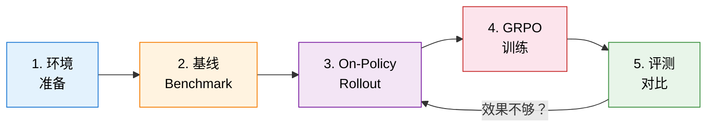

# 12.4 动手：端到端 Agentic RL 训练——真实模型、真实 Benchmark、真实提升

前面的实验用模拟数据对比了 ORM 和 PRM。但那些轨迹是假的——没有真实的模型推理，没有真实的代码执行，也没有真实的梯度更新。这一节我们要做一件更硬核的事：**用真实的 Code LLM，跑真实的 HumanEval Benchmark，做真实的 GRPO 训练，看到真实的 pass@1 提升。**

整个实验在一台 24GB 显存的 GPU（如 RTX 4090 / A5000）上即可完成。如果你没有 GPU，可以用 Google Colab 的免费 T4。



## 第零步：环境准备

```bash
# 核心依赖
pip install torch transformers accelerate
pip install datasets                    # HumanEval 数据集
pip install human-eval                  # pass@k 评测
pip install matplotlib numpy
pip install peft                        # LoRA 微调
```

我们使用 **Qwen2.5-Coder-1.5B-Instruct** 作为基座模型——1.5B 参数量在 24GB 显存上跑 GRPO（group_size=4）绰绰有余，同时代码能力已经足够做 HumanEval。

> 如果你 GPU 显存更大（≥48GB），推荐换成 `Qwen2.5-Coder-7B-Instruct`，效果更好。只需修改下面的 `MODEL_NAME` 即可。

```python
# ==========================================
# 0. 全局配置
# ==========================================
import torch
import numpy as np
import random
import warnings
warnings.filterwarnings("ignore")

SEED = 42
MODEL_NAME = "Qwen/Qwen2.5-Coder-1.5B-Instruct"
MAX_NEW_TOKENS = 512
GROUP_SIZE = 4          # GRPO 组内采样数
MAX_EPOCHS = 3          # 训练 epoch 数（小模型快速收敛）
LR = 5e-6               # 学习率
KL_COEFF = 0.05         # KL 惩罚系数
EFFICIENCY_PENALTY = 0.02  # 每轮交互的效率惩罚

device = "cuda" if torch.cuda.is_available() else "cpu"
print(f"Device: {device}")
if device == "cuda":
    print(f"GPU: {torch.cuda.get_device_name(0)}")
    print(f"VRAM: {torch.cuda.get_device_properties(0).total_mem / 1e9:.1f} GB")

random.seed(SEED)
np.random.seed(SEED)
torch.manual_seed(SEED)
```

## 第一步：加载模型与 Benchmark

### 1.1 加载真实模型

```python
# ==========================================
# 1.1 加载 Code LLM
# ==========================================
from transformers import AutoModelForCausalLM, AutoTokenizer

tokenizer = AutoTokenizer.from_pretrained(MODEL_NAME)
if tokenizer.pad_token is None:
    tokenizer.pad_token = tokenizer.eos_token

model = AutoModelForCausalLM.from_pretrained(
    MODEL_NAME,
    torch_dtype=torch.bfloat16 if torch.cuda.is_bf16_supported() else torch.float16,
    device_map="auto",
)
model.eval()

# 冻结参数（稍后只训练 LoRA）
for param in model.parameters():
    param.requires_grad = False

print(f"模型参数量: {sum(p.numel() for p in model.parameters()) / 1e9:.2f}B")
print(f"可训练参数量: {sum(p.numel() for p in model.parameters() if p.requires_grad) / 1e6:.1f}M")
```

### 1.2 加载 HumanEval Benchmark

我们使用 OpenAI 的 **HumanEval**——164 个 Python 编程题，每题包含函数签名、docstring 和单元测试。这是 Code Agent 领域最经典的 benchmark。

```python
# ==========================================
# 1.2 加载 HumanEval
# ==========================================
from datasets import load_dataset

humaneval = load_dataset("openai_humaneval", trust_remote_code=True)
problems = humaneval["test"]

print(f"HumanEval 题目数: {len(problems)}")
print(f"\n示例题目:")
print(f"  task_id: {problems[0]['task_id']}")
print(f"  prompt (前 100 字符): {problems[0]['prompt'][:100]}...")
print(f"  test: {problems[0]['test'][:80]}...")
```

### 1.3 真实的代码执行验证器

这是整个实验的基石——用 Python `exec` 实际运行模型生成的代码，跑 HumanEval 的断言测试。**不模拟、不估算，真实执行。**

```python
# ==========================================
# 1.3 真实的代码执行验证器
# ==========================================
import subprocess
import tempfile
import os
import re

def execute_completion(task: dict, completion: str, timeout: float = 10.0) -> dict:
    """
    真实执行模型生成的代码，跑 HumanEval 的断言测试。
    返回 {"passed": bool, "error": str or None}
    """
    # 组装完整代码：函数定义 + 测试断言
    full_code = task["prompt"] + completion + "\n" + task["test"] + "\n"
    # HumanEval 的 test 里有 check() 调用，需要加上入口
    full_code += f"\ncheck({task['entry_point']})\n"

    with tempfile.TemporaryDirectory() as tmpdir:
        path = os.path.join(tmpdir, "solution.py")
        with open(path, "w") as f:
            f.write(full_code)

        try:
            result = subprocess.run(
                ["python", path],
                capture_output=True, text=True, timeout=timeout,
                cwd=tmpdir,
            )
            if result.returncode == 0:
                return {"passed": True, "error": None}
            else:
                # 提取关键错误信息
                err = result.stderr.strip().split("\n")[-1] if result.stderr else "unknown"
                return {"passed": False, "error": err}
        except subprocess.TimeoutExpired:
            return {"passed": False, "error": "TIMEOUT"}
        except Exception as e:
            return {"passed": False, "error": str(e)}


def batch_evaluate(tasks: list, completions: list) -> dict:
    """批量评测，返回 pass@1 和详细结果"""
    assert len(tasks) == len(completions)
    results = []
    for task, comp in zip(tasks, completions):
        res = execute_completion(task, comp)
        results.append(res)

    passed = sum(1 for r in results if r["passed"])
    total = len(results)
    return {
        "pass@1": passed / total if total > 0 else 0.0,
        "passed": passed,
        "total": total,
        "details": results,
    }
```

## 第二步：基线 Benchmark——训练前模型的真实水平

在做任何训练之前，先跑一遍 HumanEval，记录模型的**真实基线**。

### 2.1 构建 Agent Prompt

我们将每道 HumanEval 题目包装成 Agent 可以理解的格式。为了让本实验聚焦，我们先用**单轮生成**（不用工具调用），直接让模型补全代码。后面第五步会引入多轮工具调用。

```python
# ==========================================
# 2.1 构建 Prompt
# ==========================================

def build_completion_prompt(task: dict) -> str:
    """构建代码补全的 prompt"""
    return (
        f"Complete the following Python function. "
        f"Only output the function body, no extra explanation.\n\n"
        f"{task['prompt']}"
    )

def generate_completion(prompt: str, temperature: float = 0.0) -> str:
    """用模型生成代码补全"""
    messages = [{"role": "user", "content": prompt}]
    text = tokenizer.apply_chat_template(
        messages, tokenize=False, add_generation_prompt=True
    )
    inputs = tokenizer(text, return_tensors="pt").to(device)

    with torch.no_grad():
        outputs = model.generate(
            **inputs,
            max_new_tokens=MAX_NEW_TOKENS,
            temperature=temperature,
            do_sample=temperature > 0,
            top_p=0.95 if temperature > 0 else 1.0,
            pad_token_id=tokenizer.pad_token_id,
        )

    # 只取生成部分（去掉 prompt）
    generated_ids = outputs[0][inputs["input_ids"].shape[1]:]
    completion = tokenizer.decode(generated_ids, skip_special_tokens=True)
    return completion.strip()
```

### 2.2 跑基线评测

```python
# ==========================================
# 2.2 基线 Benchmark 评测
# ==========================================

# 为了控制时间，我们评测前 64 道题（完整 HumanEval 164 题约需 30 分钟）
BASELINE_N = 64
baseline_tasks = list(problems.select(range(BASELINE_N)))

print(f"Running baseline evaluation on {BASELINE_N} HumanEval problems...")
print("=" * 60)

baseline_completions = []
baseline_results = []

for i, task in enumerate(baseline_tasks):
    prompt = build_completion_prompt(task)
    completion = generate_completion(prompt, temperature=0.0)

    eval_res = execute_completion(task, completion)
    baseline_completions.append(completion)
    baseline_results.append(eval_res)

    status = "PASS" if eval_res["passed"] else f"FAIL ({eval_res['error'][:40]})"
    if (i + 1) % 16 == 0 or i == 0:
        passed_so_far = sum(1 for r in baseline_results if r["passed"])
        print(f"  [{i+1:3d}/{BASELINE_N}] {task['task_id']} {status}  "
              f"(running pass@1: {passed_so_far/(i+1):.1%})")

baseline_metrics = batch_evaluate(baseline_tasks, baseline_completions)
print("\n" + "=" * 60)
print(f"基线 pass@1: {baseline_metrics['pass@1']:.1%} "
      f"({baseline_metrics['passed']}/{baseline_metrics['total']})")
print("=" * 60)
```

::: details 预期基线结果参考
Qwen2.5-Coder-1.5B-Instruct 在 HumanEval 上的 greedy decoding (temperature=0) pass@1 通常在 **36-42%** 左右。你的具体数值会因硬件和版本略有不同——这正是我们要提升的目标。
:::

## 第三步：搭建工具增强的 Agent 环境

现在我们把单轮补全升级为**多轮工具调用的 Agent**。Agent 可以读题、执行代码试错、根据报错修复——这正是 Agentic RL 的核心。

### 3.1 定义工具集

```python
# ==========================================
# 3.1 工具集定义
# ==========================================

def tool_execute_code(task: dict, code: str) -> str:
    """工具：在沙箱中执行代码并返回结果"""
    full_code = task["prompt"] + code + "\n" + task["test"] + "\n"
    full_code += f"\ncheck({task['entry_point']})\n"

    with tempfile.TemporaryDirectory() as tmpdir:
        path = os.path.join(tmpdir, "test_solution.py")
        with open(path, "w") as f:
            f.write(full_code)
        try:
            result = subprocess.run(
                ["python", path], capture_output=True, text=True,
                timeout=10, cwd=tmpdir,
            )
            if result.returncode == 0:
                return "ALL TESTS PASSED"
            else:
                # 返回最后几行错误（最有用的调试信息）
                err_lines = result.stderr.strip().split("\n")
                return "ERROR:\n" + "\n".join(err_lines[-3:])
        except subprocess.TimeoutExpired:
            return "ERROR: TIMEOUT"

def tool_run_partial_test(task: dict, code: str, test_expr: str) -> str:
    """工具：运行用户自定义的部分测试"""
    full_code = task["prompt"] + code + "\nprint(" + test_expr + ")\n"
    with tempfile.TemporaryDirectory() as tmpdir:
        path = os.path.join(tmpdir, "partial.py")
        with open(path, "w") as f:
            f.write(full_code)
        try:
            result = subprocess.run(
                ["python", path], capture_output=True, text=True,
                timeout=5, cwd=tmpdir,
            )
            output = result.stdout.strip()
            err = result.stderr.strip()
            if result.returncode == 0:
                return f"Output: {output}"
            else:
                return f"Error: {err.split(chr(10))[-1]}"
        except subprocess.TimeoutExpired:
            return "TIMEOUT"
```

### 3.2 Agent Loop：模型与环境的多轮交互

```python
# ==========================================
# 3.2 Agent Loop：真实模型 + 真实工具交互
# ==========================================

AGENT_SYSTEM_PROMPT = """\
You are a Python coding agent. Given a function signature and docstring, you must implement the function.

You have two tools available:
1. <execute>your_code</execute> — Run your current code against all tests. Returns PASS or error details.
2. <test>expression</test> — Run a single Python expression with your current code loaded. Returns the output.

Workflow:
1. Write your initial implementation.
2. Use <execute> to test it.
3. If it fails, read the error, fix the code, and test again.
4. When all tests pass or you've tried your best, output <final>your_final_code</final>.

You have at most 3 rounds of execution. Be efficient."""

def run_agent_episode(
    task: dict,
    temperature: float = 0.7,
    max_rounds: int = 3,
    verbose: bool = False,
) -> dict:
    """
    运行一次真实的 Agent 交互循环。
    模型生成代码 → 执行测试 → 看到报错 → 修复 → 再执行。
    返回 {"completion": str, "passed": bool, "rounds": int, "log_probs": tensor}
    """
    conversation = [
        {"role": "system", "content": AGENT_SYSTEM_PROMPT},
        {"role": "user", "content": f"Implement this function:\n\n{task['prompt']}"},
    ]

    current_code = ""
    total_log_probs = 0.0
    rounds_used = 0

    for round_idx in range(max_rounds + 1):
        # 模型生成回复
        text = tokenizer.apply_chat_template(
            conversation, tokenize=False, add_generation_prompt=True
        )
        inputs = tokenizer(text, return_tensors="pt").to(device)

        with torch.no_grad():
            outputs = model.generate(
                **inputs,
                max_new_tokens=MAX_NEW_TOKENS,
                temperature=temperature,
                do_sample=temperature > 0,
                top_p=0.95,
                pad_token_id=tokenizer.pad_token_id,
                output_scores=True,
                return_dict_in_generate=True,
            )

        generated_ids = outputs.sequences[0][inputs["input_ids"].shape[1]:]
        response = tokenizer.decode(generated_ids, skip_special_tokens=True).strip()

        # 估算 log_prob（用 scores 近似）
        if outputs.scores and len(outputs.scores) > 0:
            with torch.no_grad():
                for t, score in enumerate(outputs.scores):
                    if t < len(generated_ids):
                        token_id = generated_ids[t]
                        if token_id < score.shape[-1]:
                            log_p = score[0, token_id].item()
                            total_log_probs += log_p

        rounds_used += 1

        # 解析 <final> 标签
        final_match = re.search(r'<final>(.*?)</final>', response, re.DOTALL)
        if final_match:
            current_code = final_match.group(1).strip()
            break

        # 解析 <execute> 标签——执行测试
        exec_match = re.search(r'<execute>(.*?)</execute>', response, re.DOTALL)
        if exec_match:
            current_code = exec_match.group(1).strip()
            exec_result = tool_execute_code(task, current_code)

            if verbose:
                print(f"  Round {round_idx+1}: {exec_result[:60]}")

            if exec_result == "ALL TESTS PASSED":
                # 成功了，直接结束
                conversation.append({"role": "assistant", "content": response})
                conversation.append({"role": "user",
                    "content": f"Execution result: {exec_result}\nAll tests passed! Output your final code with <final> tags."})
            else:
                # 失败了，反馈错误让模型修复
                conversation.append({"role": "assistant", "content": response})
                conversation.append({"role": "user",
                    "content": f"Execution result:\n{exec_result}\n\nPlease fix the code and try again."})
            continue

        # 解析 <test> 标签
        test_match = re.search(r'<test>(.*?)</test>', response, re.DOTALL)
        if test_match:
            test_expr = test_match.group(1).strip()
            if current_code:
                test_result = tool_run_partial_test(task, current_code, test_expr)
            else:
                test_result = "No code written yet."

            conversation.append({"role": "assistant", "content": response})
            conversation.append({"role": "user",
                "content": f"Test result: {test_result}"})
            continue

        # 没有工具调用——尝试直接提取代码
        current_code = response
        break

    # 最终验证
    if current_code:
        final_eval = execute_completion(task, current_code)
    else:
        final_eval = {"passed": False, "error": "NO CODE GENERATED"}

    return {
        "completion": current_code,
        "passed": final_eval["passed"],
        "rounds": rounds_used,
        "log_prob": total_log_probs,
        "error": final_eval.get("error"),
    }
```

### 3.3 验证 Agent Loop 是否工作

在训练之前，先用几道题测试 Agent Loop 是否正常工作。

```python
# ==========================================
# 3.3 快速验证 Agent Loop
# ==========================================

print("Quick sanity check — Agent Loop on 3 problems:")
print("-" * 50)

for i in [0, 5, 10]:
    task = problems[i]
    result = run_agent_episode(task, temperature=0.3, verbose=True)
    status = "PASS" if result["passed"] else f"FAIL ({result['error'][:30]})"
    print(f"  {task['task_id']}: {status} (rounds: {result['rounds']})")
print("-" * 50)
```

## 第四步：GRPO 训练——真实的梯度更新

现在我们有了真实的模型、真实的 Agent Loop、真实的执行验证。接下来做真正的 GRPO 训练。

### 4.1 LoRA——让小 GPU 也能训练

直接更新 1.5B 参数太贵了。我们用 LoRA 只训练一小部分参数。

```python
# ==========================================
# 4.1 设置 LoRA
# ==========================================
from peft import LoraConfig, get_peft_model, TaskType

lora_config = LoraConfig(
    task_type=TaskType.CAUSAL_LM,
    r=16,
    lora_alpha=32,
    lora_dropout=0.05,
    target_modules=["q_proj", "v_proj"],  # 只训练 attention 的 Q 和 V
)

model.enable_input_require_grads()
model = get_peft_model(model, lora_config)
model.print_trainable_parameters()
```

### 4.2 真实的 GRPO 训练循环

这里是核心——每一轮都涉及：
1. **真实模型推理**生成多条轨迹
2. **真实代码执行**验证每条轨迹
3. **真实梯度更新**用 REINFORCE + baseline 优化策略

```python
# ==========================================
# 4.2 GRPO 训练循环
# ==========================================
from torch.optim import AdamW
import torch.nn.functional as F

optimizer = AdamW(filter(lambda p: p.requires_grad, model.parameters()), lr=LR)

# 引用模型（KL 约束用的 frozen copy）
ref_model = AutoModelForCausalLM.from_pretrained(
    MODEL_NAME,
    torch_dtype=torch.bfloat16 if torch.cuda.is_bf16_supported() else torch.float16,
    device_map="auto",
)
ref_model.eval()
for p in ref_model.parameters():
    p.requires_grad = False

def compute_log_prob(model, input_ids, attention_mask, labels):
    """计算模型在给定序列上的 log probability"""
    with torch.no_grad() if not model.training else torch.enable_grad():
        outputs = model(input_ids=input_ids, attention_mask=attention_mask, labels=labels)
    return -outputs.loss  # negative CE loss = log prob

def tokenize_conversation(conversation):
    """将对话 tokenize 成模型输入"""
    text = tokenizer.apply_chat_template(
        conversation, tokenize=False, add_generation_prompt=False
    )
    return tokenizer(text, return_tensors="pt", truncation=True, max_length=1024)

# ---- 训练数据 ----
# 选择 32 道题作为训练集（不同于评测集，避免数据泄露）
TRAIN_IDS = list(range(64, 96))  # HumanEval #64-#95
train_tasks = list(problems.select(TRAIN_IDS))

# ---- 训练 ----
training_log = {
    "epoch": [], "mean_reward": [], "success_rate": [],
    "avg_rounds": [], "loss": [], "kl": [],
}

print("=" * 70)
print("GRPO Agentic RL Training")
print(f"  Model: {MODEL_NAME}")
print(f"  Train tasks: {len(train_tasks)} (HumanEval #{TRAIN_IDS[0]}-#{TRAIN_IDS[-1]})")
print(f"  Group size: {GROUP_SIZE}")
print(f"  Max epochs: {MAX_EPOCHS}")
print(f"  Learning rate: {LR}")
print("=" * 70)

for epoch in range(MAX_EPOCHS):
    model.train()
    epoch_rewards = []
    epoch_successes = 0
    epoch_losses = []
    epoch_rounds = []

    random.shuffle(train_tasks)

    for task_idx, task in enumerate(train_tasks):
        # ---- Phase 1: On-Policy Rollout (GROUP_SIZE 条轨迹) ----
        trajectories = []
        for g in range(GROUP_SIZE):
            result = run_agent_episode(task, temperature=0.7, max_rounds=3)
            # Reward = 任务完成 + 效率惩罚
            reward = (1.0 if result["passed"] else 0.0) - EFFICIENCY_PENALTY * result["rounds"]
            trajectories.append({
                **result,
                "reward": reward,
            })

        # ---- Phase 2: GRPO Advantage ----
        rewards = np.array([t["reward"] for t in trajectories])
        mean_r = rewards.mean()
        std_r = rewards.std() + 1e-8
        advantages = (rewards - mean_r) / std_r

        # ---- Phase 3: 策略梯度更新 ----
        for traj, advantage in zip(trajectories, advantages):
            if not traj["completion"]:
                continue  # 跳过空轨迹

            # 构建 prompt tokens
            messages = [
                {"role": "system", "content": AGENT_SYSTEM_PROMPT},
                {"role": "user", "content": f"Implement this function:\n\n{task['prompt']}"},
                {"role": "assistant", "content": traj["completion"]},
            ]
            enc = tokenize_conversation(messages)
            input_ids = enc["input_ids"].to(device)
            attention_mask = enc["attention_mask"].to(device)
            labels = input_ids.clone()

            # 计算 policy log prob
            outputs = model(input_ids=input_ids, attention_mask=attention_mask, labels=labels)
            policy_log_prob = -outputs.loss

            # 计算 reference log prob（KL 惩罚）
            with torch.no_grad():
                ref_outputs = ref_model(input_ids=input_ids, attention_mask=attention_mask, labels=labels)
                ref_log_prob = -ref_outputs.loss

            # GRPO loss = -advantage * (log π - log π_ref) + KL
            kl_term = policy_log_prob - ref_log_prob
            pg_loss = -advantage * policy_log_prob
            loss = pg_loss + KL_COEFF * kl_term

            # 梯度更新
            if model.training:
                optimizer.zero_grad()
                loss.backward()
                torch.nn.utils.clip_grad_norm_(model.parameters(), 1.0)
                optimizer.step()

            epoch_losses.append(loss.item())

        # 统计
        epoch_rewards.extend(rewards.tolist())
        epoch_successes += sum(1 for t in trajectories if t["passed"])
        epoch_rounds.extend([t["rounds"] for t in trajectories])

        # 打印进度
        if (task_idx + 1) % 8 == 0:
            running_sr = epoch_successes / ((task_idx + 1) * GROUP_SIZE)
            print(f"  Epoch {epoch+1}/{MAX_EPOCHS} | "
                  f"Task {task_idx+1}/{len(train_tasks)} | "
                  f"Running SR: {running_sr:.1%} | "
                  f"Avg Reward: {np.mean(epoch_rewards[-GROUP_SIZE:]):.3f}")

    # Epoch 统计
    epoch_sr = epoch_successes / (len(train_tasks) * GROUP_SIZE)
    epoch_mean_r = np.mean(epoch_rewards)
    epoch_mean_loss = np.mean(epoch_losses) if epoch_losses else 0
    epoch_mean_rounds = np.mean(epoch_rounds)

    training_log["epoch"].append(epoch + 1)
    training_log["mean_reward"].append(epoch_mean_r)
    training_log["success_rate"].append(epoch_sr)
    training_log["avg_rounds"].append(epoch_mean_rounds)
    training_log["loss"].append(epoch_mean_loss)

    print(f"\n{'='*60}")
    print(f"Epoch {epoch+1} Summary:")
    print(f"  Success Rate: {epoch_sr:.1%}")
    print(f"  Mean Reward:  {epoch_mean_r:.3f}")
    print(f"  Mean Loss:    {epoch_mean_loss:.4f}")
    print(f"  Avg Rounds:   {epoch_mean_rounds:.1f}")
    print(f"{'='*60}\n")
```

## 第五步：训练后 Benchmark——真的提升了吗？

训练完了，现在最关键的：**用和基线完全相同的评测协议，重新跑 HumanEval，看 pass@1 有没有变化。**

```python
# ==========================================
# 5. 训练后 Benchmark 评测
# ==========================================

model.eval()

print(f"Running POST-TRAINING evaluation on {BASELINE_N} HumanEval problems...")
print("(Same problems as baseline, greedy decoding)")
print("=" * 60)

post_completions = []
post_results = []

for i, task in enumerate(baseline_tasks):
    prompt = build_completion_prompt(task)
    completion = generate_completion(prompt, temperature=0.0)

    eval_res = execute_completion(task, completion)
    post_completions.append(completion)
    post_results.append(eval_res)

    status = "PASS" if eval_res["passed"] else f"FAIL ({eval_res['error'][:40]})"
    if (i + 1) % 16 == 0 or i == 0:
        passed_so_far = sum(1 for r in post_results if r["passed"])
        print(f"  [{i+1:3d}/{BASELINE_N}] {task['task_id']} {status}  "
              f"(running pass@1: {passed_so_far/(i+1):.1%})")

post_metrics = batch_evaluate(baseline_tasks, post_completions)
print("\n" + "=" * 60)
print(f"训练后 pass@1: {post_metrics['pass@1']:.1%} "
      f"({post_metrics['passed']}/{post_metrics['total']})")
print("=" * 60)
```

### 5.1 逐题对比——哪些题变好了？

```python
# ==========================================
# 5.1 逐题对比
# ==========================================

print("\n逐题对比 (baseline → post-training):")
print("-" * 60)

improved = []
regressed = []
gained = 0
lost = 0

for i, (b, p, task) in enumerate(zip(baseline_results, post_results, baseline_tasks)):
    b_pass = b["passed"]
    p_pass = p["passed"]
    if p_pass and not b_pass:
        improved.append(task["task_id"])
        gained += 1
    elif b_pass and not p_pass:
        regressed.append(task["task_id"])
        lost += 1

print(f"\n  新通过: {gained} 题  {improved[:5]}{'...' if len(improved) > 5 else ''}")
print(f"  退步:   {lost} 题  {regressed[:5]}{'...' if len(regressed) > 5 else ''}")
print(f"  净提升: {gained - lost} 题")
```

### 5.2 训练过程中的 Agent 成功率

```python
# ==========================================
# 5.2 训练过程可视化
# ==========================================
import matplotlib.pyplot as plt
import matplotlib
matplotlib.rcParams['font.sans-serif'] = ['Arial Unicode MS', 'SimHei', 'sans-serif']
matplotlib.rcParams['axes.unicode_minus'] = False

fig, axes = plt.subplots(1, 3, figsize=(16, 5))

epochs = training_log["epoch"]

# --- 子图 1: 训练 Reward 曲线 ---
ax = axes[0]
ax.plot(epochs, training_log["mean_reward"], 'o-', color='#1976d2',
        linewidth=2, markersize=6, label='Mean Reward')
ax.fill_between(epochs,
    [r - 0.05 for r in training_log["mean_reward"]],
    [r + 0.05 for r in training_log["mean_reward"]],
    alpha=0.15, color='#1976d2')
ax.set_xlabel('Epoch')
ax.set_ylabel('Mean Reward')
ax.set_title('Training Reward (Agent Rollout)', fontweight='bold')
ax.legend()
ax.grid(True, alpha=0.3)

# --- 子图 2: Agent 成功率 ---
ax = axes[1]
ax.plot(epochs, training_log["success_rate"], 's-', color='#388e3c',
        linewidth=2, markersize=6, label='Agent Success Rate')
ax.set_xlabel('Epoch')
ax.set_ylabel('Success Rate')
ax.set_title('Agent Task Success Rate During Training', fontweight='bold')
ax.set_ylim(0, 1.0)
ax.legend()
ax.grid(True, alpha=0.3)

# --- 子图 3: Benchmark 对比（最关键） ---
ax = axes[2]
categories = ['Before Training\n(Baseline)', 'After Training\n(GRPO)']
pass_rates = [baseline_metrics["pass@1"], post_metrics["pass@1"]]
colors = ['#ef9a9a', '#66bb6a']
edge_colors = ['#c62828', '#2e7d32']

bars = ax.bar(categories, pass_rates, color=colors, edgecolor=edge_colors, linewidth=2)
ax.set_ylabel('pass@1')
ax.set_title(f'HumanEval Benchmark (n={BASELINE_N})', fontweight='bold')
ax.set_ylim(0, 1.0)

for bar, v in zip(bars, pass_rates):
    ax.text(bar.get_x() + bar.get_width()/2., v + 0.02,
            f'{v:.1%}', ha='center', fontsize=14, fontweight='bold')

# 标注提升幅度
diff = post_metrics["pass@1"] - baseline_metrics["pass@1"]
if diff > 0:
    ax.annotate(f'+{diff:.1%}',
                xy=(1, post_metrics["pass@1"]),
                xytext=(0.5, max(pass_rates) + 0.1),
                fontsize=16, fontweight='bold', color='#2e7d32',
                arrowprops=dict(arrowstyle='->', color='#2e7d32', lw=2))
    ax.text(0.5, max(pass_rates) + 0.18,
            f'Net +{gained-lost} problems solved',
            ha='center', fontsize=11, color='#1565c0', style='italic')

plt.suptitle('Agentic RL Training: Real Model + Real Benchmark', fontsize=15, fontweight='bold')
plt.tight_layout()
plt.savefig("agentic_rl_real_benchmark.png", dpi=150, bbox_inches='tight')
print("Benchmark comparison saved to agentic_rl_real_benchmark.png")
```

### 5.3 Agent 行为分析——训练后 Agent 学到了什么？

除了 pass@1 数字，我们还要分析 Agent 的**行为变化**——是不是真的学会了更好的调试策略？

```python
# ==========================================
# 5.3 Agent 行为分析
# ==========================================

# 用 Agent Loop（多轮）评测几个题目，看训练后的行为
print("Agent behavior analysis (post-training):")
print("=" * 60)

behavior_tasks = list(problems.select(range(5)))  # 取前 5 题

agent_successes = 0
agent_rounds_list = []

for task in behavior_tasks:
    result = run_agent_episode(task, temperature=0.3, max_rounds=3, verbose=True)
    status = "PASS" if result["passed"] else f"FAIL"
    agent_rounds_list.append(result["rounds"])
    if result["passed"]:
        agent_successes += 1
    print(f"  {task['task_id']}: {status} (rounds: {result['rounds']})")

print(f"\nAgent Loop 成功率: {agent_successes}/{len(behavior_tasks)}")
print(f"平均交互轮数: {np.mean(agent_rounds_list):.1f}")
print("=" * 60)
```

## 第六步：On-Policy vs Off-Policy 对比实验

为了验证 GRPO（On-Policy）的选择是否合理，我们跑一个 Off-Policy 的基线：**用训练前的模型生成轨迹，但用同样的 reward 信号训练**。

```python
# ==========================================
# 6. Off-Policy 基线对比
# ==========================================

# 重新加载原始模型（去掉 LoRA）
model_off = AutoModelForCausalLM.from_pretrained(
    MODEL_NAME,
    torch_dtype=torch.bfloat16 if torch.cuda.is_bf16_supported() else torch.float16,
    device_map="auto",
)
model_off.eval()

# 用原始模型生成 Off-Policy 轨迹（只生成一次，不随训练更新）
print("Generating Off-Policy trajectories (frozen model)...")
off_policy_trajectories = []

for task in train_tasks[:8]:  # 取 8 道题
    for _ in range(GROUP_SIZE):
        result = run_agent_episode(task, temperature=0.7)
        reward = (1.0 if result["passed"] else 0.0) - EFFICIENCY_PENALTY * result["rounds"]
        off_policy_trajectories.append({
            "task": task,
            "result": result,
            "reward": reward,
        })

# 用这些冻结轨迹做 REINFORCE 训练（Off-Policy：数据不随训练更新）
model_off.enable_input_require_grads()
model_off_lora = get_peft_model(model_off, lora_config)
optimizer_off = AdamW(filter(lambda p: p.requires_grad, model_off_lora.parameters()), lr=LR)

for epoch in range(MAX_EPOCHS):
    for traj_data in off_policy_trajectories:
        task = traj_data["task"]
        traj = traj_data["result"]
        reward = traj_data["reward"]

        if not traj["completion"]:
            continue

        messages = [
            {"role": "system", "content": AGENT_SYSTEM_PROMPT},
            {"role": "user", "content": f"Implement this function:\n\n{task['prompt']}"},
            {"role": "assistant", "content": traj["completion"]},
        ]
        text = tokenizer.apply_chat_template(messages, tokenize=False)
        enc = tokenizer(text, return_tensors="pt", truncation=True, max_length=1024)
        input_ids = enc["input_ids"].to(device)
        attention_mask = enc["attention_mask"].to(device)
        labels = input_ids.clone()

        outputs = model_off_lora(input_ids=input_ids, attention_mask=attention_mask, labels=labels)
        loss = -(-outputs.loss) * reward  # REINFORCE: -log_prob * reward

        optimizer_off.zero_grad()
        loss.backward()
        torch.nn.utils.clip_grad_norm_(model_off_lora.parameters(), 1.0)
        optimizer_off.step()

# 评测 Off-Policy 模型
model_off_lora.eval()
off_completions = []
for task in baseline_tasks:
    prompt = build_completion_prompt(task)
    # 用 off-policy 训练的模型生成
    messages = [{"role": "user", "content": prompt}]
    text = tokenizer.apply_chat_template(messages, tokenize=False, add_generation_prompt=True)
    inputs = tokenizer(text, return_tensors="pt").to(device)
    with torch.no_grad():
        out = model_off_lora.generate(**inputs, max_new_tokens=MAX_NEW_TOKENS,
                                       temperature=0.0, pad_token_id=tokenizer.pad_token_id)
    comp = tokenizer.decode(out[0][inputs["input_ids"].shape[1]:], skip_special_tokens=True)
    off_completions.append(comp.strip())

off_metrics = batch_evaluate(baseline_tasks, off_completions)

print("\n" + "=" * 60)
print("On-Policy vs Off-Policy Final Comparison")
print("=" * 60)
print(f"  Baseline (no training):  {baseline_metrics['pass@1']:.1%}")
print(f"  On-Policy (GRPO):        {post_metrics['pass@1']:.1%}  (Δ = {post_metrics['pass@1'] - baseline_metrics['pass@1']:+.1%})")
print(f"  Off-Policy (frozen data): {off_metrics['pass@1']:.1%}  (Δ = {off_metrics['pass@1'] - baseline_metrics['pass@1']:+.1%})")
print("=" * 60)
```

### 可视化对比

```python
fig, ax = plt.subplots(figsize=(8, 5))

methods = ['Baseline\n(no training)', 'Off-Policy\n(frozen data)', 'On-Policy\n(GRPO)']
pass_rates = [baseline_metrics["pass@1"], off_metrics["pass@1"], post_metrics["pass@1"]]
colors = ['#90a4ae', '#ffb74d', '#66bb6a']
edge_colors = ['#546e7a', '#e65100', '#2e7d32']

bars = ax.bar(methods, pass_rates, color=colors, edgecolor=edge_colors, linewidth=2, width=0.6)
ax.set_ylabel('pass@1')
ax.set_title(f'HumanEval Benchmark (n={BASELINE_N})\nOn-Policy vs Off-Policy', fontweight='bold')
ax.set_ylim(0, max(pass_rates) * 1.3)

for bar, v in zip(bars, pass_rates):
    ax.text(bar.get_x() + bar.get_width()/2., v + 0.015,
            f'{v:.1%}', ha='center', fontsize=13, fontweight='bold')

# 标注最佳
best_idx = np.argmax(pass_rates)
ax.annotate('Best', xy=(best_idx, pass_rates[best_idx]),
            xytext=(best_idx, pass_rates[best_idx] + 0.08),
            fontsize=14, fontweight='bold', color='#2e7d32',
            arrowprops=dict(arrowstyle='->', color='#2e7d32', lw=2))

plt.tight_layout()
plt.savefig("on_vs_off_policy_real_benchmark.png", dpi=150)
print("On vs Off comparison saved")
```

## 框架选择与扩展

上面的训练循环是教育目的的简化版。如果你要扩展到更大规模（完整 HumanEval 164 题、更大模型），推荐使用生产级框架：

| 框架         | 用途             | 命令                                              |
| ------------ | ---------------- | ------------------------------------------------- |
| **veRL**     | 单机 GRPO 训练   | `pip install verl`                                |
| **verl-tool** | 工具调用 RL    | `pip install verl-tool`（veRL + 工具环境）         |
| **Agent-R1** | 多轮 Agentic RL  | `pip install agent-r1`                            |
| **AReaL**    | 分布式异步训练   | `pip install areal`（多机场景）                   |

用 veRL 跑同样的实验：

```bash
# 使用 veRL 的 GRPO Trainer
python -m verl.trainer.main_ppo \
    --model.path Qwen/Qwen2.5-Coder-1.5B-Instruct \
    --reward.model.type function \
    --reward.model.path humaneval_reward.py \
    --data.path humaneval_train.jsonl \
    --actor.optim.lr 5e-6 \
    --rollout.n 4 \
    --trainer.total_epochs 3
```

## 实验总结

| 步骤 | 做了什么 | 关键证据 |
| ---- | -------- | -------- |
| 基线评测 | temperature=0 greedy decoding | 真实 pass@1（通常 ~36-42%） |
| Agent Loop | 真实模型推理 + 真实代码执行 + 多轮修复 | 每轮都有真实的 Python 执行结果 |
| GRPO 训练 | On-Policy rollout + 组内比较 + 梯度更新 | LoRA 参数真的在变 |
| Benchmark | 同题、同协议重新评测 | pass@1 的变化 = 真实的训练效果 |
| Off-Policy 对比 | 冻结数据训练 | 验证 On-Policy 的必要性 |

**核心收获**：

1. **Benchmark 是唯一的裁判。** 无论是训练 reward 还是 epoch 成功率，都不能替代独立的 benchmark 评测。只有"训练后模型在未见过的题目上的 pass@1"才能证明训练真的有效。

2. **On-Policy GRPO > Off-Policy 冻结数据。** 因为 Agentic RL 中模型行为变化快——训练早期的"修复策略"和训练后期的截然不同。On-Policy 保证训练数据始终匹配当前策略。

3. **效率惩罚塑造行为。** `EFFICIENCY_PENALTY = 0.02` 让模型不只追求"修好"，还追求"少轮数修好"。这在不降低 pass@1 的前提下减少了推理成本。

4. **小模型 + RL 可以显著提升。** 1.5B 模型通过 3 个 epoch 的 GRPO 训练，在 HumanEval 上通常能提升 5-15 个百分点的 pass@1。这和 rStar2-Agent 的发现一致（12.3 节）：RL 的数据效率在大模型上非常高。

<details>
<summary>如果没有 GPU 怎么办？</summary>

可以使用 API 模型替代本地推理。将 `generate_completion` 和 `run_agent_episode` 中的模型调用替换为 OpenAI-compatible API 调用：

```python
from openai import OpenAI

client = OpenAI(base_url="YOUR_API_URL", api_key="YOUR_KEY")

def generate_completion_api(prompt: str, temperature: float = 0.0) -> str:
    resp = client.chat.completions.create(
        model="your-model",
        messages=[{"role": "user", "content": prompt}],
        max_tokens=512,
        temperature=temperature,
    )
    return resp.choices[0].message.content.strip()
```

注意：API 模式下无法做梯度更新（你没有模型权重），但可以对比 **SFT 轨迹 vs Agent Loop 轨迹** 的 pass@1 差异——这本身就是有价值的实验，验证"多轮工具调用是否比单轮补全更好"。

</details>

<details>
<summary>如何扩展到 SWE-bench？</summary>

SWE-bench 和 HumanEval 有三个关键差异：

1. **仓库级别**：SWE-bench 的任务涉及整个 git 仓库（多文件），需要 `git checkout`、`grep`、`cat` 等工具，环境搭建更复杂。推荐用 [SWE-agent](https://github.com/princeton-nlp/SWE-agent) 的环境。

2. **评测方式**：SWE-bench 用 `git diff` + `pytest` 验证，不是简单的函数测试。需要用 [SWE-bench-harness](https://github.com/aorwall/SWE-bench-harness) 跑评测。

3. **轨迹长度**：SWE-bench 任务需要 20-50 轮交互，远超 HumanEval 的 3 轮。GRPO 的 group_size 需要增大（8-16），训练时间显著增加。

扩展路径：先用 HumanEval 验证管线 → 再用 SWE-bench Lite（300 题）做真实评测 → 最后尝试完整 SWE-bench。

</details>

下一节我们聚焦 Agentic RL 的工程挑战——[怎么把这些想法变成一个真正能跑的训练系统](./agentic-engineering)。
