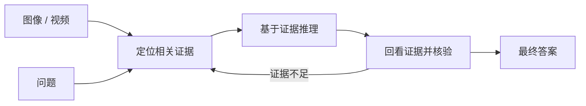
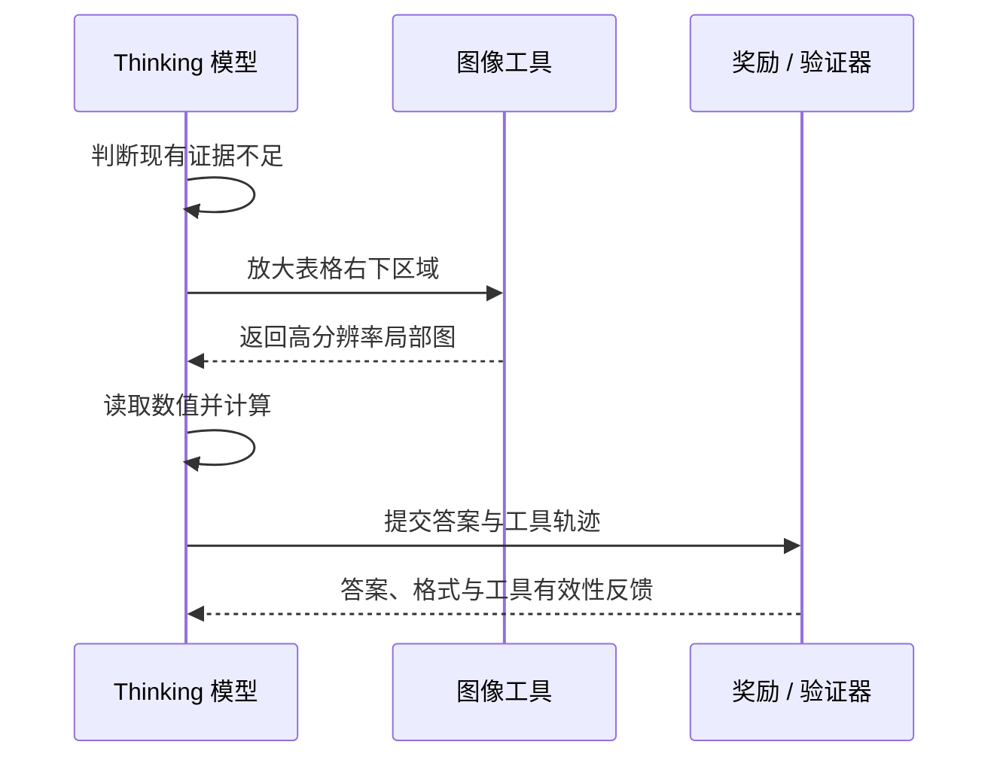

# 23.2 视觉反思 RL：让模型带着证据再回答

先看一道图表题。柱状图中，A 类为 42，B 类为 57，C 类为 39。问题问“B 比 A 高多少”。模型如果只抓住最高的柱，很容易直接回答 57；如果先读出两根柱的数值，再计算 $57-42$，答案才是 15。

这里缺少的能力并不神秘：模型需要在输出最终答案前，保留视觉证据、完成计算，并回到图像检查一次。我们把这种“观察—推理—核验—回答”的过程称为 **视觉反思**。它的目标是减少看错、漏看和凭语言先验猜答案，而不是单纯让回答变长。

本节以 [Qwen3-VL 技术报告](https://arxiv.org/abs/2511.21631)为主线，解释视觉反思依赖哪些模型结构、怎样通过后训练形成，以及为什么“多想几步”仍然可能失败。Qwen3-VL 于 2025 年 9 月开始发布模型，技术报告在 2025 年 11 月公开；它与 2025 年 4 月发布的纯文本 Qwen3 不是同一次发布。

## 第一步：区分“描述图片”和“用图片推理”

给模型一张收据，问“含税总额是多少”。描述任务只要求识别“这是一张收据”；推理任务需要定位小计与税额，读取两个数字，再完成加法。只要其中一个数字来自错误区域，后面的计算即使完全正确，最终答案仍会失败。

因此，一条视觉推理轨迹至少包含三类对象：

- **视觉证据**：图中哪些区域、文字、物体或时间片段与问题有关。
- **中间推理**：证据之间怎样比较、计算或建立因果关系。
- **最终答案**：按任务要求输出数字、选项、坐标或自然语言。

普通结果奖励只检查最终答案。它会把“看错后算对”和“看对后算错”都记为失败，也会把“完全没有看图但碰巧猜对”记为成功。[23.1 视觉奖励设计](./vlm-challenges)已经说明这种标量奖励的局限；视觉反思的价值，就是把部分中间过程变成可观察、可验证的轨迹。



## 第二步：Qwen3-VL 为什么更容易保留视觉证据

反思能力首先受模型结构限制。如果视觉细节在进入语言模型前已经丢失，再长的思维链也无法恢复原始信息。Qwen3-VL 仍采用“视觉编码器—视觉语言合并层—语言模型”三部分结构，同时加入三项与证据保留直接相关的改动[^qwen3vl]。

### DeepStack：把不同深度的视觉特征送入语言模型

视觉编码器的浅层更容易保留边缘、纹理和局部位置，深层更偏向物体与语义。只取最后一层特征，细小文字或局部几何关系可能已经被压缩。

DeepStack 会从视觉编码器的多个层级取出特征，经独立的合并模块处理后，注入语言模型前几层。这样做不需要把更多视觉 token 塞进上下文，却能让语言模型同时接触局部细节与高层语义。它解决的是“证据有没有进入推理过程”，并不保证模型一定使用了正确证据。

### Interleaved-MRoPE：把时间、宽度和高度写进位置

一张图片中的视觉 token 具有二维位置，视频还多出时间轴。Qwen3-VL 的 interleaved-MRoPE 把时间、高度和宽度位置交错分配到旋转位置编码中，使模型能区分“左上角的表头”“右下角的数值”和“第 12 秒出现的物体”。

这项结构改动对空间关系和长视频尤其重要。若位置编码无法稳定表达时间与空间，模型可能识别出两个对象，却弄错它们的先后与相对位置。

### 文本时间戳：让视频证据可以被说出来

视频任务常问“某个动作发生在什么时候”。Qwen3-VL 将时间位置显式写成文本时间戳，使回答可以引用“3.0 秒附近”这样的证据。这样，时间定位从隐藏向量变成了可检查的文本对象。

三项改动共同提供了视觉反思的底座：DeepStack 尽量保留细节，位置编码保存空间与时间关系，文本时间戳让视频证据能够进入语言推理。官方报告还给出原生 256K 交错多模态上下文，并提供 2B、4B、8B、32B 稠密模型以及 30B-A3B、235B-A22B MoE 模型，以覆盖不同延迟与质量需求[^qwen3vl_repo]。

## 第三步：Thinking 模型怎样通过后训练形成

Qwen3-VL 同时发布 Instruct 与 Thinking 版本。Instruct 版本更偏向直接回答；Thinking 版本会在复杂任务上生成较长的中间推理。二者共享多模态底座，但后训练目标不同。

根据技术报告，Thinking 路线依次使用长思维链冷启动、强模型到弱模型蒸馏、推理强化学习和通用强化学习[^qwen3vl]。这条链可以从一道几何题理解。

冷启动阶段先给模型少量结构完整的示范：读出图形关系，写出中间等式，再给答案。它解决的是输出格式与基本推理习惯。

蒸馏阶段让更强模型为较小模型提供高质量轨迹。小模型先学会“可行的推理大致长什么样”，再进入强化学习探索，减少从完全随机的长回答中寻找正确路径的成本。

推理强化学习覆盖文本与多模态任务，包括数学、代码、逻辑、视觉定位和视觉谜题。可验证任务可以使用答案、坐标、边界框或工具结果作为奖励。通用强化学习随后补充指令遵循、交互质量与安全等目标，防止模型只会做有标准答案的题。

这和“在提示词里写一句 please think step by step”有本质差别。提示词只改变一次推理的上下文；后训练会提高整类轨迹在策略中的概率，使模型在没有手写五步模板时也可能产生观察、计算与核验行为。

## 第四步：Thinking with Images 为什么还需要工具

有些图像细节小到模型一次前向很难看清。例如，在一张 4K 电路图里寻找某个标号，或在长截图中核对一行金额。继续生成文本不会增加图像分辨率，此时缺少的是“重新观察”的动作。

Qwen3-VL 的 Thinking with Images 把图像放大与搜索工具接入推理过程。模型可以先判断证据不足，再调用 `image_zoom_in_tool` 裁出局部区域，读取新的视觉观察后继续推理。官方仓库将这一能力单独列为 cookbook，技术报告则描述了冷启动 SFT 与工具集成 RL 的训练流程[^qwen3vl_repo]。



为了理解这类训练，可以写一个教学化的复合奖励：

$$
R = R_{\text{answer}} + \lambda_f R_{\text{format}}
  + \lambda_t R_{\text{tool}} - \lambda_c C_{\text{tool}}.
$$

$R_{\text{answer}}$ 检查最终答案，$R_{\text{format}}$ 检查输出能否解析，$R_{\text{tool}}$ 检查工具参数与返回值是否有效，$C_{\text{tool}}$ 计算不必要的调用成本。这个公式是用于解释设计空间的教学简化，并非 Qwen3-VL 论文公布的精确训练目标。

加入成本项很重要。若只奖励最终正确，模型可能对每道题都反复放大整张图；成功率提高了，延迟与调用成本却不可接受。工具让模型获得新证据，同时也把“何时重新看、看哪里、看几次”变成新的策略学习问题。

## 第五步：运行一个最小的视觉反思检查

下面的代码使用官方 `transformers` 接口加载 4B Thinking 模型。它只演示推理接口，不代表完成了 RL 训练。显存需求受图片分辨率、精度和注意力实现影响，运行前应按本机条件选择模型与量化方式。

```python
from transformers import AutoModelForImageTextToText, AutoProcessor

model_id = "Qwen/Qwen3-VL-4B-Thinking"
model = AutoModelForImageTextToText.from_pretrained(
    model_id,
    dtype="auto",
    device_map="auto",
)
processor = AutoProcessor.from_pretrained(model_id)

messages = [{
    "role": "user",
    "content": [
        {"type": "image", "url": "./chart.png"},
        {"type": "text", "text": "读出 A、B 两根柱的数值，计算 B-A，并给出证据。"},
    ],
}]

inputs = processor.apply_chat_template(
    messages,
    tokenize=True,
    add_generation_prompt=True,
    return_dict=True,
    return_tensors="pt",
).to(model.device)

output_ids = model.generate(**inputs, max_new_tokens=1024)
answer = processor.batch_decode(
    output_ids[:, inputs.input_ids.shape[1]:],
    skip_special_tokens=True,
)[0]
print(answer)
```

检查结果时不要只看最终数字。至少记录四项证据：是否读出了 A 与 B，两个读数是否来自正确位置，计算是否正确，换成一张数值不同但版式相同的图后答案是否随图变化。

最后一项是反事实检查。若换图后中间证据和答案几乎不变，模型很可能依赖题型先验。此时继续奖励长思维链只会让猜测写得更像推理。

## 第六步：视觉反思仍然会怎样失败

**反思可能建立在错误观察上。** 模型把 42 看成 47 后，可以写出一条完全自洽的减法过程。修复这类问题需要视觉定位、OCR 或工具验证，单纯延长思维链没有帮助。

**推理长度可能代替证据质量。** 奖励模型若偏爱详细回答，模型会学会增加步骤和措辞。评测应同时报告正确率、视觉证据命中率、输出 token 数和工具调用成本。

**Thinking 并非所有任务都需要。** 对简单 OCR 或直接定位任务，长推理会增加延迟，并可能在正确观察之后引入新的计算错误。2026 年的 Perception-RFT 在文档问答实验中甚至观察到，4B 模型的无显式推理训练优于 reasoning 变体[^perception_rft]。这项结果不否定视觉推理；它说明“先看还是先想”取决于任务瓶颈。

**工具调用成功不等于任务成功。** 放大区域正确，只能证明动作有效；还要检查模型是否使用返回结果更新了结论。轨迹评测必须同时保存调用参数、工具观察和最终答案。

## 从视觉反思到音频接地推理

视觉与音频面对同一个根问题：推理链必须锚定到当前模态的证据。视觉模型可能绕开图片直接猜答案，音频模型也可能把声音先粗略转成文字，再只围绕文字推理。

[Step-Audio-R1](https://arxiv.org/abs/2511.15848) 把这一问题称为声学接地不足，并提出 MGRD（Modality-Grounded Reasoning Distillation，模态接地推理蒸馏）。MGRD 通过迭代蒸馏、监督微调与可验证奖励强化，让推理显式引用音高、节奏、音色等声学证据。它不是 DPO 的多模态版本；完整方法与奖励设计放在 [24.1 音频奖励设计](../chapter27_audio_rl/reward-design)。

这组对照留下一个可以迁移到所有模态的判断：推理变长之前，先确认模型是否获得并使用了正确证据。

## 小结

- 视觉反思是一条“观察—推理—核验—回答”的轨迹，目标是提高证据使用质量。
- Qwen3-VL 的 DeepStack、interleaved-MRoPE 和文本时间戳先解决视觉证据怎样进入语言推理。
- Thinking 版本通过长思维链冷启动、蒸馏、推理 RL 与通用 RL 形成推理行为；提示词只能控制一次推理。
- Thinking with Images 把放大与搜索变成动作，让模型在证据不足时重新观察。
- 视觉反思仍需用视觉定位、反事实换图、成本和轨迹回放检验；回答更长不能证明模型看得更准。

## 参考资料

[^qwen3vl]: Qwen Team, [Qwen3-VL Technical Report](https://arxiv.org/abs/2511.21631), 2025。架构、后训练与 Thinking with Images 的主要来源。

[^qwen3vl_repo]: QwenLM, [Qwen3-VL 官方仓库](https://github.com/QwenLM/Qwen3-VL)。模型版本、官方推理接口与 cookbook 索引。

[^perception_rft]: Harikrishnan P M, et al., [Stop Thinking, Start Looking: Efficient Post-Training for Multimodal Document Question Answering via Reasoning-Free Alignment](https://arxiv.org/abs/2607.14682), 2026。用于说明显式推理并非所有视觉任务都受益。

- [QVQ-72B-Preview：To See the World with Wisdom](https://qwenlm.github.io/blog/qvq-72b-preview/)：Qwen 团队在 Qwen3-VL 之前对视觉长思维链的探索。
- [QVQ-Max：Think with Evidence](https://qwenlm.github.io/blog/qvq-max-preview/)：展示增加思考预算对视觉数学任务的影响与边界。
