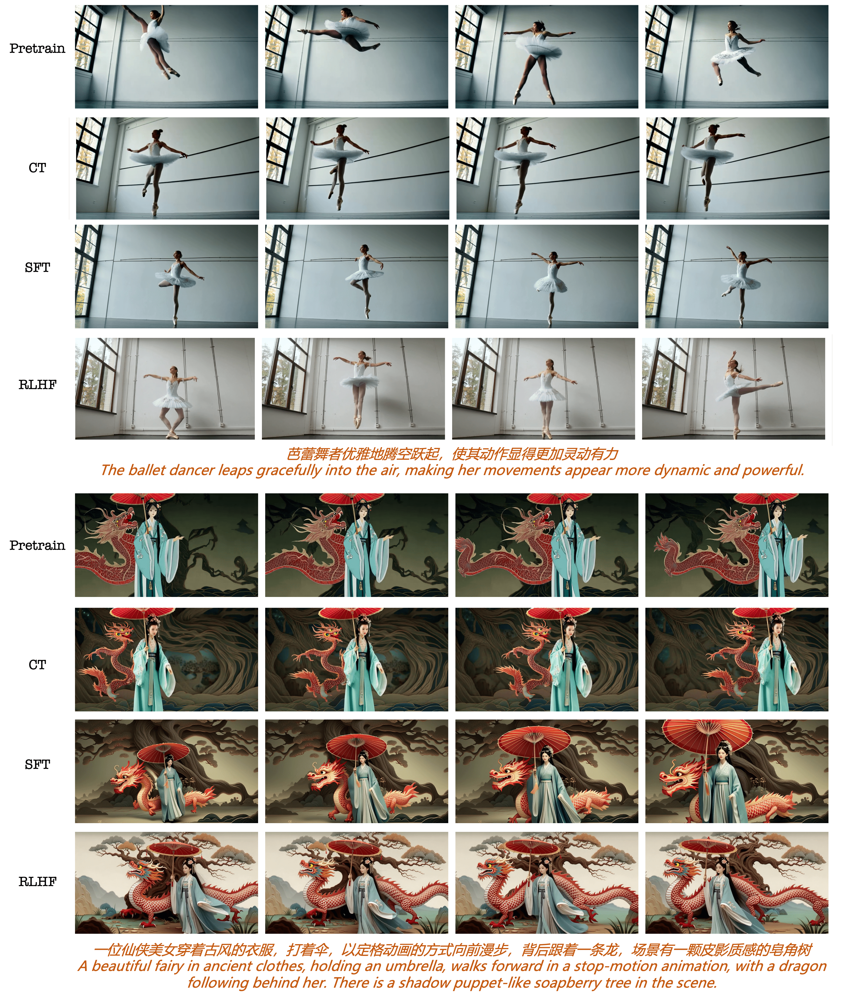
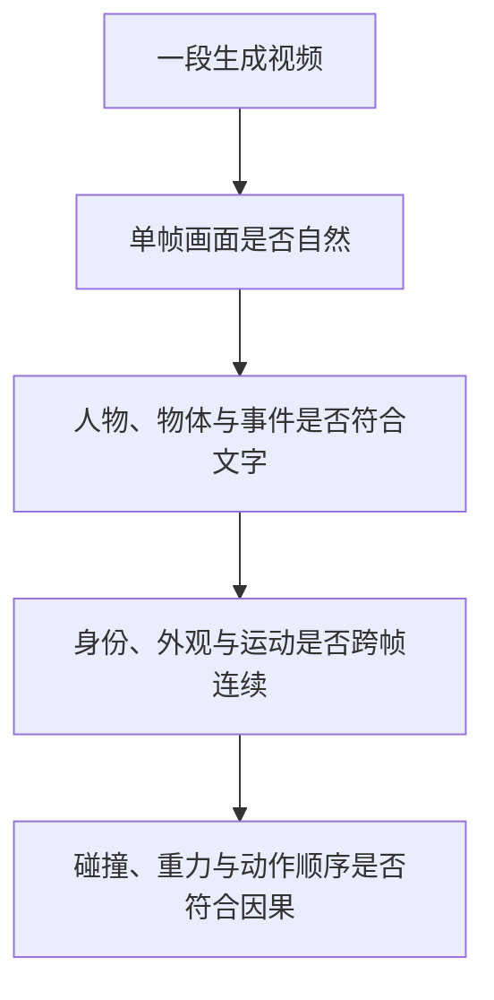
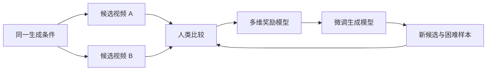
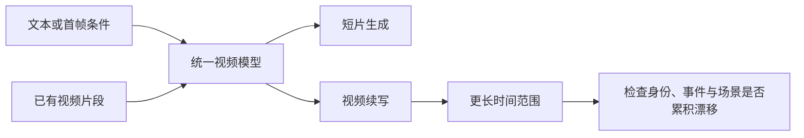

# 24.5 视频的时间一致性

先想象一段只有四秒的视频。

> 一颗红球从斜坡顶端滚下，撞到蓝色积木后停在桌边。

第一秒，红球和蓝色积木都很清晰。第二秒，球开始向下滚。第三秒，球还没有碰到积木，积木却先倒了。第四秒，红球突然出现在桌子的另一侧。

把任意一帧单独截出来，画面都可能很好看。连起来以后，动作顺序、物体身份和因果关系全错了。视频生成由此多出一个图像生成没有的核心问题：**模型既要画对每一帧，还要让变化发生得合理。**

这一节学习三件事：

- 怎样把“视频好不好”拆成画面、语义、时间和物理四个层次；
- VADER、DanceGRPO 和视频 RLHF 分别怎样利用奖励；
- Seedance 与 LongCat-Video 的公开论文披露了哪些训练方法，哪些工业细节仍然未知。

最后我们会建立一个小型评测框架。它不要求先训练视频模型，却能帮助我们判断一次改进究竟提升了运动与因果，还是只让单帧更漂亮。



<div style="text-align: center; font-size: 0.9em; color: var(--vp-c-text-2); margin-top: -10px; margin-bottom: 20px;">
  <em>图 1：同一生成条件经过预训练、持续训练、监督微调与 RLHF 后得到的视频帧。读图时要沿每一行检查动作和身份是否连续，不能只比较某一帧是否更漂亮。来源：<a href="https://arxiv.org/abs/2506.09113" target="_blank" rel="noopener noreferrer">Seedance 1.0 技术报告</a>。</em>
</div>

## 24.5.1 一条时间轴增加了什么问题

图像生成可以把结果写成 $x$，视频则由连续帧组成。下面是本书用于表示帧序列的教学记号：

$$
v=(x^{(1)},x^{(2)},\ldots,x^{(F)}).
$$

$F$ 是帧数。模型需要同时处理空间与时间：一帧内部的人物、物体和背景要合理，相邻帧之间的身份、位置与动作也要连续。

判断视频质量时，可以从四层逐步检查。

第一层是**单帧画面质量**。人物的手有没有畸形，边缘是否清晰，光照和构图是否自然。这一层接近图像生成评测。

第二层是**文字与事件对齐**。提示词说“红球先撞积木，再停在桌边”，视频是否真的包含红球、积木、碰撞和停止，事件顺序是否正确。

第三层是**时间一致性**。同一个人物的衣服不能中途变色，桌上的杯子不能无故消失，镜头移动时背景结构不能反复重建。

第四层是**物理与因果一致性**。积木应当在碰撞之后倒下，抛出的物体应当沿连续轨迹运动，遮挡后的物体仍应保持存在。



这四层会相互影响，却不能互相代替。一段视频可以有很高的审美分数，同时存在明显的物体瞬移。一个总分会把这种错误藏起来，因此视频训练与评测都需要保留各个子信号。

## 24.5.2 为什么终点的一个分数不够

沿用上一节的记号，视频生成也可以看成一条采样轨迹 $\tau$。最简单的做法是在视频生成结束后给一个总奖励。下面仍是教学记号，用来说明终点奖励能够看到哪些信息：

$$
R(\tau,c)=r_\phi(v,c).
$$

$c$ 是生成条件，$v$ 是最终视频，$r_\phi$ 是视频奖励模型。这个写法可以直接用于策略梯度，但它没有告诉模型错误发生在哪一段。

仍以红球为例。若前两秒正确，后两秒发生瞬移，终局奖励只能说“整段视频偏差”。去噪过程、视频帧和事件阶段都很长，模型难以判断哪些决策应当改变。这就是视频生成中的信用分配问题。

一个常见思路是把奖励拆开。下面的加权和是**教学性的奖励模板**，不是 VADER、DanceGRPO 或 Seedance 论文共同采用的固定公式：

$$
R
=
\lambda_qR_{\mathrm{quality}}
+
\lambda_aR_{\mathrm{alignment}}
+
\lambda_tR_{\mathrm{temporal}}
+
\lambda_pR_{\mathrm{physics}}.
$$

$R_{\mathrm{quality}}$ 衡量画面质量，$R_{\mathrm{alignment}}$ 衡量条件与事件是否匹配，$R_{\mathrm{temporal}}$ 衡量跨帧一致性，$R_{\mathrm{physics}}$ 衡量运动与因果。每个 $\lambda$ 表达一种训练取舍。

公式写出来很容易，真正困难的是四个奖励是否可靠。例如，用相邻帧相似度衡量一致性，会偏爱几乎不动的视频；用运动幅度鼓励动态，又可能产生没有语义的剧烈晃动。训练系统需要分别观察子奖励，并用未参与训练的评测检查它们是否被利用。

## 24.5.3 三条不同的视频对齐路线

“使用奖励改进视频”并不只对应一种算法。公开研究大致给出了三条路线。

### VADER：让可微奖励直接穿过生成过程

[VADER 原论文](https://arxiv.org/abs/2407.08737)将可微奖励的梯度反向传播进视频扩散模型[^vader]。若审美模型、文本视频对齐模型或视频表征模型能够提供稳定梯度，就可以直接问：怎样修改生成模型参数，能让这段视频的奖励升高？


这条路线避免了大量只为估计黑盒策略梯度而产生的奖励查询。VADER 论文报告，它比梯度自由方法更节省奖励查询与计算，并展示了超过训练序列长度的视频对齐实验[^vader]。它的边界也很清楚：奖励必须能够稳定求导，而且奖励网络的偏差会直接成为优化方向。

论文还使用视频表征模型提供时间一致性信号。这样的奖励可以改善跨帧表征稳定性，却不能单独证明模型掌握了牛顿力学。一个视频在表征空间里平滑，仍可能让物体在错误时刻倒下。

### DanceGRPO：用黑盒奖励比较同一条件下的一组视频

[24.4 节](./visual-generation-dancegrpo)已经推导了 [DanceGRPO](https://arxiv.org/abs/2505.07818)。它为扩散与 rectified-flow 采样建立随机转移概率，再对同一条件生成一组结果，使用组内归一化优势更新模型[^dancegrpo]。

视频奖励可以是审美模型、文本视频匹配模型、运动模型，也可以是返回通过或失败的规则检查器。奖励不需要可微，因此适合接入人类偏好模型或多模态评审器。代价是一次更新要完整生成多个视频，显存和采样时间都会迅速增加。

DanceGRPO 的论文实验包含文本到视频与图像到视频模型。公开证据支持“它能用于视频生成强化学习”，却不支持“所有主流视频产品都使用它”。工业模型的论文若没有披露优化器，就应当把算法写成未知。

### 视频 RLHF：从人类比较中学习多维偏好

另一条路线先收集偏好数据。标注者观看同一条件下的两个视频，比较文字遵循、画面质量、动作自然度与时间一致性。系统可以训练一个奖励模型，再用强化学习微调生成模型；也可以把被偏好的样本用于监督微调或偏好优化。



这条数据循环的关键不是把所有偏好压成一个数字。标注界面应当让评审者指出问题属于画面、事件、时间还是物理。这样才能发现训练奖励上升时，究竟是哪一项真的改善了。

## 24.5.4 Seedance：公开技术报告怎样描述视频 RLHF

[Seedance 1.0 技术报告](https://arxiv.org/abs/2506.09113)给出了一个较完整的工业训练案例[^seedance]。这篇报告值得读的原因，在于它把数据、架构、监督微调、RLHF 与推理加速放在同一条系统链路中。

### 先用数据与架构建立可生成的基础模型

Seedance 使用多来源视频数据，并通过筛选、描述与质量控制构造训练语料。模型统一处理文本到视频和图像到视频，还针对多镜头视频设计了相应表示。预训练先让模型学会常见物体、运动和镜头变化；后训练再把分布推向更符合人类要求的区域。

这一步提醒我们：RLHF 不能凭空创造底座没有见过的运动知识。若训练数据中缺少某类动作或镜头，奖励只能在已有候选中进行选择，很难补出完整能力。

### 细粒度监督微调之后再做视频专用 RLHF

技术报告描述了细粒度监督微调和视频专用 RLHF，并使用多维奖励改善指令遵循、运动、审美与整体偏好[^seedance]。公开报告没有给出各奖励的精确权重，也没有说明其 RLHF 优化器就是 DanceGRPO。因此，可靠的结论应当停在“使用多维奖励的视频 RLHF”，不能继续编造权重搜索、固定丢弃比例或内部算法名称。

回看本节开头的图 1，要沿时间轴观察，而不能只挑一帧。检查人物外观是否持续一致，动作是否真的完成，背景是否因镜头移动而重建，再判断后训练改进发生在哪一层。


<div style="text-align: center; font-size: 0.9em; color: var(--vp-c-text-2); margin-top: -10px; margin-bottom: 20px;">
  <em>图 2：Seedance 报告展示的多项奖励变化。基础能力、运动和审美需要分别监控；一条总曲线无法说明各项是否共同改善。来源：<a href="https://arxiv.org/abs/2506.09113" target="_blank" rel="noopener noreferrer">Seedance 1.0 技术报告</a>。</em>
</div>

### 生成速度来自训练与系统共同优化

Seedance 报告还描述了多阶段蒸馏与系统优化带来的推理加速，并给出在 NVIDIA L20 上生成 5 秒 1080p 视频所需时间的公开测量[^seedance]。这类结果说明，模型质量提升之后仍需解决采样步数、显存、并行和服务吞吐。视频强化学习只覆盖其中一段，不能代替整个工程系统。

## 24.5.5 LongCat-Video：长视频为什么要从预训练阶段准备

短视频可以只展示一个动作，长视频则要维持人物、场景和事件。误差会沿时间积累：开头的一次身份漂移，会让后面的动作和叙事都失去参照。

[LongCat-Video 技术报告](https://arxiv.org/abs/2510.22200)将这一问题放在统一视频生成模型中处理[^longcat]。论文披露的核心包括：

- 13.6B 参数的 Diffusion Transformer，同时支持文本到视频、图像到视频和视频续写；
- 在预训练中加入视频续写，使模型学习从已有片段继续生成；
- 采用时间与空间上的由粗到细训练，并使用块稀疏注意力降低长序列成本；
- 在后训练阶段组合多种奖励进行 RLHF；
- 公开代码与模型权重，便于复现和检查。



这条路线的关键含义是：长视频能力需要在预训练和架构阶段准备，RLHF 再负责调整人类偏好与多维质量。原有页面把 LongCat 写成固定五秒分块、重叠平均、故事 LLM 奖励和两级扩散；这些细节没有出现在公开论文的核心方法中，不能当作事实保留。

LongCat-Video 来自美团团队，与字节跳动的 Seedance 是两项不同工作。阅读工业论文时，先核对机构、模型与公开材料，可以避免把相近发布时间的项目拼成一条不存在的训练链。

## 24.5.6 看主流产品时，先区分能力展示与训练证据

[Hailuo](https://hailuoai.video/)、Wan、[Kling](https://klingai.com/)、[Sora](https://openai.com/sora/) 和 [Veo](https://deepmind.google/models/veo/) 都展示了视频生成能力，但公开程度不同。

[Wan 技术报告](https://arxiv.org/abs/2503.20314)与[官方仓库](https://github.com/Wan-Video/Wan2.1)提供了模型说明、代码和权重，研究者可以检查模型结构、运行推理并复现部分实验[^wan]。开放模型不等于公开了全部后训练数据与偏好优化流程，算法归属仍应以论文和仓库为准。

Hailuo 与 Kling 的产品展示可以帮助观察人物运动、镜头控制和物理失败。若公开材料没有说明它们使用 DanceGRPO 或 CISPO，就不能根据公司其他论文推断具体训练算法。MiniMax-VL-01 是视觉语言模型，也不能作为 Hailuo 视频模型开源的证据。

Sora 与 Veo 的公开页面展示了生成能力和产品特性。训练数据、奖励组成与后训练优化器只披露了一部分。比较这些系统时，可以描述“支持何种输入、输出多长、是否包含音频、公开评测如何设计”，不应填入未经来源支持的 RL 配方。

这条规则看似保守，却是阅读快速变化领域的基本方法：**产品结果告诉我们系统能做什么，技术报告才告诉我们作者公开承认怎样做到。**

## 24.5.7 怎样评测“物理感”

“看起来有物理感”太宽，无法直接成为评测项。先把它拆成可观察事件。

### 物体恒常性

杯子被手遮挡一秒后应当重新出现，颜色、形状和位置变化应能由之前的运动解释。这里测试的是物体是否在模型的时间表示中持续存在。

### 连续轨迹

抛出的球应沿连续路径运动，速度变化应当平滑。仅比较相邻帧相似度不够，因为静止视频也会得到很高的一致性分数。为了说明轨迹检查，下面用 $\mathbf p_f$ 表示第 $f$ 帧检测到的物体位置：

$$
\mathbf{p}_1,\mathbf{p}_2,\ldots,\mathbf{p}_F.
$$

再检查位移和加速度是否出现无法解释的跳变。

### 接触与因果顺序

提示词“球撞倒积木”至少包含三个事件：球接近积木、发生接触、积木随后倒下。若三个事件分别发生在第 8、12、15 帧，顺序正确；若倒下发生在第 10 帧、接触发生在第 12 帧，因果关系已经颠倒。把顺序写成教学记号就是：

$$
t_{\mathrm{approach}} < t_{\mathrm{contact}} < t_{\mathrm{fall}}.
$$

若积木在接触前倒下，单帧质量再高也应判为因果失败。

### 重力、支撑与遮挡

物体失去支撑后应向下运动，放在桌面上时不应穿透桌面。镜头移动造成的遮挡也不能让物体永久消失。这些测试不需要建立完整物理引擎，却能覆盖视频模型最常见的可见错误。

## 24.5.8 做一个最小视频评测 Harness

在训练前先建立评测集，成本通常比盲目增加奖励更低。一个最小 Harness 可以这样组织。

第一步，准备六类提示词：身份保持、物体恒常、连续轨迹、碰撞顺序、重力与支撑、镜头运动。每类先写十条短提示，控制对象数量和背景复杂度。

第二步，为每条提示固定若干随机种子。训练前后使用相同条件生成多个候选，保存模型版本、采样器、步数、分辨率和时长。没有这些元数据，结果无法复现。

第三步，把自动指标分开记录：

- 画面质量模型评价清晰度和伪影；
- 文本视频模型检查主体、属性和事件；
- 目标检测与跟踪检查身份和轨迹；
- 事件识别器检查接触、倒下和停止的顺序；
- 人类盲评负责识别自动指标遗漏的整体异常。

第四步，保存失败片段，而不是只保存平均分。一次有用的评测报告应当能回答：错误从第几秒开始，属于哪一类，前面的状态怎样传播到后续帧。

```python
for case in evaluation_cases:
    for seed in fixed_seeds:
        video = generator(case.prompt, seed=seed)

        report = {
            "visual_quality": quality_model(video),
            "text_alignment": video_text_model(video, case.prompt),
            "track_consistency": tracker_score(video),
            "event_order": event_order_score(video, case.events),
        }
        save_video_and_report(video, report, metadata={
            "prompt": case.prompt,
            "seed": seed,
            "model_version": generator.version,
        })
```

这段代码的重点是保存分项结果与生成元数据。真实系统还需要标注置信度、跟踪失败和人工复核状态。自动评测器本身出错时，Harness 应把样本送入人工检查，而不是强行给出确定结论。

## 24.5.9 接下来还会遇到哪些问题

更长视频首先受制于状态累积。目标从十秒片段扩展到数分钟后，模型需要记住人物身份、空间布局和未完成事件。续写训练、稀疏注意力和分层时间表示都在降低成本，评测也必须从单动作扩展到完整事件链。

音视频联合生成增加了另一条同步约束。脚步声要跟随落脚时刻，口型要与语音对齐，环境声还要随镜头和空间变化。此时奖励需要同时观察声音、画面和二者的时间对应，单独优化视频质量无法保证同步。

交互式生成把一次性采样变成连续修改。用户可能要求保留人物，只改变镜头；保留动作，只替换背景。系统必须识别哪些状态需要冻结，哪些区域允许重新生成，并在很短的延迟内响应。

精细控制还会继续扩大条件集合。姿态、轨迹、相机、灯光和参考角色都可能同时出现。条件越多，训练越容易出现“满足其中一项、忽略另一项”的现象，因此分项奖励、反事实提示和失败案例回放会比单一排行榜更重要。

真正的物理模拟仍是更远的目标。当前生成模型主要从视频分布中学习可见规律，物理引擎、三维场景表示与世界模型可能提供更可靠的状态和约束。引入这些组件后，评测仍要检查模拟约束是否改善了用户看到的视频，而不能只报告内部物理损失。

## 小结

视频生成比图像生成多了一条时间轴。单帧画得好，只能通过第一层检查；事件顺序、身份保持和物理因果需要沿整段视频判断。

VADER 让可微奖励梯度穿过视频扩散过程，DanceGRPO 用黑盒奖励比较同一条件下的一组视频，视频 RLHF 则从人类成对比较中学习多维偏好。三条路线使用奖励的方式不同，都需要独立评测防止模型只讨好代理指标。

Seedance 的公开报告展示了数据、监督微调、多维 RLHF 与推理优化怎样连接；LongCat-Video 说明长视频能力还要从预训练、续写任务和长序列架构开始准备。对于未公开的工业配方，最准确的写法就是“尚未披露”。

至此，第 24 章从音频、语音智能体和 VLA 推进到图像与视频生成。下一章进入[第 25 章奖励黑客与强化学习评测](../chapter30_alignment_failures/classical-failures)，继续讨论奖励漏洞、对齐失败与评测可信度。

## 参考资料

[^vader]: Prabhudesai, M. et al. (2024). Video Diffusion Alignment via Reward Gradients. <https://arxiv.org/abs/2407.08737>；项目页：<https://vader-vid.github.io/>

[^dancegrpo]: Xue, Z. et al. (2025). DanceGRPO: Unleashing GRPO on Visual Generation. <https://arxiv.org/abs/2505.07818>；官方实现：<https://github.com/XueZeyue/DanceGRPO>

[^seedance]: Seed Team. (2025). Seedance 1.0: Exploring the Boundaries of Video Generation Models. <https://arxiv.org/abs/2506.09113>；官方论文页：<https://seed.bytedance.com/en/public_papers/seedance-1-0-exploring-the-boundaries-of-video-generation-models>

[^longcat]: LongCat Team. (2025). LongCat-Video: A Unified Video Generation Model. <https://arxiv.org/abs/2510.22200>

[^wan]: Wan Team. (2025). Wan: Open and Advanced Large-Scale Video Generative Models. <https://arxiv.org/abs/2503.20314>；官方实现：<https://github.com/Wan-Video/Wan2.1>
